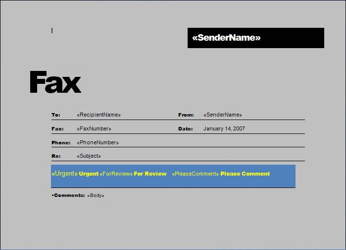

The merge engine takes a document as input, looks for `MERGEFIELD` fields in it, and replaces them with the data obtained from the data source. Typically, plain text and HTML are inserted, but Aspose.Words users can also generate a document that handles more unusual scenarios for Mail Merge fields.

Powerful Aspose.Words functionality allows you to extend the Mail Merge process:

- insert checkboxes and text input form fields into the document during a mail merge
- insert images from any custom storage (files, BLOB fields, etc.)

## Insert Checkboxes and Text Input during Mail Merge

Sometimes it is necessary to perform a Mail Merge operation so that not text is substituted in the merge field, but a checkbox or text input field. Even though this is not the most common scenario, it is very handy for some tasks.

The following screenshot of a Word document shows a template with merge fields:

This screenshot of the Word document below shows the already generated document:

{}

Note that some fields were replaced with plain text, some fields were replaced with checkbox form fields, and the `Subject` field was replaced with a text input field.

{}

The following code example shows how to insert checkboxes and input text fields into a document during a mail merge:





## Insert Images during Mail Merge

When performing a Mail Merge operation, you can insert images from the database into the document using special image Mail Merge fields. The image Mail Merge field is a merge field named Image:MyFieldName.

### Insert Images from a Database

During a mail merge, when an image Mail Merge field is encountered in a document, the [FieldMergingCallback](https://reference.aspose.com/words/java/com.aspose.words/mailmerge/#getFieldMergingCallback) event is fired. You can respond to this event to return a filename, stream, or image object to the Mail Merge engine so it can be inserted into the document.

The following code example shows how to insert images stored in a database BLOB field into a report:



### Set Image Properties during Mail Merge

While merging an image merge field, you may sometimes need to control various image properties, such as [WrapType](https://reference.aspose.com/words/java/com.aspose.words/wraptype/).

Currently, using [ImageFieldMergingArgs](https://reference.aspose.com/words/java/com.aspose.words/imagefieldmergingargs/) you can only set image width or height properties, respectively. To overcome this issue, Aspose.Words provides the [Shape](https://reference.aspose.com/words/java/com.aspose.words/imagefieldmergingargs/#getShape) property, which facilitates to get full control over the inserted image or any other shape.

The following code example shows how to set various image properties:





------  

## FAQ

1. **Q:** How can I insert a checkbox form field during a mail merge?  
   **A:** Implement a custom `IFieldMergingCallback` (or `FieldMergingCallback` in Java) and, in the `fieldMerging` method, detect the target merge field name. Replace the field with a `CheckBoxFormField` created via `DocumentBuilder.insertCheckBox`. Return the new field in the callback so the merge engine inserts it instead of plain text.

2. **Q:** How do I add a text input form field using mail merge?  
   **A:** In the same `fieldMerging` callback, create a `TextFormField` with `DocumentBuilder.insertTextInput`. Set its name, default text, and size as needed, then assign it to the merge field. The callback replaces the merge field with the interactive text box.

3. **Q:** How can I insert images that are stored in a database BLOB during mail merge?  
   **A:** Use an image merge field (`Image:MyField`) in the template. In the `fieldMerging` callback, retrieve the BLOB as a `byte[]` or `InputStream`, then set `ImageFieldMergingArgs.setImageStream` (or `setImageBytes`) to supply the image data to the engine.

4. **Q:** How can I control the size, rotation, or wrap type of an inserted image?  
   **A:** Inside the `fieldMerging` callback, obtain the `Shape` object from `ImageFieldMergingArgs.getShape()`. You can then set properties such as `setWidth`, `setHeight`, `setWrapType`, and `setRotationAngle` to fully customize the image appearance.

5. **Q:** Do I need a licensed version of Aspose.Words to use form fields or image insertion in mail merge?  
   **A:** Yes. While the evaluation version allows basic mail merge, inserting form fields, customizing image properties, and using callbacks are fully supported only with a valid Aspose.Words license. Apply the license at the start of your application with `License license = new License(); license.setLicense("Aspose.Words.Java.lic");`.