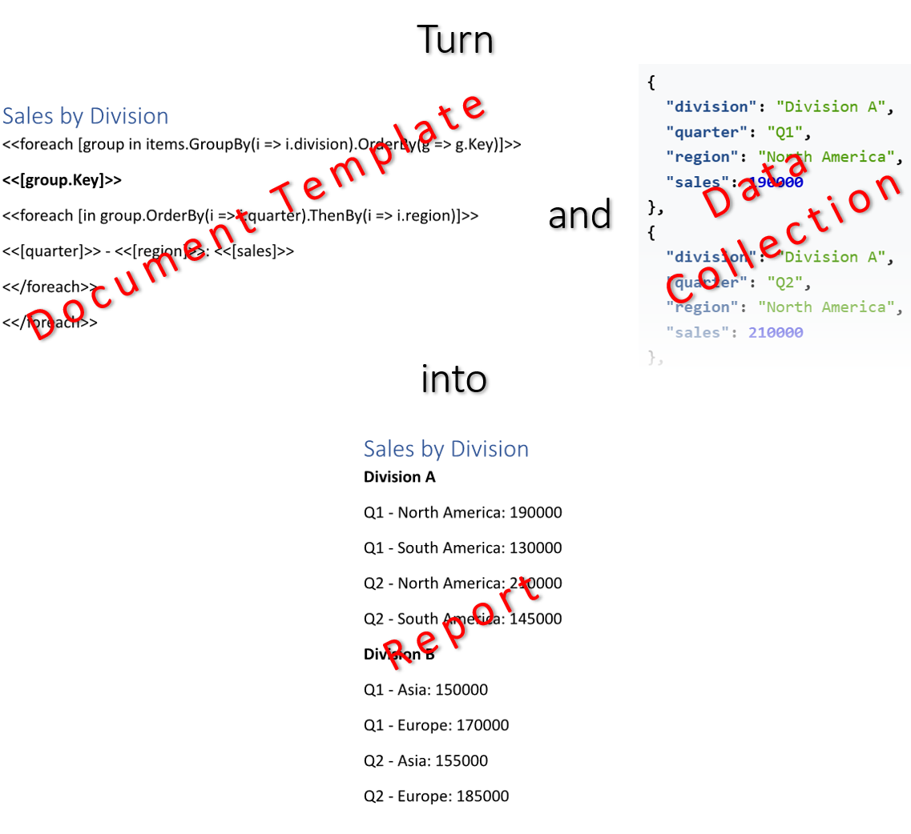

Binding a collection during building a report allows for presentation of sequential data in the form of commonly used and
recognized document elements such as lists, tables, charts, and others. This improves clarity and perception of large datasets,
making it easier for users to understand the data and make informed decisions. You can bind data collections while making
a report using LINQ Reporting Engine in C#.\
\

The process of binding a collection while making a report incorporates the following steps:

1. Preparing data in one of [supported formats]()

2. Creating a template document in Microsoft Word

3. Running C# code invoking [LINQ Reporting Engine
APIs](https://reference.aspose.com/words/net/aspose.words.reporting/reportingengine/)

{}

A typical template with a data collection bound represents a regular Microsoft Word document with special tags added to it:
Opening and closing `foreach` tags binding a template block to the collection, and expression tags binding the block with
values calculated upon an item of the collection. While building a report, the block is reproduced for every item of
the collection and filled with the item's data.

{}

The complete syntax of a `foreach` tag - essential for binding a collection - is described at [Repeating Template
Block](), whereas building of document elements
usually implying binding a collection is further explained in these sections:

- [Building Lists]()
- [Building Tables]()
- [Building Charts]()

The following sections walk through applying data transformations common for binding a collection while making a report
using LINQ Reporting Engine in C#:



{}