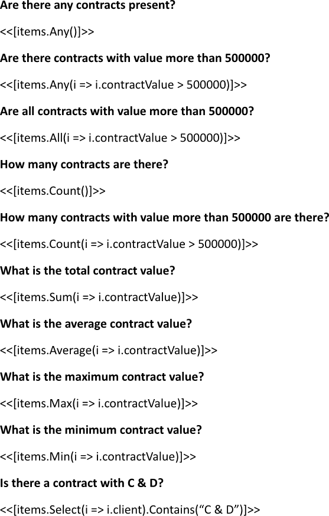
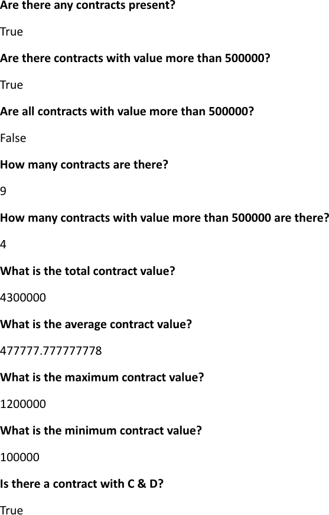

Applying [aggregate functions](https://en.wikipedia.org/wiki/Aggregate_function) to a collection during building a report
enables the calculation of key values, such as totals, averages, and counts, which provide valuable insights into the data's
overall performance. This analytical approach helps users understand trends and patterns, facilitating data-driven
decision-making based on comprehensive summaries. You can apply aggregate functions while making a report using LINQ Reporting
Engine in C#.

## How to Apply Aggregate Functions

1. Prepare data for your report in one of [formats supported by LINQ Reporting Engine](),
for example, a JSON file as follows:




2. In Microsoft Word, bind a template document to aggregate values calculated upon a data collection by adding expression tags
to the template such as the following ones as per your requirements:

    * To check whether the collection contains any items, use [the `Any` LINQ extension
method](https://learn.microsoft.com/en-us/dotnet/api/system.linq.enumerable.any?view=net-9.0#system-linq-enumerable-any-1(system-collections-generic-ienumerable((-0))))
like so:

<<[items.Any()]>>


    * To determine whether any item of the collection satisfies a condition, apply [the `Any` LINQ extension
method](https://learn.microsoft.com/en-us/dotnet/api/system.linq.enumerable.any?view=net-9.0#system-linq-enumerable-any-1(system-collections-generic-ienumerable((-0))-system-func((-0-system-boolean)))),
for instance, as per the snippet:

<<[items.Any(i => i.contractValue > 500000)]>>


    * To check whether all items of the collection satisfy a condition, use [the `All` LINQ extension
method](https://learn.microsoft.com/en-us/dotnet/api/system.linq.enumerable.all?view=net-9.0), for example, this way:

<<[items.All(i => i.contractValue > 500000)]>>


    * To get the number of items in the collection, apply [the `Count` LINQ extension
method](https://learn.microsoft.com/en-us/dotnet/api/system.linq.enumerable.count?view=net-9.0#system-linq-enumerable-count-1(system-collections-generic-ienumerable((-0))))
like this:

<<[items.Count()]>>


    * To count how many items of the collection satisfy a condition, use [the `Count` LINQ extension
method](https://learn.microsoft.com/en-us/dotnet/api/system.linq.enumerable.count?view=net-9.0#system-linq-enumerable-count-1(system-collections-generic-ienumerable((-0))-system-func((-0-system-boolean)))),
for instance, as follows:

<<[items.Count(i => i.contractValue > 500000)]>>


    * To compute the sum of addible values, each of which is calculated upon an item of the collection using a selector
function, apply [the `Sum` LINQ extension
method](https://learn.microsoft.com/en-us/dotnet/api/system.linq.enumerable.sum?view=net-9.0#system-linq-enumerable-sum-1(system-collections-generic-ienumerable((-0))-system-func((-0-system-double))))
as per the example:

<<[items.Sum(i => i.contractValue)]>>


    * To calculate the average of addible and divisible values, each of which is obtained upon an item of the collection by
applying a selector function, use [the `Average` LINQ extension
method](https://learn.microsoft.com/en-us/dotnet/api/system.linq.enumerable.average?view=net-9.0#system-linq-enumerable-average-1(system-collections-generic-ienumerable((-0))-system-func((-0-system-double)))),
for instance, like that:

<<[items.Average(i => i.contractValue)]>>


    * To get the maximum of comparable values, each of which is calculated upon an item of the collection using a selector
function, apply [the `Max` LINQ extension
method](https://learn.microsoft.com/en-us/dotnet/api/system.linq.enumerable.max?view=net-9.0#system-linq-enumerable-max-1(system-collections-generic-ienumerable((-0))-system-func((-0-system-double))))
similarly to this:

<<[items.Max(i => i.contractValue)]>>


    * To find the minimum of comparable values, each of which is obtained upon an item of the collection by applying a selector
function, use [the `Min` LINQ extension
method](https://learn.microsoft.com/en-us/dotnet/api/system.linq.enumerable.min?view=net-9.0#system-linq-enumerable-min-1(system-collections-generic-ienumerable((-0))-system-func((-0-system-double)))),
for example, as per the snippet:

<<[items.Min(i => i.contractValue)]>>


    * To check whether the collection contains a particular item, apply [the `Contains` LINQ extension
method](https://learn.microsoft.com/en-us/dotnet/api/system.linq.enumerable.contains?view=net-9.0#system-linq-enumerable-contains-1(system-collections-generic-ienumerable((-0))-0)),
for instance, in this fashion:

<<[items.Select(i => i.client).Contains("C & D")]>>


{}

In this case, the collection is [projected using `Select`]() in order to
simplify the example. This is not required in general.

{}

3. Review your aggregate functions applying template before saving. Depending on your use cases, the template should contain
one or several blocks that look like these:\
\

4. Build your report applying aggregate functions using LINQ Reporting Engine by running the following C# code:\


## Aggregate Functions Applying Report Example

After taking all the steps, LINQ Reporting Engine creates an aggregate functions applying report as follows:\
\

{}

You can download the [template
](https://github.com/aspose-words/Aspose.Words-for-.NET/raw/ivan.lyagin/UEX-331/Examples/Data/LINQ/Aggregate%20Functions%20Applying%20Template.docx)
and [data
](https://github.com/aspose-words/Aspose.Words-for-.NET/raw/ivan.lyagin/UEX-331/Examples/Data/LINQ/Aggregate%20Functions%20Applying%20Data.json)
from the example, and try to make a report applying aggregate functions online for free by using one of the options:\
<a class="product-item docs-btn" href="https://products.aspose.app/words/assembly" >APP </a>
<a class="product-item docs-btn" href="https://products.aspose.com/words/net/report/" >.NET API </a>
<a class="product-item docs-btn" href="https://products.aspose.com/words/python-net/report/" >
PYTHON via <em class="docs-vianet">net</em> API</a>
 
 

{}

## See Also

- [Binding Collections]()
- [Binding Data]()
- [LINQ Reporting Engine]()
- [ReportingEngine Class](https://reference.aspose.com/words/net/aspose.words.reporting/reportingengine/)

{}