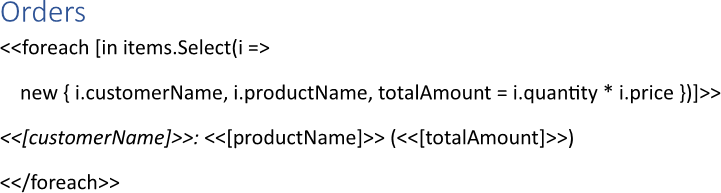
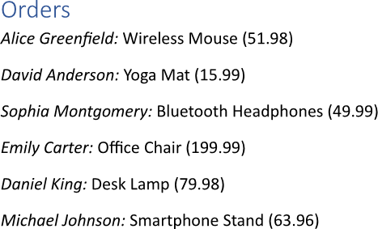
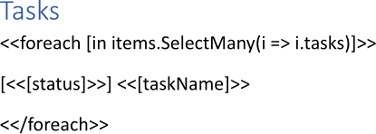
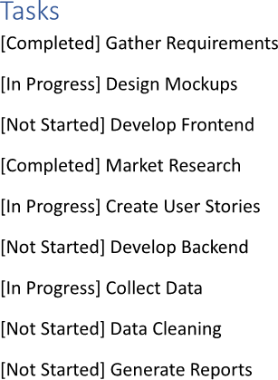

Applying a collection projection during building a report allows for the selection and presentation of only the most relevant
fields from a dataset, reducing complexity and focusing on key values. This streamlined view enhances clarity and comprehension,
enabling users to quickly grasp essential information without being distracted by unnecessary details. You can apply a collection
projection while making a report using LINQ Reporting Engine in C#.

## How to Apply a Collection Projection

{}

Although this guide deals with text blocks, the same approach can be applied to any template blocks such as
[lists](), [table rows and columns](), 
[charts](), and others.

{}

1. Prepare data for your report in one of [formats supported by LINQ Reporting Engine](),
for example, a JSON file as follows:




2. In Microsoft Word, bind a text block to a data collection by adding an opening `foreach` tag to the beginning of the block
and applying a collection projection using [the `Select` LINQ extension
method](https://learn.microsoft.com/en-us/dotnet/api/system.linq.enumerable.select?view=net-9.0#system-linq-enumerable-select-2(system-collections-generic-ienumerable((-0))-system-func((-0-1))))
as per the example:

<<foreach [in items.Select(i => new { i.customerName, i.productName, totalAmount = i.quantity * i.price })]>>


{}

In this case, a collection item is projected using [an anonymous
type](https://learn.microsoft.com/en-us/dotnet/csharp/fundamentals/types/anonymous-types). However, you can project a collection
item into a single value or use any regular (that is, non-anonymous) type for the projection.

{}

3. Add a closing `foreach` tag to the end of the text block like that:

<</foreach>>


4. Bind the text block to values calculated upon a projected collection item by adding expression tags to the block between
the opening and closing `foreach` tags such as the following ones:

<<[customerName]>>


<<[productName]>>


<<[totalAmount]>>


5. Review your collection projection applying template before saving, it should look like this:\
\

6. Build your report applying a collection projection using LINQ Reporting Engine by running the following C# code:\


## Collection Projection Applying Report Example

After taking all the steps, LINQ Reporting Engine creates a collection projection applying report as follows:\
\

{}

You can download the [template
](https://github.com/aspose-words/Aspose.Words-for-.NET/raw/ivan.lyagin/UEX-331/Examples/Data/LINQ/Collection%20Projection%20Applying%20Template.docx)
and [data
](https://github.com/aspose-words/Aspose.Words-for-.NET/raw/ivan.lyagin/UEX-331/Examples/Data/LINQ/Collection%20Projection%20Applying%20Data.json)
from the example, and try to make a report applying a collection projection online for free by using one of the options:\
<a class="product-item docs-btn" href="https://products.aspose.app/words/assembly" >APP </a>
<a class="product-item docs-btn" href="https://products.aspose.com/words/net/report/" >.NET API </a>
<a class="product-item docs-btn" href="https://products.aspose.com/words/python-net/report/" >
PYTHON via <em class="docs-vianet">net</em> API</a>
 
 

{}

## How to Flatten Collections

{}

Although this guide deals with text blocks, the same approach can be applied to any template blocks such as
[lists](), [table rows and columns](), 
[charts](), and others.

{}

1. Prepare data for your report in one of [formats supported by LINQ Reporting Engine](),
for example, a JSON file as follows:




2. In Microsoft Word, bind a text block to a data collection by adding an opening `foreach` tag to the beginning of the block
and projecting every item of the collection to a related collection with further flattening all the related collections into
one using [the `SelectMany` LINQ extension
method](https://learn.microsoft.com/en-us/dotnet/api/system.linq.enumerable.selectmany?view=net-9.0#system-linq-enumerable-selectmany-2(system-collections-generic-ienumerable((-0))-system-func((-0-system-collections-generic-ienumerable((-1))))))
as per the example:

<<foreach [in items.SelectMany(i => i.tasks)]>>


3. Add a closing `foreach` tag to the end of the text block like that:

<</foreach>>


4. Bind the text block to values calculated upon an item of the single flattened collection by adding expression tags to
the block between the opening and closing `foreach` tags such as the following ones:

<<[status]>>


<<[taskName]>>


5. Review your collections flattening template before saving, it should look like this:\
\

6. Build your report flattening collections using LINQ Reporting Engine by running the following C# code:\


## Collections Flattening Report Example

After taking all the steps, LINQ Reporting Engine creates a collections flattening report as follows:\
\

{}

You can download the [template
](https://github.com/aspose-words/Aspose.Words-for-.NET/raw/ivan.lyagin/UEX-331/Examples/Data/LINQ/Collections%20Flattening%20Template.docx)
and [data
](https://github.com/aspose-words/Aspose.Words-for-.NET/raw/ivan.lyagin/UEX-331/Examples/Data/LINQ/Collections%20Flattening%20Data.json)
from the example, and try to make a report flattening collections online for free by using one of the options:\
<a class="product-item docs-btn" href="https://products.aspose.app/words/assembly" >APP </a>
<a class="product-item docs-btn" href="https://products.aspose.com/words/net/report/" >.NET API </a>
<a class="product-item docs-btn" href="https://products.aspose.com/words/python-net/report/" >
PYTHON via <em class="docs-vianet">net</em> API</a>
 
 

{}

## See Also

- [Binding Collections]()
- [Binding Data]()
- [LINQ Reporting Engine]()
- [ReportingEngine Class](https://reference.aspose.com/words/net/aspose.words.reporting/reportingengine/)

{}