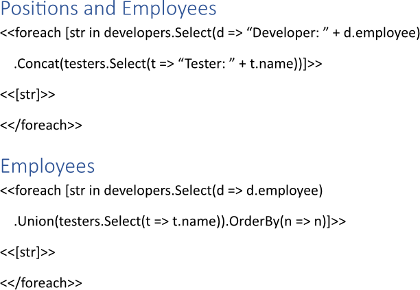
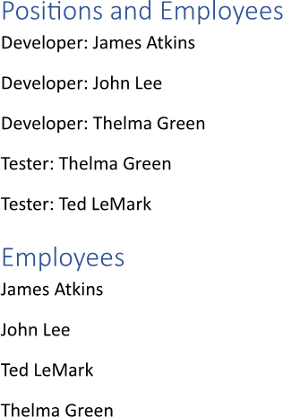

Combining collections during building a report creates a unified view of related datasets, allowing for comprehensive analysis
across multiple aspects. This approach facilitates the identification of relationships and correlations between different data
points, enhancing the depth and quality of insights presented in the data. You can combine collections while making a report
using LINQ Reporting Engine in C#.

## How to Combine Collections

{}

Although this guide deals with text blocks, the same approach can be applied to any template blocks such as
[lists](), [table rows and columns](), 
[charts](), and others.

{}

1. Prepare data for your report in one of [formats supported by LINQ Reporting Engine](),
for example, a JSON file as follows:




2. In Microsoft Word, bind a text block to combined data collections by adding an opening `foreach` tag to the beginning of
the block and combining the collections in one of the following ways as per your requirements:

    * To concatenate two collections, use [the `Concat` LINQ extension
method](https://learn.microsoft.com/en-us/dotnet/api/system.linq.enumerable.concat?view=net-9.0), for instance, like so:

<<foreach [str in developers.Select(d => "Developer: " + d.employee).Concat(testers.Select(t => "Tester: " + t.name))]>>


    * To combine two collections excluding duplicate items, apply [the `Union` LINQ extension
method](https://learn.microsoft.com/en-us/dotnet/api/system.linq.enumerable.union?view=net-9.0#system-linq-enumerable-union-1(system-collections-generic-ienumerable((-0))-system-collections-generic-ienumerable((-0))))
similarly to this:

<<foreach [str in developers.Select(d => d.employee).Union(testers.Select(t => t.name)).OrderBy(n => n)]>>


{}

In this case, since items of collections being combined are of different structure, the both collections are [projected using
`Select`]() to unify all the items. Also, it often makes sense to [sort
items]() of combined collections using the `OrderBy`, `OrderByDescending`, `ThenBy`, and
`ThenByDescending` LINQ extension methods in order to get consistent output as shown in the latter snippet.

{}

3. Add a closing `foreach` tag to the end of the text block like that:

<</foreach>>


4. Bind the text block to values calculated upon an item of the combined collection by adding expression tags to the block
between the opening and closing `foreach` tags such as the following one:

<<[str]>>


5. Review your collections combining template before saving. Depending on your use cases, the template should contain one or
several blocks that look like these:\
\

6. Build your report combining collections using LINQ Reporting Engine by running the following C# code:\


## Collections Combining Report Example

After taking all the steps, LINQ Reporting Engine creates a collections combining report as follows:\
\

{}

You can download the [template
](https://github.com/aspose-words/Aspose.Words-for-.NET/raw/ivan.lyagin/UEX-331/Examples/Data/LINQ/Collections%20Combining%20Template.docx)
and [data
](https://github.com/aspose-words/Aspose.Words-for-.NET/raw/ivan.lyagin/UEX-331/Examples/Data/LINQ/Collections%20Combining%20Data.json)
from the example, and try to make a report combining collections online for free by using one of the options:\
<a class="product-item docs-btn" href="https://products.aspose.app/words/assembly" >APP </a>
<a class="product-item docs-btn" href="https://products.aspose.com/words/net/report/" >.NET API </a>
<a class="product-item docs-btn" href="https://products.aspose.com/words/python-net/report/" >
PYTHON via <em class="docs-vianet">net</em> API</a>
 
 

{}

## See Also

- [Binding Collections]()
- [Binding Data]()
- [LINQ Reporting Engine]()
- [ReportingEngine Class](https://reference.aspose.com/words/net/aspose.words.reporting/reportingengine/)

{}