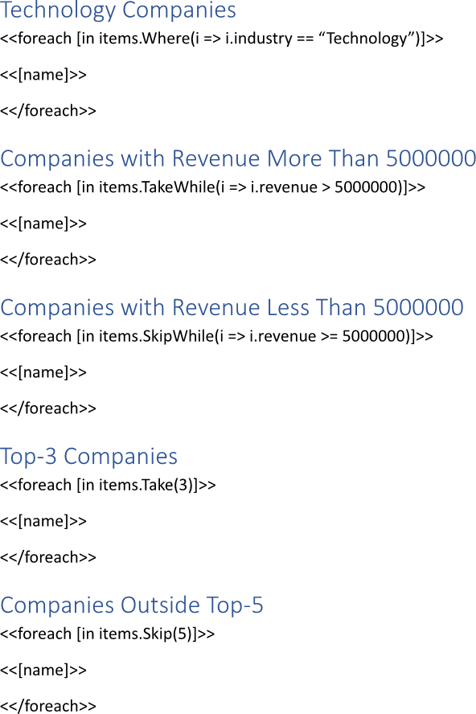
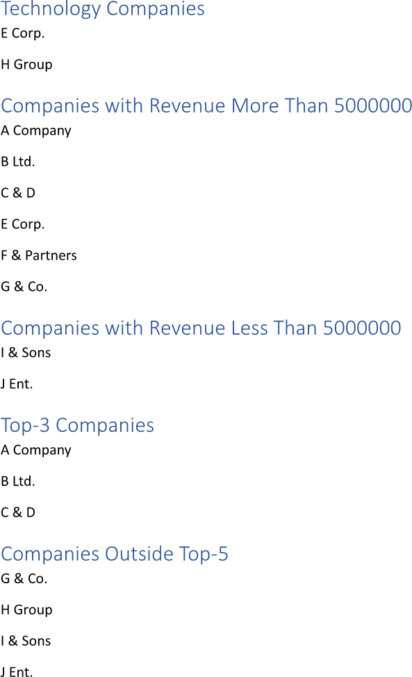

Filtering a collection during building a report enables the selection of specific data points that meet defined criteria,
ensuring that only relevant information is included. This targeted approach helps streamline the reporting process, allowing
users to focus on key insights and trends without being overwhelmed by extraneous data. You can filter a collection while
making a report using LINQ Reporting Engine in C#.

## How to Filter a Collection

{}

Although this guide deals with text blocks, the same approach can be applied to any template blocks such as
[lists](), [table rows and columns](), 
[charts](), and others.

{}

1. Prepare data for your report in one of [formats supported by LINQ Reporting Engine](),
for example, a JSON file as follows:




2. In Microsoft Word, bind a text block to a data collection by adding an opening `foreach` tag to the beginning of the block
and applying collection filtering in one of the following ways as per your requirements:

    * To filter all collection items based on a predicate, use [the `Where` LINQ extension
method](https://learn.microsoft.com/en-us/dotnet/api/system.linq.enumerable.where?view=net-8.0#system-linq-enumerable-where-1(system-collections-generic-ienumerable((-0))-system-func((-0-system-boolean)))),
for instance, like so:

<<foreach [in items.Where(i => i.industry == "Technology")]>>


    * To keep collection items as long as a specified condition is true, apply [the `TakeWhile` LINQ extension
method](https://learn.microsoft.com/en-us/dotnet/api/system.linq.enumerable.takewhile?view=net-8.0#system-linq-enumerable-takewhile-1(system-collections-generic-ienumerable((-0))-system-func((-0-system-boolean))))
as per the example:

<<foreach [in items.TakeWhile(i => i.revenue > 5000000)]>>


    * To bypass collection items as long as a specified condition is true and keep the remaining items, use [the `SkipWhile` LINQ extension
method](https://learn.microsoft.com/en-us/dotnet/api/system.linq.enumerable.skipwhile?view=net-8.0#system-linq-enumerable-skipwhile-1(system-collections-generic-ienumerable((-0))-system-func((-0-system-boolean)))),
for instance, this way:

<<foreach [in items.SkipWhile(i => i.revenue >= 5000000)]>>


    * To keep a specified number of items from the start of the collection, apply [the `Take` LINQ extension
method](https://learn.microsoft.com/en-us/dotnet/api/system.linq.enumerable.take?view=net-8.0#system-linq-enumerable-take-1(system-collections-generic-ienumerable((-0))-system-int32))
similarly to this:

<<foreach [in items.Take(3)]>>


    * To bypass a specified number of items from the start of the collection and keep the remaining items, use [the `Skip` LINQ extension
method](https://learn.microsoft.com/en-us/dotnet/api/system.linq.enumerable.skip?view=net-8.0), for instance, as per the snippet:

<<foreach [in items.Skip(5)]>>


3. Add a closing `foreach` tag to the end of the text block like that:

<</foreach>>


4. Bind the text block to a value calculated upon an item of the collection by adding an expression tag to the block between
the opening and closing `foreach` tags such as the following one:

<<[name]>>


5. Review your collection filtering template before saving. Depending on your use cases, the template should contain one or
several blocks that look like these:\
\

6. Build your report filtering a collection using LINQ Reporting Engine by running the following C# code:\


## Collection Filtering Report Example

After taking all the steps, LINQ Reporting Engine creates a collection filtering report as follows:\
\

{}

You can download the [template
](https://github.com/aspose-words/Aspose.Words-for-.NET/raw/ivan.lyagin/UEX-331/Examples/Data/LINQ/Collection%20Filtering%20Template.docx)
and [data
](https://github.com/aspose-words/Aspose.Words-for-.NET/raw/ivan.lyagin/UEX-331/Examples/Data/LINQ/Collection%20Filtering%20Data.json)
from the example, and try to make a report filtering a collection online for free by using one of the options:\
<a class="product-item docs-btn" href="https://products.aspose.app/words/assembly" >APP </a>
<a class="product-item docs-btn" href="https://products.aspose.com/words/net/report/" >.NET API </a>
<a class="product-item docs-btn" href="https://products.aspose.com/words/python-net/report/" >
PYTHON via <em class="docs-vianet">net</em> API</a>
 
 

{}

## See Also

- [Binding Collections]()
- [Binding Data]()
- [LINQ Reporting Engine]()
- [ReportingEngine Class](https://reference.aspose.com/words/net/aspose.words.reporting/reportingengine/)

{}