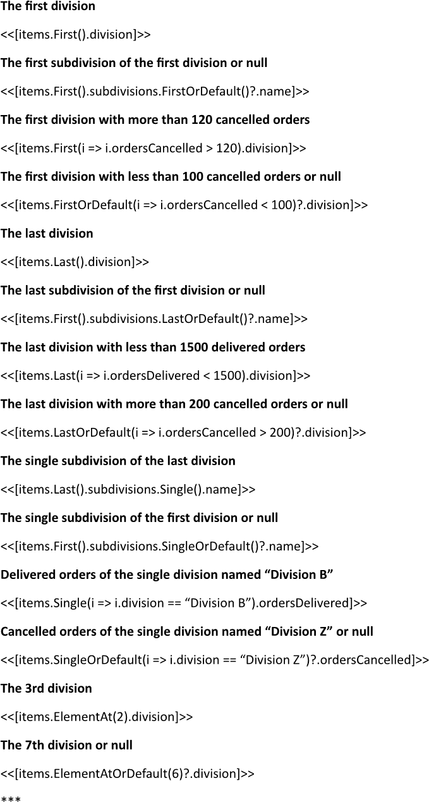
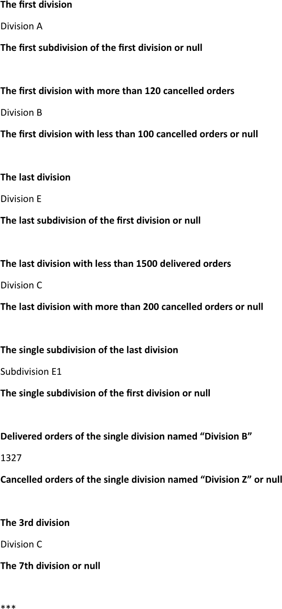

Getting a collection item (for example, by its index) during building a report allows for precise access to specific data
points, enabling detailed examination of individual records within a larger dataset. This targeted retrieval can facilitate
deeper insights and direct comparisons, enhancing the overall quality and relevance of findings from the data. You can get
a collection item while making a report using LINQ Reporting Engine in C#.

## How to Get a Collection Item

1. Prepare data for your report in one of [formats supported by LINQ Reporting Engine](),
for example, a JSON file as follows:




2. In Microsoft Word, bind a template document to values calculated upon an item of a data collection by adding expression tags
to the template and obtaining the item in one of the following ways as per your requirements:

    * To reference the first collection item, apply [the `First` LINQ extension
method](https://learn.microsoft.com/en-us/dotnet/api/system.linq.enumerable.first?view=net-9.0#system-linq-enumerable-first-1(system-collections-generic-ienumerable((-0)))),
for instance, like so:

<<[items.First().division]>>


    * To recieve the first collection item or a default value if the collection contains no items, use [the `FirstOrDefault`
LINQ extension
method](https://learn.microsoft.com/en-us/dotnet/api/system.linq.enumerable.firstordefault?view=net-9.0#system-linq-enumerable-firstordefault-1(system-collections-generic-ienumerable((-0)))),
for example, as follows:

<<[items.First().subdivisions.FirstOrDefault()?.name]>>


    * To find the first collection item that satisfies a specified condition, apply [the `First` LINQ extension
method](https://learn.microsoft.com/en-us/dotnet/api/system.linq.enumerable.first?view=net-9.0#system-linq-enumerable-first-1(system-collections-generic-ienumerable((-0))-system-func((-0-system-boolean)))),
for instance, as per the snippet:

<<[items.First(i => i.ordersCancelled > 120).division]>>


    * To get the first collection item that satisfies a specified condition or a default value if there is no such item, use
[the `FirstOrDefault` LINQ extension
method](https://learn.microsoft.com/en-us/dotnet/api/system.linq.enumerable.firstordefault?view=net-9.0#system-linq-enumerable-firstordefault-1(system-collections-generic-ienumerable((-0))-system-func((-0-system-boolean)))),
for example, this way:

<<[items.FirstOrDefault(i => i.ordersCancelled < 100)?.division]>>


    * To pick the last collection item, apply [the `Last` LINQ extension
method](https://learn.microsoft.com/en-us/dotnet/api/system.linq.enumerable.last?view=net-9.0#system-linq-enumerable-last-1(system-collections-generic-ienumerable((-0)))),
for instance, like that:

<<[items.Last().division]>>


    * To retrieve the last collection item or a default value if the collection contains no items, use [the `LastOrDefault`
LINQ extension
method](https://learn.microsoft.com/en-us/dotnet/api/system.linq.enumerable.lastordefault?view=net-9.0#system-linq-enumerable-lastordefault-1(system-collections-generic-ienumerable((-0)))),
for example, in this fashion:

<<[items.First().subdivisions.LastOrDefault()?.name]>>


    * To obtain the last collection item that satisfies a specified condition, apply [the `Last` LINQ extension
method](https://learn.microsoft.com/en-us/dotnet/api/system.linq.enumerable.last?view=net-9.0#system-linq-enumerable-last-1(system-collections-generic-ienumerable((-0))-system-func((-0-system-boolean)))),
for instance, as follows:

<<[items.Last(i => i.ordersDelivered < 1500).division]>>


    * To recieve the last collection item that satisfies a specified condition or a default value if there is no such item, use
[the `LastOrDefault` LINQ extension
method](https://learn.microsoft.com/en-us/dotnet/api/system.linq.enumerable.lastordefault?view=net-9.0#system-linq-enumerable-lastordefault-1(system-collections-generic-ienumerable((-0))-system-func((-0-system-boolean))))
as per the example:

<<[items.LastOrDefault(i => i.ordersCancelled > 200)?.division]>>


    * To reference the single collection item, apply [the `Single` LINQ extension
method](https://learn.microsoft.com/en-us/dotnet/api/system.linq.enumerable.single?view=net-9.0#system-linq-enumerable-single-1(system-collections-generic-ienumerable((-0)))),
for instance, like this:

<<[items.Last().subdivisions.Single().name]>>


    * To get the single collection item or a default value if the collection contains no items, use [the `SingleOrDefault`
LINQ extension
method](https://learn.microsoft.com/en-us/dotnet/api/system.linq.enumerable.singleordefault?view=net-9.0#system-linq-enumerable-singleordefault-1(system-collections-generic-ienumerable((-0)))),
for example, this way:

<<[items.First().subdivisions.SingleOrDefault()?.name]>>


    * To find the single collection item that satisfies a specified condition, apply [the `Single` LINQ extension
method](https://learn.microsoft.com/en-us/dotnet/api/system.linq.enumerable.single?view=net-9.0#system-linq-enumerable-single-1(system-collections-generic-ienumerable((-0))-system-func((-0-system-boolean)))),
for instance, like that:

<<[items.Single(i => i.division == "Division B").ordersDelivered]>>


    * To retrieve the single collection item that satisfies a specified condition or a default value if there is no such item, use
[the `SingleOrDefault` LINQ extension
method](https://learn.microsoft.com/en-us/dotnet/api/system.linq.enumerable.singleordefault?view=net-9.0#system-linq-enumerable-singleordefault-1(system-collections-generic-ienumerable((-0))-system-func((-0-system-boolean))))
similarly to this:

<<[items.SingleOrDefault(i => i.division == "Division Z")?.ordersCancelled]>>


    * To pick a collection item with a specified index, apply [the `ElementAt` LINQ extension
method](https://learn.microsoft.com/en-us/dotnet/api/system.linq.enumerable.elementat?view=net-9.0#system-linq-enumerable-elementat-1(system-collections-generic-ienumerable((-0))-system-int32)),
for example, as per the snippet:

<<[items.ElementAt(2).division]>>


    * To recieve a collection item with a specified index or a default value if there is no such item, use
[the `ElementAtOrDefault` LINQ extension
method](https://learn.microsoft.com/en-us/dotnet/api/system.linq.enumerable.elementatordefault?view=net-9.0#system-linq-enumerable-elementatordefault-1(system-collections-generic-ienumerable((-0))-system-int32)),
for instance, in this fashion:

<<[items.ElementAtOrDefault(6)?.division]>>


{}

Often, it is required to access multiple members of a collection item obtained in one of the abovementioned ways. In that case,
it becomes helpful to store the item into a [variable]() and then use the variable
several times to access the members.

{}

3. Review your collection item getting template before saving. Depending on your use cases, the template should contain
one or several blocks that look like these:\
\

4. Build your report getting a collection item using LINQ Reporting Engine by running the following C# code:\


## Collection Item Getting Report Example

After taking all the steps, LINQ Reporting Engine creates a collection item getting report as follows:\
\

{}

You can download the [template
](https://github.com/aspose-words/Aspose.Words-for-.NET/raw/ivan.lyagin/UEX-331/Examples/Data/LINQ/Collection%20Item%20Getting%20Template.docx)
and [data
](https://github.com/aspose-words/Aspose.Words-for-.NET/raw/ivan.lyagin/UEX-331/Examples/Data/LINQ/Collection%20Item%20Getting%20Data.json)
from the example, and try to make a report getting a collection item online for free by using one of the options:\
<a class="product-item docs-btn" href="https://products.aspose.app/words/assembly" >APP </a>
<a class="product-item docs-btn" href="https://products.aspose.com/words/net/report/" >.NET API </a>
<a class="product-item docs-btn" href="https://products.aspose.com/words/python-net/report/" >
PYTHON via <em class="docs-vianet">net</em> API</a>
 
 

{}

## See Also

- [Binding Collections]()
- [Binding Data]()
- [LINQ Reporting Engine]()
- [ReportingEngine Class](https://reference.aspose.com/words/net/aspose.words.reporting/reportingengine/)

{}