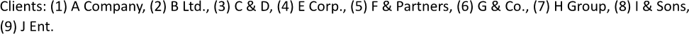

Getting an index of a collection item during building a report allows for efficient identification and reference to specific
records within a dataset, enabling quick access to essential information. This capability enhances the clarity of the data by
ensuring that users can easily locate and review relevant items within the larger context. You can get a collection item index
while making a report using LINQ Reporting Engine in C#.

## How to Get a Collection Item Index

{}

Although this guide deals with a text block, the same approach can be applied everywhere `foreach` tags are used, for instance,
within [lists](), [tables](), 
[charts](), and others.

{}

1. Prepare data for your report in one of [formats supported by LINQ Reporting Engine](),
for example, a JSON file as follows:




2. In Microsoft Word, bind a text block within a paragraph to a data collection by adding an opening `foreach` tag to the beginning
of the block as per the example:

<<foreach [in items]>>


3. Add a closing `foreach` tag to the end of the text block like that:

<</foreach>>


4. Bind the text block to values calculated upon a collection item index by adding expression tags to the block between
the opening and closing `foreach` tags and referencing the index in one of the following ways as per your requirements:

    * To utilize [the zero-based index](https://en.wikipedia.org/wiki/Zero-based_numbering) of a collection item, apply
the `IndexOf` built-in extension method, for instance, this way:

<<[IndexOf() == 0 ? "" : ", "]>>


    * To obtain the one-based index of a collection item, use the `NumberOf` built-in extension method similarly to this:

<<[NumberOf()]>>


{}

`IndexOf` and `NumberOf` are accessible only within the scope of a `foreach` tag.

{}

5. Bind the text block to values calculated upon an item of the collection by adding expression tags to the block between
the opening and closing `foreach` tags such as the following one:

<<[client]>>


6. Review your item index getting template before saving. Depending on your use cases, the template may look like this:\
\

6. Build your report getting a collection item index using LINQ Reporting Engine by running the following C# code:\


## Item Index Getting Report Example

After taking all the steps, LINQ Reporting Engine creates an item index getting report as follows:\
\

{}

You can download the [template
](https://github.com/aspose-words/Aspose.Words-for-.NET/raw/ivan.lyagin/UEX-331/Examples/Data/LINQ/Item%20Index%20Getting%20Template.docx)
and [data
](https://github.com/aspose-words/Aspose.Words-for-.NET/raw/ivan.lyagin/UEX-331/Examples/Data/LINQ/Item%20Index%20Getting%20Data.json)
from the example, and try to make a report getting a collection item index online for free by using one of the options:\
<a class="product-item docs-btn" href="https://products.aspose.app/words/assembly" >APP </a>
<a class="product-item docs-btn" href="https://products.aspose.com/words/net/report/" >.NET API </a>
<a class="product-item docs-btn" href="https://products.aspose.com/words/python-net/report/" >
PYTHON via <em class="docs-vianet">net</em> API</a>
 
 

{}

## See Also

- [Binding Collections]()
- [Binding Data]()
- [LINQ Reporting Engine]()
- [ReportingEngine Class](https://reference.aspose.com/words/net/aspose.words.reporting/reportingengine/)

{}