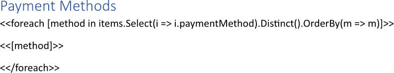
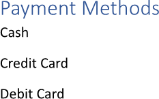

Getting unique collection items during building a report eliminates duplicates, providing a clear and concise overview of
distinct data points. This process helps users focus on the variety of items or categories represented, enabling better
analysis of trends and patterns without redundancy. You can get unique collection items while making a report using LINQ
Reporting Engine in C#.

## How to Get Unique Collection Items

{}

Although this guide deals with text blocks, the same approach can be applied to any template blocks such as
[lists](), [table rows and columns](), 
[charts](), and others.

{}

1. Prepare data for your report in one of [formats supported by LINQ Reporting Engine](),
for example, a JSON file as follows:




2. In Microsoft Word, bind a text block to a data collection by adding an opening `foreach` tag to the beginning of the block
and excluding duplicate collection items using [the `Distinct` LINQ extension
method](https://learn.microsoft.com/en-us/dotnet/api/system.linq.enumerable.distinct?view=net-9.0#system-linq-enumerable-distinct-1(system-collections-generic-ienumerable((-0))))
as per the example:

<<foreach [method in items.Select(i => i.paymentMethod).Distinct().OrderBy(m => m)]>>


{}

In this case, [a collection projection is applied using
`Select`]() to form a collection to exclude duplicate items from. Also, since
the projection does not imply any ordering, the result collection is further [sorted using
`OrderBy`]() to get consistent output as shown in the example. Depending on structure of
your data, these extra steps may be not needed.

{}

3. Add a closing `foreach` tag to the end of the text block like that:

<</foreach>>


4. Bind the text block to values calculated upon an item of the result collection by adding expression tags to the block
between the opening and closing `foreach` tags such as the following one:

<<[method]>>


5. Review your unique collection items getting template before saving, it should look like this:\
\

6. Build your report getting unique collection items using LINQ Reporting Engine by running the following C# code:\


## Unique Collection Items Getting Report Example

After taking all the steps, LINQ Reporting Engine creates a unique collection items getting report as follows:\
\

{}

You can download the [template
](https://github.com/aspose-words/Aspose.Words-for-.NET/raw/ivan.lyagin/UEX-331/Examples/Data/LINQ/Unique%20Collection%20Items%20Getting%20Template.docx)
and [data
](https://github.com/aspose-words/Aspose.Words-for-.NET/raw/ivan.lyagin/UEX-331/Examples/Data/LINQ/Unique%20Collection%20Items%20Getting%20Data.json)
from the example, and try to make a report getting unique collection items online for free by using one of the options:\
<a class="product-item docs-btn" href="https://products.aspose.app/words/assembly" >APP </a>
<a class="product-item docs-btn" href="https://products.aspose.com/words/net/report/" >.NET API </a>
<a class="product-item docs-btn" href="https://products.aspose.com/words/python-net/report/" >
PYTHON via <em class="docs-vianet">net</em> API</a>
 
 

{}

## See Also

- [Binding Collections]()
- [Binding Data]()
- [LINQ Reporting Engine]()
- [ReportingEngine Class](https://reference.aspose.com/words/net/aspose.words.reporting/reportingengine/)

{}