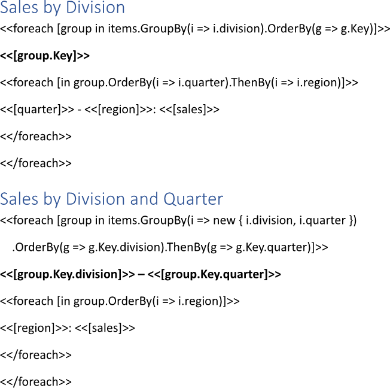
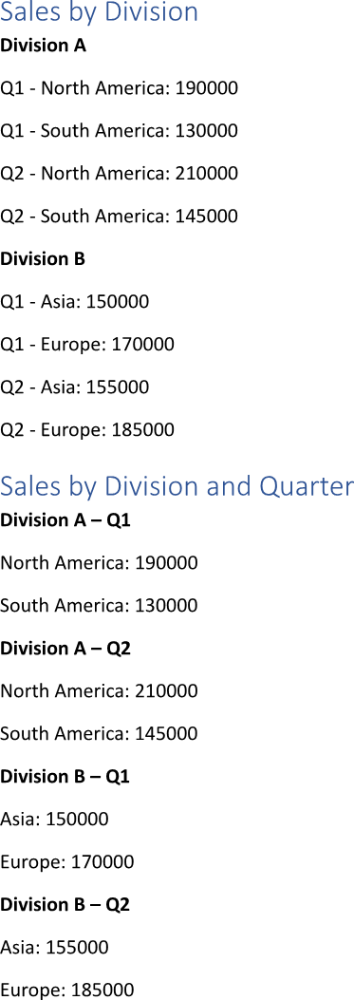

Grouping collection items during building a report consolidates related data into aggregated categories, facilitating
navigation and understanding of the information presented. This approach enhances data analysis by providing insights into
different segments of the data, making it easier for users to understand trends and make comparisons within the dataset.
You can group collection items while making a report using LINQ Reporting Engine in C#.

## How to Group Collection Items

{}

Although this guide deals with text blocks, the same approach can be applied to any template blocks such as
[lists](), [table rows and columns](), 
[charts](), and others.

{}

1. Prepare data for your report in one of [formats supported by LINQ Reporting Engine](),
for example, a JSON file as follows:




2. In Microsoft Word, bind a text block to a data collection by adding an opening `foreach` tag to the beginning of the block
and applying grouping of collection items in one of the following ways as per your requirements:

    * To group collection items according to a single key, use [the `GroupBy` LINQ extension
method](https://learn.microsoft.com/en-us/dotnet/api/system.linq.enumerable.groupby?view=net-9.0#system-linq-enumerable-groupby-2(system-collections-generic-ienumerable((-0))-system-func((-0-1))))
with a selector function returning the key, for instance, like so:

<<foreach [group in items.GroupBy(i => i.division).OrderBy(g => g.Key)]>>


    * To group collection items according to multiple keys, apply the `GroupBy` LINQ extension method with a selector function
returning an instance of [an anonymous type](https://learn.microsoft.com/en-us/dotnet/csharp/fundamentals/types/anonymous-types)
with properties initialized upon the keys similarly to this:

<<foreach [group in items.GroupBy(i => new { i.division, i.quarter }).OrderBy(g => g.Key.division).ThenBy(g => g.Key.quarter)]>>


{}

Since grouping itself does not imply ordering, it often makes sense to [sort groups of items]()
using the `OrderBy`, `OrderByDescending`, `ThenBy`, and `ThenByDescending` LINQ extension methods in order to get consistent
output as shown in this guide.

{}

3. Add a closing `foreach` tag to the end of the text block like that:

<</foreach>>


4. Bind the text block to values calculated upon [the Key
property](https://learn.microsoft.com/en-us/dotnet/api/system.linq.igrouping-2.key?view=net-9.0#system-linq-igrouping-2-key)
of a group of collection items by adding expression tags to the block between the opening and closing `foreach` tags such as
the following ones depending on how the group's key was initialized:

<<[group.Key]>>


<<[group.Key.division]>>


<<[group.Key.quarter]>>


5. Bind an inner text block to items of a group by adding an inner opening `foreach` tag before the outer closing `foreach` tag
and applying ordering to the items as per one of the examples according to your scenario:

<<foreach [in group.OrderBy(i => i.quarter).ThenBy(i => i.region)]>>


<<foreach [in group.OrderBy(i => i.region)]>>


{}

Ordering of collection items forming a group is used under the same reasoning as ordering of groups themselves and can be
omitted, if needed.

{}

6. Add an inner closing `foreach` tag before the outer closing `foreach` tag this way:

<</foreach>>


7. Bind the inner text block to values calculated upon an item of a group by adding expression tags to the block between
the inner opening and closing `foreach` tags like the following ones:

<<[quarter]>>


<<[region]>>


<<[sales]>>


8. Review your collection items grouping template before saving. Depending on your use cases, the template should contain one or
several blocks that look like these:\
\

9. Build your report grouping collection items using LINQ Reporting Engine by running the following C# code:\


## Collection Items Grouping Report Example

After taking all the steps, LINQ Reporting Engine creates a collection items grouping report as follows:\
\

{}

You can download the [template
](https://github.com/aspose-words/Aspose.Words-for-.NET/raw/ivan.lyagin/UEX-331/Examples/Data/LINQ/Collection%20Items%20Grouping%20Template.docx)
and [data
](https://github.com/aspose-words/Aspose.Words-for-.NET/raw/ivan.lyagin/UEX-331/Examples/Data/LINQ/Collection%20Items%20Grouping%20Data.json)
from the example, and try to make a report grouping collection items online for free by using one of the options:\
<a class="product-item docs-btn" href="https://products.aspose.app/words/assembly" >APP </a>
<a class="product-item docs-btn" href="https://products.aspose.com/words/net/report/" >.NET API </a>
<a class="product-item docs-btn" href="https://products.aspose.com/words/python-net/report/" >
PYTHON via <em class="docs-vianet">net</em> API</a>
 
 

{}

## See Also

- [Sorting Collection]()
- [Binding Collections]()
- [Binding Data]()
- [LINQ Reporting Engine]()
- [ReportingEngine Class](https://reference.aspose.com/words/net/aspose.words.reporting/reportingengine/)

{}