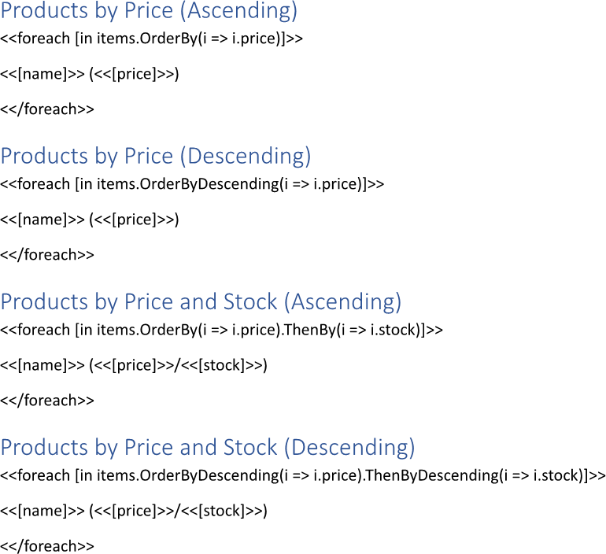
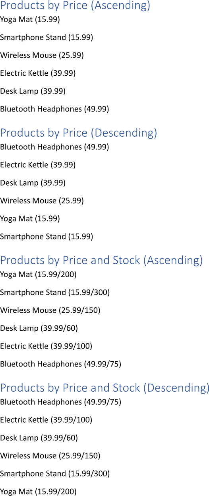

[Sorting a collection](https://en.wikipedia.org/wiki/Sorting) during building a report organizes data in a meaningful order,
making it easier to identify patterns, trends, and outliers. This structured presentation enhances readability and allows users
to quickly analyze information, facilitating informed decision-making based on prioritized insights. You can sort a collection
while making a report using LINQ Reporting Engine in C#.

## How to Sort a Collection

{}

Although this guide deals with text blocks, the same approach can be applied to any template blocks such as
[lists](), [table rows and columns](), 
[charts](), and others.

{}

1. Prepare data for your report in one of [formats supported by LINQ Reporting Engine](),
for example, a JSON file as follows:




2. In Microsoft Word, bind a text block to a data collection by adding an opening `foreach` tag to the beginning of the block
and applying collection sorting in one of the following ways as per your requirements:

    * To sort collection items in ascending order according to a key, use [the `OrderBy` LINQ extension
method](https://learn.microsoft.com/en-us/dotnet/api/system.linq.enumerable.orderby?view=net-8.0#system-linq-enumerable-orderby-2(system-collections-generic-ienumerable((-0))-system-func((-0-1)))),
for instance, like so:

<<foreach [in items.OrderBy(i => i.price)]>>


    * To sort collection items in descending order according to a key, apply [the `OrderByDescending` LINQ extension
method](https://learn.microsoft.com/en-us/dotnet/api/system.linq.enumerable.orderbydescending?view=net-8.0#system-linq-enumerable-orderbydescending-2(system-collections-generic-ienumerable((-0))-system-func((-0-1))))
as per the example:

<<foreach [in items.OrderByDescending(i => i.price)]>>


    * To sort collection items in ascending order according to multiple keys, use the `OrderBy` and
[`ThenBy`](https://learn.microsoft.com/en-us/dotnet/api/system.linq.enumerable.thenby?view=net-8.0#system-linq-enumerable-thenby-2(system-linq-iorderedenumerable((-0))-system-func((-0-1))))
LINQ extension methods (the latter can be applied several times), for instance, this way:

<<foreach [in items.OrderBy(i => i.price).ThenBy(i => i.stock)]>>


    * To sort collection items in descending order according to multiple keys, use the `OrderByDescending` and
[`ThenByDescending`](https://learn.microsoft.com/en-us/dotnet/api/system.linq.enumerable.thenbydescending?view=net-8.0#system-linq-enumerable-thenbydescending-2(system-linq-iorderedenumerable((-0))-system-func((-0-1))))
LINQ extension methods (the latter can be applied several times) similarly to this:

<<foreach [in items.OrderByDescending(i => i.price).ThenByDescending(i => i.stock)]>>


{}

`OrderBy` and `OrderByDescending` as well as `ThenBy` and `ThenByDescending` can be used interchangeably. Thus, you can mix
ascending and descending ordering any way you need.

{}

3. Add a closing `foreach` tag to the end of the text block like that:

<</foreach>>


4. Bind the text block to values calculated upon an item of the collection by adding expression tags to the block between
the opening and closing `foreach` tags such as the following ones:

<<[name]>>


<<[price]>>


<<[stock]>>


5. Review your collection sorting template before saving. Depending on your use cases, the template should contain one or
several blocks that look like these:\
\

6. Build your report sorting a collection using LINQ Reporting Engine by running the following C# code:\


## Collection Sorting Report Example

After taking all the steps, LINQ Reporting Engine creates a collection sorting report as follows:\
\

{}

You can download the [template
](https://github.com/aspose-words/Aspose.Words-for-.NET/raw/ivan.lyagin/UEX-331/Examples/Data/LINQ/Collection%20Sorting%20Template.docx)
and [data
](https://github.com/aspose-words/Aspose.Words-for-.NET/raw/ivan.lyagin/UEX-331/Examples/Data/LINQ/Collection%20Sorting%20Data.json)
from the example, and try to make a report sorting a collection online for free by using one of the options:\
<a class="product-item docs-btn" href="https://products.aspose.app/words/assembly" >APP </a>
<a class="product-item docs-btn" href="https://products.aspose.com/words/net/report/" >.NET API </a>
<a class="product-item docs-btn" href="https://products.aspose.com/words/python-net/report/" >
PYTHON via <em class="docs-vianet">net</em> API</a>
 
 

{}

## See Also

- [Binding Collections]()
- [Binding Data]()
- [LINQ Reporting Engine]()
- [ReportingEngine Class](https://reference.aspose.com/words/net/aspose.words.reporting/reportingengine/)

{}