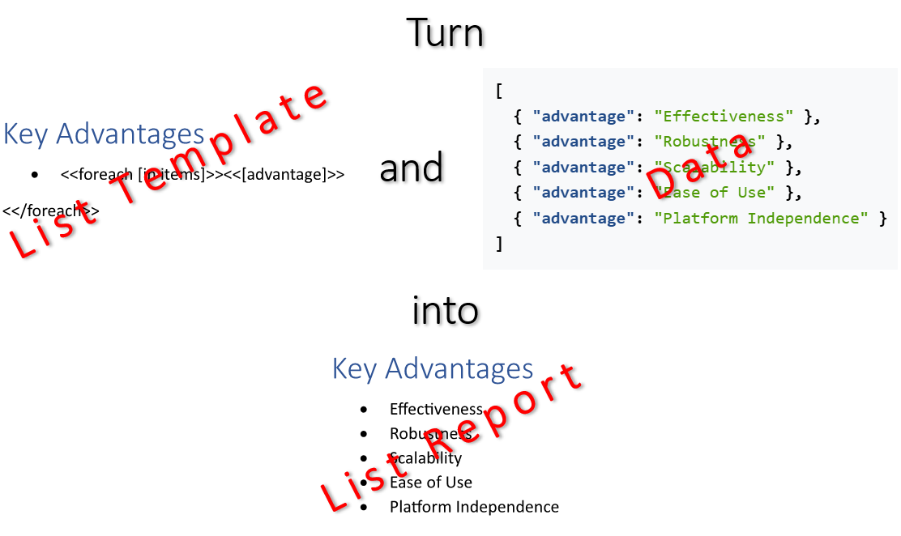

[Lists](https://en.wikipedia.org/wiki/List) enhance clarity and readability, enabling readers to quickly scan, understand,
and retain key information without being overwhelmed by dense paragraphs. They serve as an essential organizational tool that
emphasizes important points and simplifies complex information effectively. You can make a list by filling a template document
with data using LINQ Reporting Engine in C#.\
\

The process of building a list incorporates the following steps:

1. Preparing data for the list in one of [supported formats]()

2. Creating a list template in Microsoft Word

3. Running C# code invoking [LINQ Reporting Engine
APIs](https://reference.aspose.com/words/net/aspose.words.reporting/reportingengine/)

{}

A typical list template represents a regular one-paragraph Microsoft Word list with special tags added to it: An opening
`foreach` tag binding the list to a data collection and expression tags binding the paragraph with values calculated upon
an item of the collection, and one paragraph after the list with a closing `foreach` tag added.

{}

To learn more on how to make a list of a particular type with LINQ Reporting Engine in C# and use advanced features of
list building, please refer to the following sections:



{}