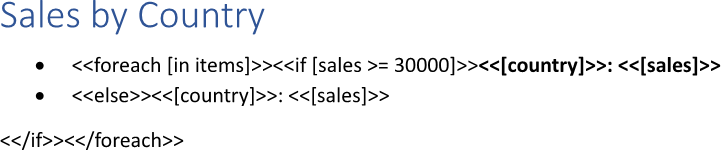
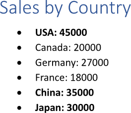
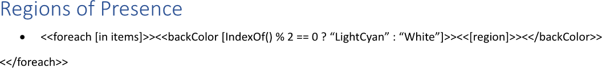
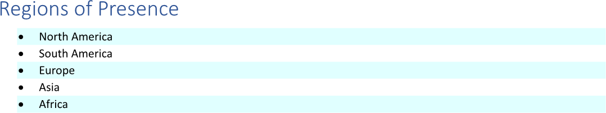
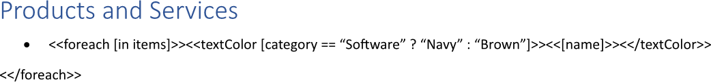
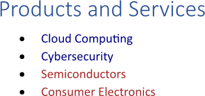

Applying conditional formatting to list items is useful because it improves data visualization and directs the reader's
attention to critical information, patterns, and trends at a glance. By using visual cues like colors or font changes based on
specific criteria, it transforms raw data into an easily digestible and actionable format. You can apply conditional formatting
to list items using LINQ Reporting Engine in C#.

## How to Apply Conditional Formatting to List Items

{}

This guide deals with a list with items bound to a collection. However, you can apply a similar approach to lists of static
structure as well.

{}

1. Prepare data for your list in one of [formats supported by LINQ Reporting Engine](),
for example, a JSON file as follows:




2. In Microsoft Word, [create a bulleted or numbered
list](https://support.microsoft.com/en-us/office/create-a-bulleted-or-numbered-list-9ff81241-58a8-4d88-8d8c-acab3006a23e)
with two empty paragraphs and [format the
list](https://support.microsoft.com/en-us/office/change-the-color-size-or-format-of-bullets-or-numbers-in-a-list-in-word-005b7248-75e4-465e-85cc-9f768af03836)
to use it as a template.

3. Bind the two paragraphs to a data collection to repeat the paragraphs for every item of the collection by adding an opening
`foreach` tag to the beginning of the first paragraph as per the example:

<<foreach [in items]>>


4. Bind visibility of the first paragraph to a Boolean value calculated upon an item of the collection by adding an opening
`if` tag to the paragraph after the opening `foreach` tag, for instance, like this:

<<if [sales >= 30000]>>


5. Bind visibility of the second paragraph to the opposite value by adding an `else` tag to the beginning of the second
paragraph this way:

<<else>>


6. Bind the first paragraph to values calculated upon an item of the data collection by adding expression tags after the opening
`if` tag such as the following ones:

<<[country]>>


<<[sales]>>


7. Bind the second paragraph to the same values by adding the same expression tags after the `else` tag.

8. Apply different formatting to every of the two paragraphs depending on your needs.

9. Right after the second paragraph, add one more paragraph without a bulleted or numbered list and put a closing `if` tag into
the new paragraph like so:

<</if>>


10. Add a closing `foreach` tag after the closing `if` tag in this fashion:

<</foreach>>


11. Review your list template before saving, it should look like this:\
\

12. Build your list using LINQ Reporting Engine by running the following C# code:\


## List with Conditional Formatting Applied to Items Report Example

After taking all the steps, LINQ Reporting Engine creates a list report as follows:\
\

{}

You can download the [template
](https://github.com/aspose-words/Aspose.Words-for-.NET/raw/ivan.lyagin/UEX-331/Examples/Data/LINQ/List%20with%20Conditional%20Formatting%20Applied%20to%20Items%20Template.docx)
and [data
](https://github.com/aspose-words/Aspose.Words-for-.NET/raw/ivan.lyagin/UEX-331/Examples/Data/LINQ/List%20with%20Conditional%20Formatting%20Applied%20to%20Items%20Data.json)
from the example, and try to apply conditional formatting to list items online for free by using one of the options:\
<a class="product-item docs-btn" href="https://products.aspose.app/words/assembly" >APP </a>
<a class="product-item docs-btn" href="https://products.aspose.com/words/net/report/" >.NET API </a>
<a class="product-item docs-btn" href="https://products.aspose.com/words/python-net/report/" >
PYTHON via <em class="docs-vianet">net</em> API</a>
 
 

{}

## How to Apply Background Colors to List Items

{}

This guide provides a shortcut method for applying only background colors to list items.

{}

1. Prepare data for your list in one of [formats supported by LINQ Reporting Engine](),
for example, a JSON file as follows:




2. In Microsoft Word, [create a bulleted or numbered
list](https://support.microsoft.com/en-us/office/create-a-bulleted-or-numbered-list-9ff81241-58a8-4d88-8d8c-acab3006a23e)
with a single empty paragraph and [format the
list](https://support.microsoft.com/en-us/office/change-the-color-size-or-format-of-bullets-or-numbers-in-a-list-in-word-005b7248-75e4-465e-85cc-9f768af03836)
to use it as a template.

3. Bind the paragraph to a data collection to repeat the paragraph for every item of the collection by adding an opening
`foreach` tag to the beginning of the paragraph as per the example:

<<foreach [in items]>>


4. Bind the background color of the paragraph to a [color value]() calculated upon an item
of the collection by adding an opening `backColor` tag to the paragraph after the opening `foreach` tag, for instance, like so:

<<backColor [IndexOf() % 2 == 0 ? "LightCyan" : "White"]>>


{}

A color value can be directly stored in a data source, for example, as a property of an item of a collection bound to the list.

{}

5. Bind the paragraph to values calculated upon an item of the data collection by adding expression tags after the opening
`backColor` tag such as the following one:

<<[region]>>


6. Add a closing `backColor` tag at the end of the paragraph this way:

<</backColor>>


7. Right after the paragraph, add one more paragraph without a bulleted or numbered list and put a closing `foreach` tag into
the new paragraph in this fashion:

<</foreach>>


8. Review your list template before saving, it should look like this:\
\

9. Build your list using LINQ Reporting Engine by running the following C# code:\


## List with Background Colors Applied to Items Report Example

After taking all the steps, LINQ Reporting Engine creates a list report as follows:\
\

{}

You can download the [template
](https://github.com/aspose-words/Aspose.Words-for-.NET/raw/ivan.lyagin/UEX-331/Examples/Data/LINQ/List%20with%20Background%20Colors%20Applied%20to%20Items%20Template.docx)
and [data
](https://github.com/aspose-words/Aspose.Words-for-.NET/raw/ivan.lyagin/UEX-331/Examples/Data/LINQ/List%20with%20Background%20Colors%20Applied%20to%20Items%20Data.json)
from the example, and try to apply background colors to list items online for free by using one of the options:\
<a class="product-item docs-btn" href="https://products.aspose.app/words/assembly" >APP </a>
<a class="product-item docs-btn" href="https://products.aspose.com/words/net/report/" >.NET API </a>
<a class="product-item docs-btn" href="https://products.aspose.com/words/python-net/report/" >
PYTHON via <em class="docs-vianet">net</em> API</a>
 
 

{}

## How to Apply Text Colors to List Items

{}

This guide provides a shortcut method for applying only text colors to list items.

{}

1. Prepare data for your list in one of [formats supported by LINQ Reporting Engine](),
for example, a JSON file as follows:




2. In Microsoft Word, [create a bulleted or numbered
list](https://support.microsoft.com/en-us/office/create-a-bulleted-or-numbered-list-9ff81241-58a8-4d88-8d8c-acab3006a23e)
with a single empty paragraph and [format the
list](https://support.microsoft.com/en-us/office/change-the-color-size-or-format-of-bullets-or-numbers-in-a-list-in-word-005b7248-75e4-465e-85cc-9f768af03836)
to use it as a template.

3. Bind the paragraph to a data collection to repeat the paragraph for every item of the collection by adding an opening
`foreach` tag to the beginning of the paragraph as per the example:

<<foreach [in items]>>


4. Bind the text color of the paragraph to a [color value]() calculated upon an item
of the collection by adding an opening `textColor` tag to the paragraph after the opening `foreach` tag, for instance, like so:

<<textColor [category == "Software" ? "Navy" : "Brown"]>>


{}

A color value can be directly stored in a data source, for example, as a property of an item of a collection bound to the list.

{}

5. Bind the paragraph to values calculated upon an item of the data collection by adding expression tags after the opening
`textColor` tag such as the following one:

<<[name]>>


6. Add a closing `textColor` tag at the end of the paragraph this way:

<</textColor>>


7. Right after the paragraph, add one more paragraph without a bulleted or numbered list and put a closing `foreach` tag into
the new paragraph in this fashion:

<</foreach>>


8. Review your list template before saving, it should look like this:\
\

9. Build your list using LINQ Reporting Engine by running the following C# code:\


## List with Text Colors Applied to Items Report Example

After taking all the steps, LINQ Reporting Engine creates a list report as follows:\
\

{}

You can download the [template
](https://github.com/aspose-words/Aspose.Words-for-.NET/raw/ivan.lyagin/UEX-331/Examples/Data/LINQ/List%20with%20Text%20Colors%20Applied%20to%20Items%20Template.docx)
and [data
](https://github.com/aspose-words/Aspose.Words-for-.NET/raw/ivan.lyagin/UEX-331/Examples/Data/LINQ/List%20with%20Text%20Colors%20Applied%20to%20Items%20Data.json)
from the example, and try to apply text colors to list items online for free by using one of the options:\
<a class="product-item docs-btn" href="https://products.aspose.app/words/assembly" >APP </a>
<a class="product-item docs-btn" href="https://products.aspose.com/words/net/report/" >.NET API </a>
<a class="product-item docs-btn" href="https://products.aspose.com/words/python-net/report/" >
PYTHON via <em class="docs-vianet">net</em> API</a>
 
 

{}

{}

## See Also

- [Building Lists]()
- [Binding Collections]()
- [LINQ Reporting Engine]()
- [ReportingEngine Class](https://reference.aspose.com/words/net/aspose.words.reporting/reportingengine/)

{}