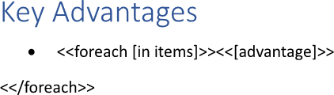
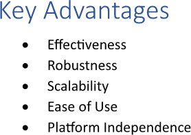

[Bulleted lists](https://en.wikipedia.org/wiki/Bullet_(typography)) are useful for breaking up dense text and improving
readability, allowing readers to quickly scan and absorb information. They highlight a series of related points of equal
importance, ensuring key takeaways are easily identifiable and memorable. You can make a bulleted list using LINQ Reporting
Engine in C#.

## How to Build a Bulleted List

1. Prepare data for your list in one of [formats supported by LINQ Reporting Engine](),
for example, a JSON file as follows:




2. In Microsoft Word, [create a bulleted
list](https://support.microsoft.com/en-us/office/create-a-bulleted-or-numbered-list-9ff81241-58a8-4d88-8d8c-acab3006a23e)
with a single empty paragraph and [format the
list](https://support.microsoft.com/en-us/office/change-the-color-size-or-format-of-bullets-or-numbers-in-a-list-in-word-005b7248-75e4-465e-85cc-9f768af03836)
to use it as a template.

3. Bind the paragraph to a data collection to repeat the paragraph for every item of the collection by adding an opening
`foreach` tag to the beginning of the paragraph as per the example:

<<foreach [in items]>>


4. Bind the paragraph to values calculated upon an item of the data collection by adding expression tags after the opening
`foreach` tag such as the following one:

<<[advantage]>>


5. Right after the paragraph, add one more paragraph without a bulleted list and put a closing `foreach` tag into the new
paragraph like so:

<</foreach>>


6. Review your list template before saving, it should look like this:\
\

7. Build your list using LINQ Reporting Engine by running the following C# code:\


## Bulleted List Report Example

After taking all the steps, LINQ Reporting Engine creates a list report as follows:\
\

{}

You can download the [template
](https://github.com/aspose-words/Aspose.Words-for-.NET/raw/ivan.lyagin/UEX-331/Examples/Data/LINQ/Bulleted%20List%20Template.docx)
and [data
](https://github.com/aspose-words/Aspose.Words-for-.NET/raw/ivan.lyagin/UEX-331/Examples/Data/LINQ/Bulleted%20List%20Data.json)
from the example, and try to make a bulleted list online for free by using one of the options:\
<a class="product-item docs-btn" href="https://products.aspose.app/words/assembly" >APP </a>
<a class="product-item docs-btn" href="https://products.aspose.com/words/net/report/" >.NET API </a>
<a class="product-item docs-btn" href="https://products.aspose.com/words/python-net/report/" >
PYTHON via <em class="docs-vianet">net</em> API</a>
 
 

{}

## See Also

- [Building Lists]()
- [Binding Collections]()
- [LINQ Reporting Engine]()
- [ReportingEngine Class](https://reference.aspose.com/words/net/aspose.words.reporting/reportingengine/)

{}