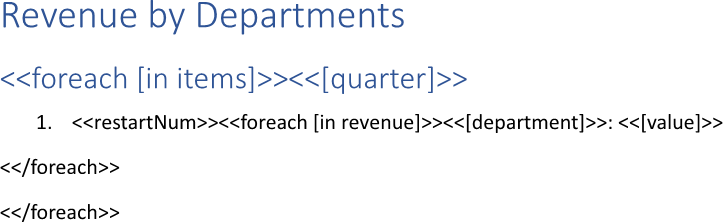
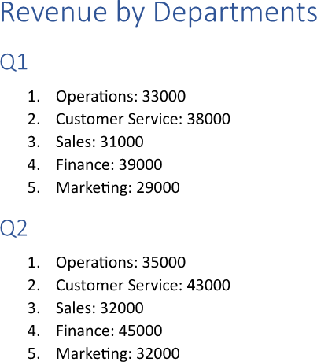

Restarting list numbering is useful for maintaining logical structure and clarity when a list is interrupted by other content
or when a new, distinct sequence of steps or items begins. It helps readers understand that a new, independent set of
information, such as a different procedure or a list within a new section, is being presented. You can restart list numbering
using LINQ Reporting Engine in C#.

## How to Restart List Numbering

{}

This guide deals with [master-detail data](https://en.wikipedia.org/wiki/Master%E2%80%93detail_interface#Data_model) to restart
numbering of a list of detail items for every item of a master data collection. This technique is helpful, because detail items
of all master items would belong to a single numbered list otherwise. However, numbering of any arbitrary list can be restarted
in a similar way, for instance, when [inserting sub-templates]().

{}

1. Prepare data for your lists in one of [formats supported by LINQ Reporting Engine](),
for example, a JSON file as follows:




2. In Microsoft Word, bind a text fragment to a master data collection by adding an opening `foreach` tag to the fragment's
beginning to repeat the fragment for every item of the collection as per the example:

<<foreach [in items]>>


3. Add a closing `foreach` tag to the end of the fragment like so:

<</foreach>>


4. Bind the fragment to values calculated upon an item of the master data collection by adding expression tags to the fragment
after the opening `foreach` tag such as the following one:

<<[quarter]>>


5. Add a new paragraph to the fragment (the paragraph should be located after the opening and before the closing `foreach` tags)
and [create a numbered
list](https://support.microsoft.com/en-us/office/create-a-bulleted-or-numbered-list-9ff81241-58a8-4d88-8d8c-acab3006a23e)
for the paragraph.

6. Make list numbering restart for every item of the master data collection by adding a `restartNum` tag to the beginning of
the paragraph like that:

<<restartNum>>


7. Bind the paragraph to a detail data collection calculated upon an item of the master data collection to repeat
the paragraph for every item of the detail collection by adding an inner opening `foreach` tag to the paragraph after
the `restartNum` tag, for instance, as follows:

<<foreach [in revenue]>>


8. Bind the paragraph to values calculated upon an item of the detail data collection by adding expression tags after
the inner opening `foreach` tag similar to these:

<<[department]>>


<<[value]>>


9. Right after the paragraph, add one more paragraph without a numbered list and put an inner closing `foreach` tag into
the new paragraph this way:

<</foreach>>


10. Review your template with lists before saving, it should look like this:\
\

11. Build your lists using LINQ Reporting Engine by running the following C# code:\


## List Numbering Restarting Report Example

After taking all the steps, LINQ Reporting Engine creates a report with lists as follows:\
\

{}

You can download the [template
](https://github.com/aspose-words/Aspose.Words-for-.NET/raw/ivan.lyagin/UEX-331/Examples/Data/LINQ/List%20Numbering%20Restarting%20Template.docx)
and [data
](https://github.com/aspose-words/Aspose.Words-for-.NET/raw/ivan.lyagin/UEX-331/Examples/Data/LINQ/List%20Numbering%20Restarting%20Data.json)
from the example, and try to restart list numbering online for free by using one of the options:\
<a class="product-item docs-btn" href="https://products.aspose.app/words/assembly" >APP </a>
<a class="product-item docs-btn" href="https://products.aspose.com/words/net/report/" >.NET API </a>
<a class="product-item docs-btn" href="https://products.aspose.com/words/python-net/report/" >
PYTHON via <em class="docs-vianet">net</em> API</a>
 
 

{}

## See Also

- [Building Lists]()
- [Binding Collections]()
- [LINQ Reporting Engine]()
- [ReportingEngine Class](https://reference.aspose.com/words/net/aspose.words.reporting/reportingengine/)

{}