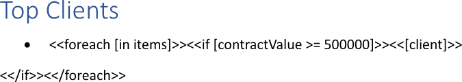
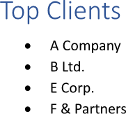

Showing a list item based on a condition is useful for improving relevance and focusing attention of the reader on critical
information. This dynamic filtering ensures that the user only sees data that is pertinent to specific criteria, making
a report more actionable and less cluttered. You can show list items based on a condition using LINQ Reporting Engine in C#.

## How to Show List Items Based on a Condition

{}

This guide focuses on usage of `if` tags nested to `foreach` tags within lists. However, showing list items based on
a condition can also be done using `foreach` tags with [filtering of
the collection]() applied. Also, a similar approach
with `if` tags can be used for showing a list item based on a condition within a static list with no `foreach` tags involved.

{}

1. Prepare data for your list in one of [formats supported by LINQ Reporting Engine](),
for example, a JSON file as follows:




2. In Microsoft Word, [create a bulleted or numbered
list](https://support.microsoft.com/en-us/office/create-a-bulleted-or-numbered-list-9ff81241-58a8-4d88-8d8c-acab3006a23e)
with a single empty paragraph and [format the
list](https://support.microsoft.com/en-us/office/change-the-color-size-or-format-of-bullets-or-numbers-in-a-list-in-word-005b7248-75e4-465e-85cc-9f768af03836)
to use it as a template.

3. Bind the paragraph to a data collection to repeat the paragraph for every item of the collection by adding an opening
`foreach` tag to the beginning of the paragraph as per the example:

<<foreach [in items]>>


4. Bind visibility of the paragraph to be shown based on a condition to a Boolean value calculated upon an item of
the collection by adding an opening `if` tag after the opening `foreach` tag, for instance, like this:

<<if [contractValue >= 500000]>>


5. Bind the paragraph to values calculated upon an item of the data collection by adding expression tags after the opening
`if` tag such as the following one:

<<[client]>>


6. Right after the paragraph, add one more paragraph without a bulleted or numbered list and put a closing `if` tag into the new
paragraph like so:

<</if>>


7. Add a closing `foreach` tag after the closing `if` tag this way:

<</foreach>>


8. Review your list template before saving, it should look like this:\
\

9. Build your list using LINQ Reporting Engine by running the following C# code:\


## List with Items Shown Based on a Condition Report Example

After taking all the steps, LINQ Reporting Engine creates a list report as follows:\
\

{}

You can download the [template
](https://github.com/aspose-words/Aspose.Words-for-.NET/raw/ivan.lyagin/UEX-331/Examples/Data/LINQ/List%20with%20Items%20Shown%20Based%20on%20Condition%20Template.docx)
and [data
](https://github.com/aspose-words/Aspose.Words-for-.NET/raw/ivan.lyagin/UEX-331/Examples/Data/LINQ/List%20with%20Items%20Shown%20Based%20on%20Condition%20Data.json)
from the example, and try to show list items based on a condition online for free by using one of the options:\
<a class="product-item docs-btn" href="https://products.aspose.app/words/assembly" >APP </a>
<a class="product-item docs-btn" href="https://products.aspose.com/words/net/report/" >.NET API </a>
<a class="product-item docs-btn" href="https://products.aspose.com/words/python-net/report/" >
PYTHON via <em class="docs-vianet">net</em> API</a>
 
 

{}

## See Also

- [Building Lists]()
- [Binding Collections]()
- [LINQ Reporting Engine]()
- [ReportingEngine Class](https://reference.aspose.com/words/net/aspose.words.reporting/reportingengine/)

{}