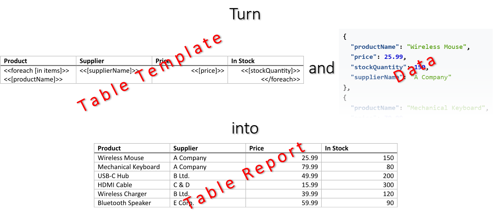

[Tables](https://en.wikipedia.org/wiki/Table_(information)) are an effective way to organize and present data in a clear and
concise manner, allowing readers to easily compare and analyze information. By structuring data into rows and columns, tables
help highlight relationships and patterns that might be overlooked in a narrative format. You can make a table by filling
a template document with data using LINQ Reporting Engine in C#.\
\

The process of building a table incorporates the following steps:

1. Preparing data for the table in one of [supported formats]()

2. Creating a table template in Microsoft Word

3. Running C# code invoking [LINQ Reporting Engine
APIs](https://reference.aspose.com/words/net/aspose.words.reporting/reportingengine/)

{}

A typical table template represents a regular Microsoft Word table with special tags added to its cells: Opening and closing
`foreach` tags binding the table to a data collection, and expression tags binding table cells with values calculated upon
an item of the collection.

{}

To learn more on how to make a table of a particular type with LINQ Reporting Engine in C# and use advanced features of
table building, please refer to the following sections:



{}