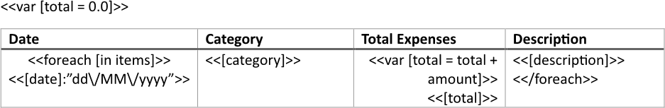
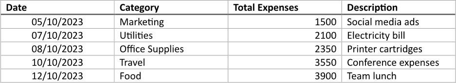

Adding a [running total](https://en.wikipedia.org/wiki/Running_total) to a table provides a cumulative sum of values, allowing
users to easily track progress or changes over time within the dataset. This feature enhances data analysis by enabling users
to quickly understand trends and make informed decisions based on the overall performance rather than individual data points
alone. You can build a table with a running total using LINQ Reporting Engine in C#.

## How to Add a Running Total to a Table

1. Prepare data for your table in one of [formats supported by LINQ Reporting Engine](),
for example, a JSON file as follows:




2. In Microsoft Word, [define a variable]() to store a cumulative value
by adding a `var` tag like this:

<<var [total = 0.0]>>


3. [Create a
table](https://support.microsoft.com/en-us/office/insert-a-table-a138f745-73ef-4879-b99a-2f3d38be612a#platform=Windows)
with a necessary number of columns after the `var` tag and [format
elements of the table](https://support.microsoft.com/en-us/office/format-a-table-e6e77bc6-1f4e-467e-b818-2e2acc488006)
to use it as a template.

4. Add static content like headers to the table, if needed.

5. Bind the table to a data collection by adding an opening `foreach` tag to the beginning of a row to be repeated for every
item of the collection as per the example:

<<foreach [in items]>>


6. Add a closing `foreach` tag to the end of a row to be repeated for every item of the collection like so:

<</foreach>>


{}

Opening and closing `foreach` tags can be located in a single row or different rows of a single table to capture one or more
rows for repeating.

{}

7. Within the range between the opening and closing `foreach` tags, bind cells of the table to values calculated upon an item
of the collection by adding expression tags to the cells such as the following ones:

<<[date]:"dd\/MM\/yyyy">>


<<[category]>>


<<[description]>>


8. Within a cell to contain a running total, define a change of the variable storing a cumulative value by a value calculated
upon an item of the collection by adding a `var` tag to the cell similarly to this:

<<var [total = total + amount]>>


9. Bind the cell to the variable by adding an expression tag to the cell after the `var` tag, for instance, as follows:

<<[total]>>


10. Review your table template before saving, it should look like this:\
\

11. Build your table using LINQ Reporting Engine by running the following C# code:\


## Table with a Running Total Report Example

After taking all the steps, LINQ Reporting Engine creates a table report as follows:\
\

{}

You can download the [template
](https://github.com/aspose-words/Aspose.Words-for-.NET/raw/ivan.lyagin/UEX-331/Examples/Data/LINQ/Table%20with%20Running%20Total%20Template.docx)
and [data
](https://github.com/aspose-words/Aspose.Words-for-.NET/raw/ivan.lyagin/UEX-331/Examples/Data/LINQ/Table%20with%20Running%20Total%20Data.json)
from the example, and try to make a table with a running total online for free by using one of the options:\
<a class="product-item docs-btn" href="https://products.aspose.app/words/assembly" >APP </a>
<a class="product-item docs-btn" href="https://products.aspose.com/words/net/report/" >.NET API </a>
<a class="product-item docs-btn" href="https://products.aspose.com/words/python-net/report/" >
PYTHON via <em class="docs-vianet">net</em> API</a>
 
 

{}

## See Also

- [Building Tables]()
- [Binding Collections]()
- [Formatting Data]()
- [LINQ Reporting Engine]()
- [ReportingEngine Class](https://reference.aspose.com/words/net/aspose.words.reporting/reportingengine/)

{}