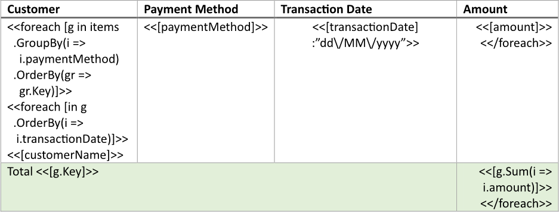
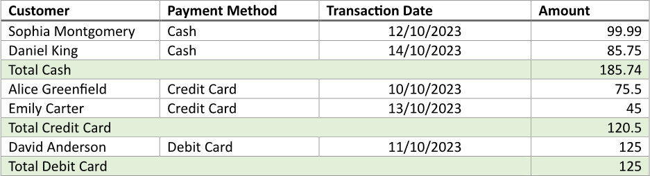

Adding subtotals to a table breaks down the cumulative values into smaller, more manageable sections, allowing users to see
intermediate totals for specific categories or groups. This approach enhances data analysis by providing insights into different
segments of the data, making it easier for users to understand trends and make comparisons within the dataset. You can build
a table with subtotals using LINQ Reporting Engine in C#.

## How to Add Subtotals to a Table

1. Prepare data for your table in one of [formats supported by LINQ Reporting Engine](),
for example, a JSON file as follows:




2. In Microsoft Word, [create a
table](https://support.microsoft.com/en-us/office/insert-a-table-a138f745-73ef-4879-b99a-2f3d38be612a#platform=Windows)
with a necessary number of columns and [format its
elements](https://support.microsoft.com/en-us/office/format-a-table-e6e77bc6-1f4e-467e-b818-2e2acc488006)
to use it as a template.

3. Add static content like headers to the table, if needed.

4. [Group items of a data collection](),
[order the groups](), and bind the table to the groups
by adding an opening `foreach` tag to the beginning of a row to be repeated for every group as per the example:

<<foreach [g in items.GroupBy(i => i.paymentMethod).OrderBy(gr => gr.Key)]>>


5. Add a closing `foreach` tag to the end of the next table row like so:

<</foreach>>


{}

Opening and closing `foreach` tags can be located in a single row or different rows of a single table to capture one or more
rows for repeating. In this example, two table rows are captured for a group to use one of the rows for displaying items of
the group and the other one as a subtotal.

{}

6. Bind cells of the table row containing the closing `foreach` tag to values calculated upon a group by adding expression tags
to the cells before the closing `foreach` tag such as the following ones:

<<[g.Key]>>


<<[g.Sum(i => i.amount)]>>


7. [Order items of a group]() and bind the table row
containing the opening `foreach` tag to the group to repeat the row for every item of the group by adding an inner opening
`foreach` tag to the beginning of the row after the outer opening `foreach` tag, for instance, as follows:

<<foreach [in g.OrderBy(i => i.transactionDate)]>>


8. Add an inner closing `foreach` tag to the end of the row this way:

<</foreach>>


9. Within the range between the inner opening and closing `foreach` tags, bind cells of the row to values calculated upon
an item of a group by adding expression tags to the cells similar to these:

<<[customerName]>>


<<[paymentMethod]>>


<<[transactionDate]:"dd\/MM\/yyyy">>


<<[amount]>>


10. Review your table template before saving, it should look like this:\
\

11. Build your table using LINQ Reporting Engine by running the following C# code:\


## Table with Subtotals Report Example

After taking all the steps, LINQ Reporting Engine creates a table report as follows:\
\

{}

You can download the [template
](https://github.com/aspose-words/Aspose.Words-for-.NET/raw/ivan.lyagin/UEX-331/Examples/Data/LINQ/Table%20with%20Subtotals%20Template.docx)
and [data
](https://github.com/aspose-words/Aspose.Words-for-.NET/raw/ivan.lyagin/UEX-331/Examples/Data/LINQ/Table%20with%20Subtotals%20Data.json)
from the example, and try to make a table with subtotals online for free by using one of the options:\
<a class="product-item docs-btn" href="https://products.aspose.app/words/assembly" >APP </a>
<a class="product-item docs-btn" href="https://products.aspose.com/words/net/report/" >.NET API </a>
<a class="product-item docs-btn" href="https://products.aspose.com/words/python-net/report/" >
PYTHON via <em class="docs-vianet">net</em> API</a>
 
 

{}

## See Also

- [Building Tables]()
- [Binding Collections]()
- [Formatting Data]()
- [LINQ Reporting Engine]()
- [ReportingEngine Class](https://reference.aspose.com/words/net/aspose.words.reporting/reportingengine/)

{}