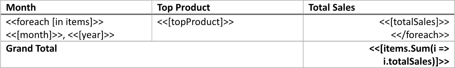
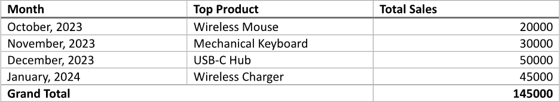

Adding a total to a table provides a quick reference point for the cumulative values of a specific column, allowing users to
easily assess overall performance or totals without having to calculate them manually. This feature enhances data analysis by
summarizing key information, making it simpler for users to draw insights and make informed decisions based on the aggregated
data. You can build a table with a total using LINQ Reporting Engine in C#.

## How to Add a Total to a Table

1. Prepare data for your table in one of [formats supported by LINQ Reporting Engine](),
for example, a JSON file as follows:




2. In Microsoft Word, [create a
table](https://support.microsoft.com/en-us/office/insert-a-table-a138f745-73ef-4879-b99a-2f3d38be612a#platform=Windows)
with a necessary number of columns and [format its
elements](https://support.microsoft.com/en-us/office/format-a-table-e6e77bc6-1f4e-467e-b818-2e2acc488006)
to use it as a template.

3. Add static content like headers to the table, if needed.

4. Bind the table to a data collection by adding an opening `foreach` tag to the beginning of a row to be repeated for every
item of the collection as per the example:

<<foreach [in items]>>


5. Add a closing `foreach` tag to the end of a row to be repeated for every item of the collection like so:

<</foreach>>


{}

Opening and closing `foreach` tags can be located in a single row or different rows of a single table to capture one or more
rows for repeating.

{}

6. Within the range between the opening and closing `foreach` tags, bind cells of the table to values calculated upon an item
of the collection by adding expression tags to the cells such as the following ones:

<<[month]>>


<<[year]>>


<<[topProduct]>>


<<[totalSales]>>


7. Bind a cell of the table's total row to a cumulative value calculated upon the collection by adding an expression tag to
the cell and [applying an aggregate function](),
for instance, this way:

<<[items.Sum(i => i.totalSales)]>>


8. Review your table template before saving, it should look like this:\
\

9. Build your table using LINQ Reporting Engine by running the following C# code:\


## Table with a Total Report Example

After taking all the steps, LINQ Reporting Engine creates a table report as follows:\
\

{}

You can download the [template
](https://github.com/aspose-words/Aspose.Words-for-.NET/raw/ivan.lyagin/UEX-331/Examples/Data/LINQ/Table%20with%20Total%20Template.docx)
and [data
](https://github.com/aspose-words/Aspose.Words-for-.NET/raw/ivan.lyagin/UEX-331/Examples/Data/LINQ/Table%20with%20Total%20Data.json)
from the example, and try to make a table with a total online for free by using one of the options:\
<a class="product-item docs-btn" href="https://products.aspose.app/words/assembly" >APP </a>
<a class="product-item docs-btn" href="https://products.aspose.com/words/net/report/" >.NET API </a>
<a class="product-item docs-btn" href="https://products.aspose.com/words/python-net/report/" >
PYTHON via <em class="docs-vianet">net</em> API</a>
 
 

{}

## See Also

- [Building Tables]()
- [Binding Collections]()
- [Formatting Data]()
- [LINQ Reporting Engine]()
- [ReportingEngine Class](https://reference.aspose.com/words/net/aspose.words.reporting/reportingengine/)

{}