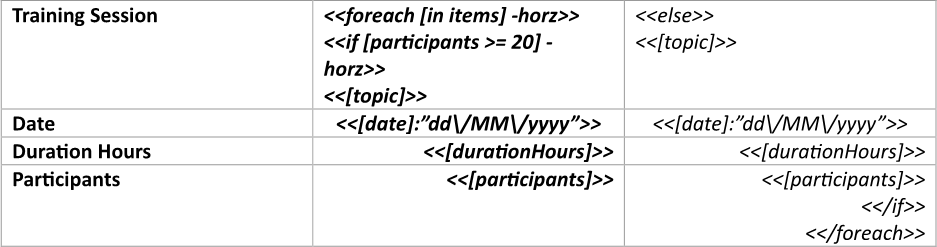
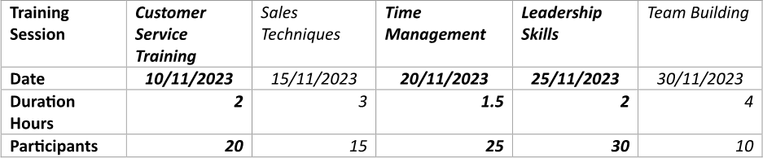
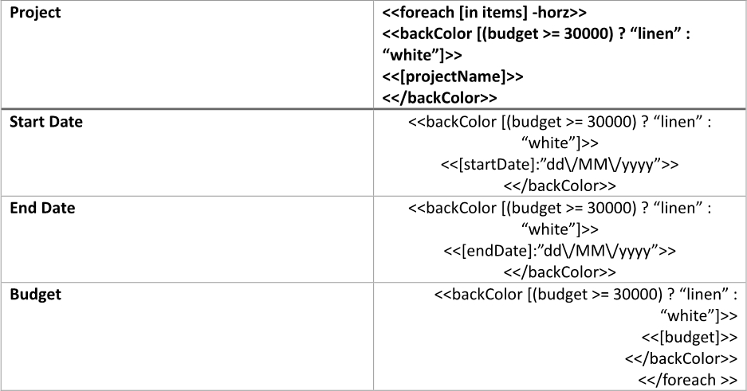
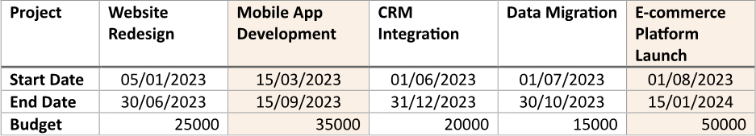
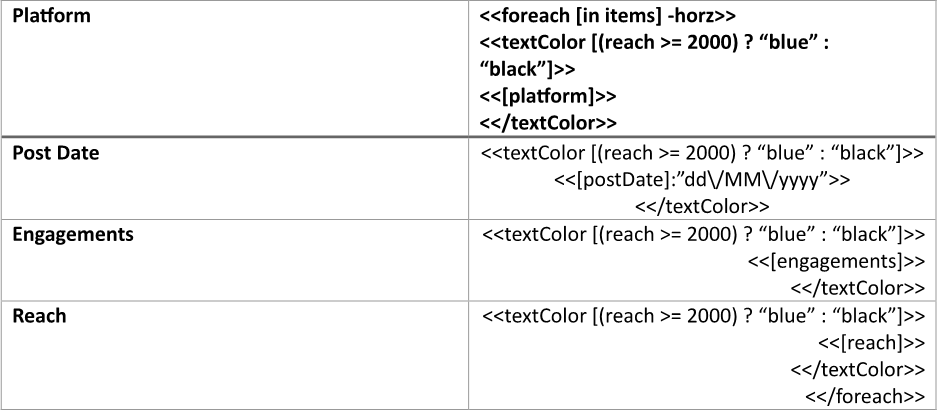
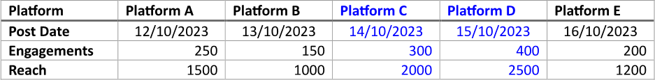

Applying conditional formatting to table columns enhances data visualization by allowing users to quickly identify patterns,
trends, or discrepancies based on specific criteria. By using visual cues such as color coding or highlighting, this technique
makes it easier for users to interpret large datasets and draw insights without having to manually sift through every entry.
You can build a table with conditional formatting applied to columns using LINQ Reporting Engine in C#.

## How to Apply Conditional Formatting to Table Columns

{}

This guide deals with a table with columns bound to a collection. However, you can apply a similar approach to tables of static
structure as well.

{}

1. Prepare data for your table in one of [formats supported by LINQ Reporting Engine](),
for example, a JSON file as follows:




2. In Microsoft Word, [create a
table](https://support.microsoft.com/en-us/office/insert-a-table-a138f745-73ef-4879-b99a-2f3d38be612a#platform=Windows)
with a necessary number of rows and [format its
elements](https://support.microsoft.com/en-us/office/format-a-table-e6e77bc6-1f4e-467e-b818-2e2acc488006)
to use it as a template.

3. Consider applying [automatical resizing to columns of
the table](https://support.microsoft.com/en-us/office/resize-a-table-row-or-column-9340d478-21be-4392-81cf-488f7bbd6715#__toc293661261).

4. Add static content like headers to the table, if needed.

5. Bind the table to a data collection by adding an opening `foreach` tag with a `horz` switch to the beginning of a column
to be repeated for every item of the collection as per the example:

<<foreach [in items] -horz>>


6. Add a closing `foreach` tag to the end of a column to be repeated for every item of the collection like so:

<</foreach>>


{}

With a `horz` switch applied, opening and closing `foreach` tags can be located in a single column or different columns of
a single table to capture one or more columns for repeating. For this example, the number of columns for capturing should be
twice larger than needed for a single item of the collection as explained further.

{}

7. Imaginably, split the range of table columns between the opening and closing `foreach` tags into two equal parts.

8. Bind visibility of the first part of columns to a Boolean value calculated upon an item of the collection by adding an opening
`if` tag with a `horz` switch to the beginning of the first column of this part after the opening `foreach` tag, for instance,
like this:

<<if [participants >= 20] -horz>>


9. Bind visibility of the second part of columns to the opposite value by adding an `else` tag to the beginning of the first column
of the second part this way:

<<else>>


10. Add a closing `if` tag to the end of the last column of the second part of columns before the closing `foreach` tag as follows:

<</if>>


{}

With a `horz` switch applied, opening `if` and `else` tags as well as `else` and closing `if` tags can be used to capture one
or more columns of a single table for showing in case when a particular condition is met or not met respectively.

{}

11. Apply different formatting to every of the parts of columns depending on your needs.

12. Within the range between the opening `if` and `else` tags, bind cells of the table to values calculated upon an item of
the data collection by adding expression tags to the cells such as the following ones:

<<[topic]>>


<<[date]:"dd\/MM\/yyyy">>


<<[durationHours]>>


<<[participants]>>


13. Use the same expression tags to bind cells of the table within the range between the `else` and closing `if` tags to values
calculated upon an item of the collection.

14. Review your table template before saving, it should look like this:\
\

15. Build your table using LINQ Reporting Engine by running the following C# code:\


## Table with Conditional Formatting Applied to Columns Report Example

After taking all the steps, LINQ Reporting Engine creates a table report as follows:\
\

{}

You can download the [template
](https://github.com/aspose-words/Aspose.Words-for-.NET/raw/ivan.lyagin/UEX-331/Examples/Data/LINQ/Table%20with%20Conditional%20Formatting%20Applied%20to%20Columns%20Template.docx)
and [data
](https://github.com/aspose-words/Aspose.Words-for-.NET/raw/ivan.lyagin/UEX-331/Examples/Data/LINQ/Table%20with%20Conditional%20Formatting%20Applied%20to%20Columns%20Data.json)
from the example, and try to make a table with conditional formatting applied to columns online for free by using one of
the options:\
<a class="product-item docs-btn" href="https://products.aspose.app/words/assembly" >APP </a>
<a class="product-item docs-btn" href="https://products.aspose.com/words/net/report/" >.NET API </a>
<a class="product-item docs-btn" href="https://products.aspose.com/words/python-net/report/" >
PYTHON via <em class="docs-vianet">net</em> API</a>
 
 

{}

## How to Apply Background Colors to Table Columns

{}

This guide provides a shortcut method for applying only background colors to table columns.

{}

1. Prepare data for your table in one of [formats supported by LINQ Reporting Engine](),
for example, a JSON file as follows:




2. In Microsoft Word, [create a
table](https://support.microsoft.com/en-us/office/insert-a-table-a138f745-73ef-4879-b99a-2f3d38be612a#platform=Windows)
with a necessary number of rows and [format its
elements](https://support.microsoft.com/en-us/office/format-a-table-e6e77bc6-1f4e-467e-b818-2e2acc488006)
to use it as a template.

3. Consider applying [automatical resizing to columns of
the table](https://support.microsoft.com/en-us/office/resize-a-table-row-or-column-9340d478-21be-4392-81cf-488f7bbd6715#__toc293661261).

4. Add static content like headers to the table, if needed.

5. Bind the table to a data collection by adding an opening `foreach` tag with a `horz` switch to the beginning of a column
to be repeated for every item of the collection as per the example:

<<foreach [in items] -horz>>


6. Add a closing `foreach` tag to the end of a column to be repeated for every item of the collection like so:

<</foreach>>


{}

With a `horz` switch applied, opening and closing `foreach` tags can be located in a single column or different columns of
a single table to capture one or more columns for repeating.

{}

7. Within the range between the opening and closing `foreach` tags, bind cells of the table to values calculated upon an item
of the data collection by adding expression tags to the cells such as the following ones:

<<[projectName]>>


<<[startDate]:"dd\/MM\/yyyy">>


<<[endDate]:"dd\/MM\/yyyy">>


<<[budget]>>


8. For every cell of a column of the table to be repeated for every item of the collection, bind the cell's background color to
the same [color value]() calculated upon an item of the collection by taking the following
steps:

    * Add an opening `backColor` tag to the beginning of the cell after the opening `foreach` tag, for instance, like this:

<<backColor [(budget >= 30000) ? "linen" : "white"]>>

{}

A color value can be directly stored in a data source, for example, as a property of an item of a collection bound to the table.

{}

    * Add a closing `backColor` tag to the end of the cell before the closing `foreach` tag as follows:

<</backColor>>


9. Review your table template before saving, it should look like this:\
\

10. Build your table using LINQ Reporting Engine by running the following C# code:\


## Table with Background Colors Applied to Columns Report Example

After taking all the steps, LINQ Reporting Engine creates a table report as follows:\
\

{}

You can download the [template
](https://github.com/aspose-words/Aspose.Words-for-.NET/raw/ivan.lyagin/UEX-331/Examples/Data/LINQ/Table%20with%20Background%20Colors%20Applied%20to%20Columns%20Template.docx)
and [data
](https://github.com/aspose-words/Aspose.Words-for-.NET/raw/ivan.lyagin/UEX-331/Examples/Data/LINQ/Table%20with%20Background%20Colors%20Applied%20to%20Columns%20Data.json)
from the example, and try to make a table with background colors applied to columns online for free by using one of the options:\
<a class="product-item docs-btn" href="https://products.aspose.app/words/assembly" >APP </a>
<a class="product-item docs-btn" href="https://products.aspose.com/words/net/report/" >.NET API </a>
<a class="product-item docs-btn" href="https://products.aspose.com/words/python-net/report/" >
PYTHON via <em class="docs-vianet">net</em> API</a>
 
 

{}

## How to Apply Text Colors to Table Columns

{}

This guide walks through a shortcut approach for applying only text colors to table columns.

{}

1. Prepare data for your table in one of [formats supported by LINQ Reporting Engine](),
for example, a JSON file as follows:




2. In Microsoft Word, [create a
table](https://support.microsoft.com/en-us/office/insert-a-table-a138f745-73ef-4879-b99a-2f3d38be612a#platform=Windows)
with a necessary number of rows and [format its
elements](https://support.microsoft.com/en-us/office/format-a-table-e6e77bc6-1f4e-467e-b818-2e2acc488006)
to use it as a template.

3. Consider applying [automatical resizing to columns of
the table](https://support.microsoft.com/en-us/office/resize-a-table-row-or-column-9340d478-21be-4392-81cf-488f7bbd6715#__toc293661261).

4. Add static content like headers to the table, if needed.

5. Bind the table to a data collection by adding an opening `foreach` tag with a `horz` switch to the beginning of a column
to be repeated for every item of the collection as per the example:

<<foreach [in items] -horz>>


6. Add a closing `foreach` tag to the end of a column to be repeated for every item of the collection like so:

<</foreach>>


{}

With a `horz` switch applied, opening and closing `foreach` tags can be located in a single column or different columns of
a single table to capture one or more columns for repeating.

{}

7. Within the range between the opening and closing `foreach` tags, bind cells of the table to values calculated upon an item
of the data collection by adding expression tags to the cells such as the following ones:

<<[platform]>>


<<[postDate]:"dd\/MM\/yyyy">>


<<[engagements]>>


<<[reach]>>


8. For every cell of a column of the table to be repeated for every item of the collection, bind the cell's text color to
the same [color value]() calculated upon an item of the collection by taking the following
steps:

    * Add an opening `textColor` tag to the beginning of the cell after the opening `foreach` tag, for instance, like this:

<<textColor [(reach >= 2000) ? "blue" : "black"]>>

{}

A color value can be directly stored in a data source, for example, as a property of an item of a collection bound to the table.

{}

    * Add a closing `textColor` tag to the end of the cell before the closing `foreach` tag as follows:

<</textColor>>


9. Review your table template before saving, it should look like this:\
\

10. Build your table using LINQ Reporting Engine by running the following C# code:\


## Table with Text Colors Applied to Columns Report Example

After taking all the steps, LINQ Reporting Engine creates a table report as follows:\
\

{}

You can download the [template
](https://github.com/aspose-words/Aspose.Words-for-.NET/raw/ivan.lyagin/UEX-331/Examples/Data/LINQ/Table%20with%20Text%20Colors%20Applied%20to%20Columns%20Template.docx)
and [data
](https://github.com/aspose-words/Aspose.Words-for-.NET/raw/ivan.lyagin/UEX-331/Examples/Data/LINQ/Table%20with%20Text%20Colors%20Applied%20to%20Columns%20Data.json)
from the example, and try to make a table with text colors applied to columns online for free by using one of the options:\
<a class="product-item docs-btn" href="https://products.aspose.app/words/assembly" >APP </a>
<a class="product-item docs-btn" href="https://products.aspose.com/words/net/report/" >.NET API </a>
<a class="product-item docs-btn" href="https://products.aspose.com/words/python-net/report/" >
PYTHON via <em class="docs-vianet">net</em> API</a>
 
 

{}

{}

## See Also

- [Building Tables]()
- [Binding Collections]()
- [Formatting Data]()
- [LINQ Reporting Engine]()
- [ReportingEngine Class](https://reference.aspose.com/words/net/aspose.words.reporting/reportingengine/)

{}