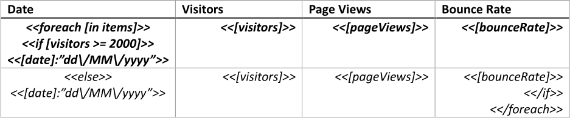
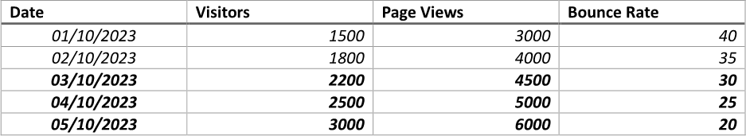
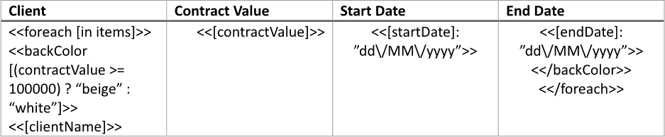
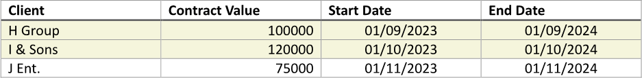
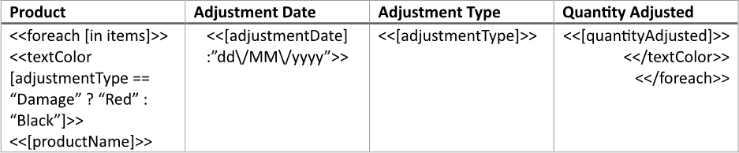
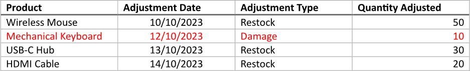

Applying conditional formatting to table rows visually distinguishes data based on specific criteria, making it easier for
users to identify trends, outliers, or important patterns at a glance. This visual emphasis enhances data interpretation and
analysis, allowing users to quickly assess the significance of information without sifting through all the data manually.
You can build a table with conditional formatting applied to rows using LINQ Reporting Engine in C#.

## How to Apply Conditional Formatting to Table Rows

{}

This guide deals with a table with rows bound to a collection. However, you can apply a similar approach to tables of static
structure as well.

{}

1. Prepare data for your table in one of [formats supported by LINQ Reporting Engine](),
for example, a JSON file as follows:




2. In Microsoft Word, [create a
table](https://support.microsoft.com/en-us/office/insert-a-table-a138f745-73ef-4879-b99a-2f3d38be612a#platform=Windows)
with a necessary number of columns and [format its
elements](https://support.microsoft.com/en-us/office/format-a-table-e6e77bc6-1f4e-467e-b818-2e2acc488006)
to use it as a template.

3. Add static content like headers to the table, if needed.

4. Bind the table to a data collection by adding an opening `foreach` tag to the beginning of a row to be repeated for every
item of the collection as per the example:

<<foreach [in items]>>


5. Add a closing `foreach` tag to the end of a row to be repeated for every item of the collection like so:

<</foreach>>


{}

Opening and closing `foreach` tags can be located in a single row or different rows of a single table to capture one or more
rows for repeating. For this example, the number of rows for capturing should be twice larger than needed for a single item of
the collection as explained further.

{}

6. Imaginably, split the range of table rows between the opening and closing `foreach` tags into two equal parts.

7. Bind visibility of the first part of rows to a Boolean value calculated upon an item of the collection by adding an opening
`if` tag to the beginning of the first row of this part after the opening `foreach` tag, for instance, like this:

<<if [visitors >= 2000]>>


8. Bind visibility of the second part of rows to the opposite value by adding an `else` tag to the beginning of the first row
of the second part this way:

<<else>>


9. Add a closing `if` tag to the end of the last row of the second part of rows before the closing `foreach` tag as follows:

<</if>>


{}

Opening `if` and `else` tags as well as `else` and closing `if` tags can be used to capture one or more rows of a single table
for showing in case when a particular condition is met or not met respectively.

{}

10. Apply different formatting to every of the parts of rows depending on your needs.

11. Within the range between the opening `if` and `else` tags, bind cells of the table to values calculated upon an item of
the data collection by adding expression tags to the cells such as the following ones:

<<[date]:"dd\/MM\/yyyy">>


<<[visitors]>>


<<[pageViews]>>


<<[bounceRate]>>


12. Use the same expression tags to bind cells of the table within the range between the `else` and closing `if` tags to values
calculated upon an item of the collection.

13. Review your table template before saving, it should look like this:\
\

14. Build your table using LINQ Reporting Engine by running the following C# code:\


## Table with Conditional Formatting Applied to Rows Report Example

After taking all the steps, LINQ Reporting Engine creates a table report as follows:\
\

{}

You can download the [template
](https://github.com/aspose-words/Aspose.Words-for-.NET/raw/ivan.lyagin/UEX-331/Examples/Data/LINQ/Table%20with%20Conditional%20Formatting%20Applied%20to%20Rows%20Template.docx)
and [data
](https://github.com/aspose-words/Aspose.Words-for-.NET/raw/ivan.lyagin/UEX-331/Examples/Data/LINQ/Table%20with%20Conditional%20Formatting%20Applied%20to%20Rows%20Data.json)
from the example, and try to make a table with conditional formatting applied to rows online for free by using one of
the options:\
<a class="product-item docs-btn" href="https://products.aspose.app/words/assembly" >APP </a>
<a class="product-item docs-btn" href="https://products.aspose.com/words/net/report/" >.NET API </a>
<a class="product-item docs-btn" href="https://products.aspose.com/words/python-net/report/" >
PYTHON via <em class="docs-vianet">net</em> API</a>
 
 

{}

## How to Apply Background Colors to Table Rows

{}

This guide provides a shortcut method for applying only background colors to table rows.

{}

1. Prepare data for your table in one of [formats supported by LINQ Reporting Engine](),
for example, a JSON file as follows:




2. In Microsoft Word, [create a
table](https://support.microsoft.com/en-us/office/insert-a-table-a138f745-73ef-4879-b99a-2f3d38be612a#platform=Windows)
with a necessary number of columns and [format its
elements](https://support.microsoft.com/en-us/office/format-a-table-e6e77bc6-1f4e-467e-b818-2e2acc488006)
to use it as a template.

3. Add static content like headers to the table, if needed.

4. Bind the table to a data collection by adding an opening `foreach` tag to the beginning of a row to be repeated for every
item of the collection as per the example:

<<foreach [in items]>>


5. Add a closing `foreach` tag to the end of a row to be repeated for every item of the collection like so:

<</foreach>>


{}

Opening and closing `foreach` tags can be located in a single row or different rows of a single table to capture one or more
rows for repeating.

{}

6. Bind the background color of a row of the table to be repeated for every item of the collection to a [color value
]() calculated upon an item of the collection by adding an opening `backColor` tag to
the beginning of the row after the opening `foreach` tag, for instance, like this:

<<backColor [(contractValue >= 100000) ? "beige" : "white"]>>


{}

A color value can be directly stored in a data source, for example, as a property of an item of a collection bound to the table.

{}

7. Add a closing `backColor` tag to the end of a row of the table to be repeated for every item of the collection before
the closing `foreach` tag as follows:

<</backColor>>


{}

Opening and closing `backColor` tags can be located in a single row or different rows of a single table to capture one or more
rows for applying a background color.

{}

8. Within the range between the opening and closing `backColor` tags, bind cells of the table to values calculated upon an item
of the data collection by adding expression tags to the cells such as the following ones:

<<[clientName]>>


<<[contractValue]>>


<<[startDate]:"dd\/MM\/yyyy">>


<<[endDate]:"dd\/MM\/yyyy">>


9. Review your table template before saving, it should look like this:\
\

10. Build your table using LINQ Reporting Engine by running the following C# code:\


## Table with Background Colors Applied to Rows Report Example

After taking all the steps, LINQ Reporting Engine creates a table report as follows:\
\

{}

You can download the [template
](https://github.com/aspose-words/Aspose.Words-for-.NET/raw/ivan.lyagin/UEX-331/Examples/Data/LINQ/Table%20with%20Background%20Colors%20Applied%20to%20Rows%20Template.docx)
and [data
](https://github.com/aspose-words/Aspose.Words-for-.NET/raw/ivan.lyagin/UEX-331/Examples/Data/LINQ/Table%20with%20Background%20Colors%20Applied%20to%20Rows%20Data.json)
from the example, and try to make a table with background colors applied to rows online for free by using one of the options:\
<a class="product-item docs-btn" href="https://products.aspose.app/words/assembly" >APP </a>
<a class="product-item docs-btn" href="https://products.aspose.com/words/net/report/" >.NET API </a>
<a class="product-item docs-btn" href="https://products.aspose.com/words/python-net/report/" >
PYTHON via <em class="docs-vianet">net</em> API</a>
 
 

{}

## How to Apply Text Colors to Table Rows

{}

This guide walks through a shortcut approach for applying only text colors to table rows.

{}

1. Prepare data for your table in one of [formats supported by LINQ Reporting Engine](),
for example, a JSON file as follows:




2. In Microsoft Word, [create a
table](https://support.microsoft.com/en-us/office/insert-a-table-a138f745-73ef-4879-b99a-2f3d38be612a#platform=Windows)
with a necessary number of columns and [format its
elements](https://support.microsoft.com/en-us/office/format-a-table-e6e77bc6-1f4e-467e-b818-2e2acc488006)
to use it as a template.

3. Add static content like headers to the table, if needed.

4. Bind the table to a data collection by adding an opening `foreach` tag to the beginning of a row to be repeated for every
item of the collection as per the example:

<<foreach [in items]>>


5. Add a closing `foreach` tag to the end of a row to be repeated for every item of the collection like so:

<</foreach>>


{}

Opening and closing `foreach` tags can be located in a single row or different rows of a single table to capture one or more
rows for repeating.

{}

6. Bind the text color of a row of the table to be repeated for every item of the collection to a [color value
]() calculated upon an item of the collection by adding an opening `textColor` tag to
the beginning of the row after the opening `foreach` tag, for instance, like this:

<<textColor [adjustmentType == "Damage" ? "Red" : "Black"]>>


{}

A color value can be directly stored in a data source, for example, as a property of an item of a collection bound to the table.

{}

7. Add a closing `textColor` tag to the end of a row of the table to be repeated for every item of the collection before
the closing `foreach` tag as follows:

<</textColor>>


{}

Opening and closing `textColor` tags can be located in a single row or different rows of a single table to capture one or more
rows for applying a text color.

{}

8. Within the range between the opening and closing `textColor` tags, bind cells of the table to values calculated upon an item
of the data collection by adding expression tags to the cells such as the following ones:

<<[productName]>>


<<[adjustmentDate]:"dd\/MM\/yyyy">>


<<[adjustmentType]>>


<<[quantityAdjusted]>>


9. Review your table template before saving, it should look like this:\
\

10. Build your table using LINQ Reporting Engine by running the following C# code:\


## Table with Text Colors Applied to Rows Report Example

After taking all the steps, LINQ Reporting Engine creates a table report as follows:\
\

{}

You can download the [template
](https://github.com/aspose-words/Aspose.Words-for-.NET/raw/ivan.lyagin/UEX-331/Examples/Data/LINQ/Table%20with%20Text%20Colors%20Applied%20to%20Rows%20Template.docx)
and [data
](https://github.com/aspose-words/Aspose.Words-for-.NET/raw/ivan.lyagin/UEX-331/Examples/Data/LINQ/Table%20with%20Text%20Colors%20Applied%20to%20Rows%20Data.json)
from the example, and try to make a table with text colors applied to rows online for free by using one of the options:\
<a class="product-item docs-btn" href="https://products.aspose.app/words/assembly" >APP </a>
<a class="product-item docs-btn" href="https://products.aspose.com/words/net/report/" >.NET API </a>
<a class="product-item docs-btn" href="https://products.aspose.com/words/python-net/report/" >
PYTHON via <em class="docs-vianet">net</em> API</a>
 
 

{}

{}

## See Also

- [Building Tables]()
- [Binding Collections]()
- [Formatting Data]()
- [LINQ Reporting Engine]()
- [ReportingEngine Class](https://reference.aspose.com/words/net/aspose.words.reporting/reportingengine/)

{}