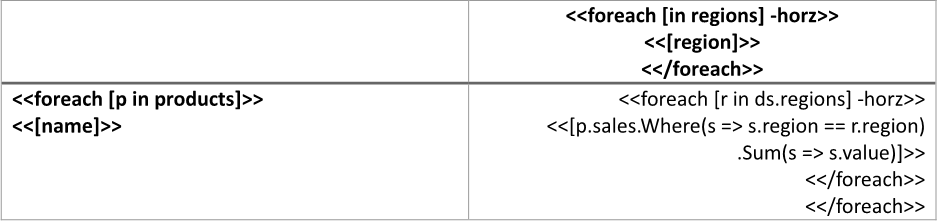
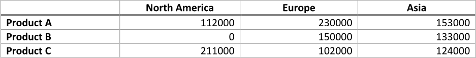
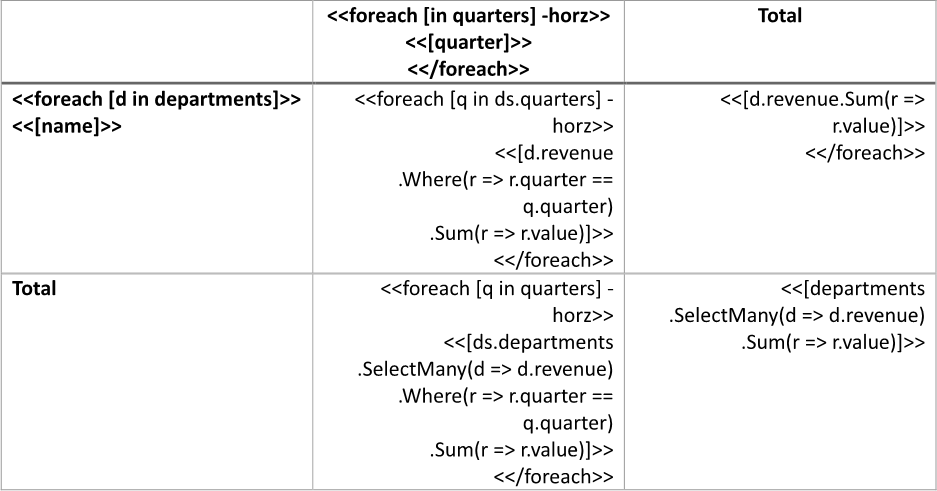
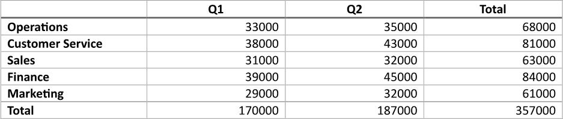
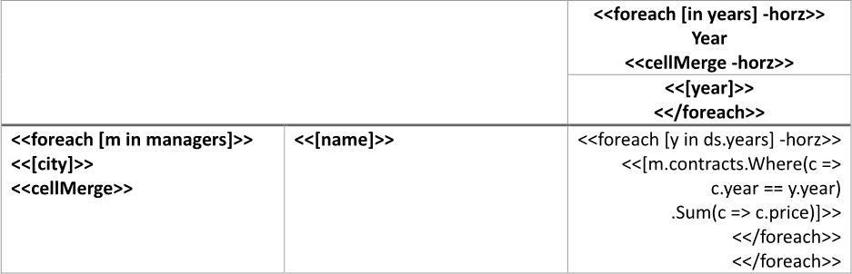
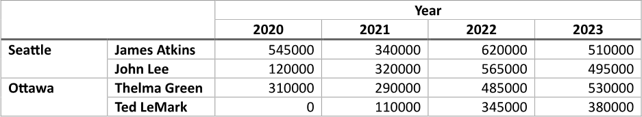

[Cross](https://en.wikipedia.org/wiki/Contingency_table) and [pivot](https://en.wikipedia.org/wiki/Pivot_table) tables allow
users to summarize and analyze large datasets by reorganizing and aggregating information across multiple dimensions. This
functionality enables users to quickly identify trends, patterns, and relationships in the data, facilitating more informed
decision-making and deeper insights from complex information. You can make a cross or pivot table using LINQ Reporting Engine
in C#.

## How to Build a Cross Table

1. Prepare data for your table in one of [formats supported by LINQ Reporting Engine](),
for example, a JSON file as follows:




2. In Microsoft Word, [create a
table](https://support.microsoft.com/en-us/office/insert-a-table-a138f745-73ef-4879-b99a-2f3d38be612a#platform=Windows)
with two rows and two columns, and [format its
elements](https://support.microsoft.com/en-us/office/format-a-table-e6e77bc6-1f4e-467e-b818-2e2acc488006)
to use it as a template.

3. Consider applying [automatical resizing to columns of
the table](https://support.microsoft.com/en-us/office/resize-a-table-row-or-column-9340d478-21be-4392-81cf-488f7bbd6715#__toc293661261).

4. Bind the table's header row to a collection of categories to establish columns of a result table by adding an opening
`foreach` tag with a `horz` switch to the beginning of the row's second cell (to be repeated horizontally for every category)
as per the example:

<<foreach [in regions] -horz>>


5. Add a closing `foreach` tag to the end of the cell like so:

<</foreach>>


6. Bind the cell to a value calculated upon an item of the collection to form column headers by adding an expression tag to
the cell between the opening and closing `foreach` tags like the following one:

<<[region]>>


7. Bind the table to a data collection by adding an opening `foreach` tag to the beginning of the table's second row (to be
repeated for every item of the collection), for instance, as per the snippet:

<<foreach [p in products]>>


8. Add a closing `foreach` tag to the end of the row this way:

<</foreach>>


9. Bind the first cell of the row to a value calculated upon an item of the collection to form row headers by adding
an expression tag to the cell after the opening `foreach` tag like this one:

<<[name]>>


10. Bind the row to the same collection of categories used for column headers by adding an inner opening `foreach` tag with
a `horz` switch to the beginning of the row's second cell (to be repeated horizontally for every category) similarly to this:

<<foreach [r in ds.regions] -horz>>


{}

Since between opening and closing `foreach` tags, expressions are evaluated upon an item of a corresponding data collection,
it is required to explicitly specify the name of a data source - such as `ds` - here, in order to reference the same collection
of categories for all the table's rows.

{}

11. Add an inner closing `foreach` tag to the end of the cell before the outer closing `foreach` tag like that:

<</foreach>>


12. Bind the cell to [an aggregate value]()
calculated [for a category]() upon an item of the data
collection to which rows of the table are bound by adding an expression tag to the cell between the inner opening and closing
`foreach` tags such as the following one:

<<[p.sales.Where(s => s.region == r.region).Sum(s => s.value)]>>


{}

Since between the inner opening and closing `foreach` tags, expression values are calculated upon an item of the collection of
categories, an explicit reference to an item of the collection to which rows of the table are bound - such as `p` - is required
to calculate an aggregate value upon it.

{}

13. Review your table template before saving, it should look like this:\
\

14. Build your table using LINQ Reporting Engine by running the following C# code:\


## Cross Table Report Example

After taking all the steps, LINQ Reporting Engine creates a table report as follows:\
\

{}

You can download the [template
](https://github.com/aspose-words/Aspose.Words-for-.NET/raw/ivan.lyagin/UEX-331/Examples/Data/LINQ/Cross%20Table%20Template.docx)
and [data
](https://github.com/aspose-words/Aspose.Words-for-.NET/raw/ivan.lyagin/UEX-331/Examples/Data/LINQ/Cross%20Table%20Data.json)
from the example, and try to make a cross table online for free by using one of the options:\
<a class="product-item docs-btn" href="https://products.aspose.app/words/assembly" >APP </a>
<a class="product-item docs-btn" href="https://products.aspose.com/words/net/report/" >.NET API </a>
<a class="product-item docs-btn" href="https://products.aspose.com/words/python-net/report/" >
PYTHON via <em class="docs-vianet">net</em> API</a>
 
 

{}

## How to Build a Cross Table with Totals

1. Prepare data for your table in one of [formats supported by LINQ Reporting Engine](),
for example, a JSON file as follows:




2. In Microsoft Word, [create a
table](https://support.microsoft.com/en-us/office/insert-a-table-a138f745-73ef-4879-b99a-2f3d38be612a#platform=Windows)
with three rows and three columns, and [format its
elements](https://support.microsoft.com/en-us/office/format-a-table-e6e77bc6-1f4e-467e-b818-2e2acc488006)
to use it as a template.

3. Consider applying [automatical resizing to columns of
the table](https://support.microsoft.com/en-us/office/resize-a-table-row-or-column-9340d478-21be-4392-81cf-488f7bbd6715#__toc293661261).

4. Bind the table's header row to a collection of categories to establish columns of a result table by adding an opening
`foreach` tag with a `horz` switch to the beginning of the row's second cell (to be repeated horizontally for every category)
as per the example:

<<foreach [in quarters] -horz>>


5. Add a closing `foreach` tag to the end of the cell like so:

<</foreach>>


6. Bind the cell to a value calculated upon an item of the collection to form column headers by adding an expression tag to
the cell between the opening and closing `foreach` tags like the following one:

<<[quarter]>>


7. Add a header to the table's total column, if needed.

8. Bind the table to a data collection by adding an opening `foreach` tag to the beginning of the table's second row (to be
repeated for every item of the collection), for instance, as per the snippet:

<<foreach [d in departments]>>


9. Add a closing `foreach` tag to the end of the row this way:

<</foreach>>


10. Bind the first cell of the row to a value calculated upon an item of the collection to form row headers by adding
an expression tag to the cell after the opening `foreach` tag like this one:

<<[name]>>


11. Bind the row to the same collection of categories used for column headers by adding an inner opening `foreach` tag with
a `horz` switch to the beginning of the row's second cell (to be repeated horizontally for every category) similarly to this:

<<foreach [q in ds.quarters] -horz>>


{}

Since between opening and closing `foreach` tags, expressions are evaluated upon an item of a corresponding data collection,
it is required to explicitly specify the name of a data source - such as `ds` - here, in order to reference the same collection
of categories for all the table's rows.

{}

12. Add an inner closing `foreach` tag to the end of the cell like that:

<</foreach>>


13. Bind the cell to [an aggregate value]()
calculated [for a category]() upon an item of the data
collection to which rows of the table are bound by adding an expression tag to the cell between the inner opening and closing
`foreach` tags such as the following one:

<<[d.revenue.Where(r => r.quarter == q.quarter).Sum(r => r.value)]>>


{}

Since between the inner opening and closing `foreach` tags, expression values are calculated upon an item of the collection of
categories, an explicit reference to an item of the collection to which rows of the table are bound - such as `d` - is required
to calculate an aggregate value upon it.

{}

14. Bind the row's cell corresponding to the total column to [an aggregate
value]()
calculated for all categories upon an item of the data collection to which rows of the table are bound by adding an expression
tag to the cell before the outer closing `foreach` tag like this one:

<<[d.revenue.Sum(r => r.value)]>>


15. Add a header to the table's total row, if needed.

16. Bind the total row to the same collection of categories used for column headers by adding an opening `foreach` tag with
a `horz` switch to the beginning of the row's second cell (to be repeated horizontally for every category) as per the example:

<<foreach [q in quarters] -horz>>


17. Add a closing `foreach` tag to the end of the cell in this fashion:

<</foreach>>


18. Bind the cell to [an aggregate value]()
calculated [for a category]() upon [all
items]() of the data collection to which
rows of the table are bound by adding an expression tag to the cell between the opening and closing `foreach` tags such as
the following one:

<<[ds.departments.SelectMany(d => d.revenue).Where(r => r.quarter == q.quarter).Sum(r => r.value)]>>


{}

Since between the opening and closing `foreach` tags, expression values are calculated upon an item of the collection of
categories, it is required to explicitly specify the name of a data source - such as `ds` - here, in order to reference
the collection to which rows of the table are bound.

{}

19. Bind a cell intersecting the total row and the total column of the table to [an aggregate
value]()
calculated for all categories upon [all
items]() of the data collection to which
rows of the table are bound by adding an expression tag to the cell, for instance, as per the snippet:

<<[departments.SelectMany(d => d.revenue).Sum(r => r.value)]>>


20. Review your table template before saving, it should look like this:\
\

21. Build your table using LINQ Reporting Engine by running the following C# code:\


## Cross Table with Totals Report Example

After taking all the steps, LINQ Reporting Engine creates a table report as follows:\
\

{}

You can download the [template
](https://github.com/aspose-words/Aspose.Words-for-.NET/raw/ivan.lyagin/UEX-331/Examples/Data/LINQ/Cross%20Table%20with%20Totals%20Template.docx)
and [data
](https://github.com/aspose-words/Aspose.Words-for-.NET/raw/ivan.lyagin/UEX-331/Examples/Data/LINQ/Cross%20Table%20with%20Totals%20Data.json)
from the example, and try to make a cross table with totals online for free by using one of the options:\
<a class="product-item docs-btn" href="https://products.aspose.app/words/assembly" >APP </a>
<a class="product-item docs-btn" href="https://products.aspose.com/words/net/report/" >.NET API </a>
<a class="product-item docs-btn" href="https://products.aspose.com/words/python-net/report/" >
PYTHON via <em class="docs-vianet">net</em> API</a>
 
 

{}

## How to Build a Cross Table with Merged Cells

{}

This guide touches implementation of multi-level headers for a cross or pivot table by using two header rows and two header
columns for the table in conjunction with dynamic cell merging.

{}

1. Prepare data for your table in one of [formats supported by LINQ Reporting Engine](),
for example, a JSON file as follows:




2. In Microsoft Word, [create a
table](https://support.microsoft.com/en-us/office/insert-a-table-a138f745-73ef-4879-b99a-2f3d38be612a#platform=Windows)
with three rows and three columns, and [format its
elements](https://support.microsoft.com/en-us/office/format-a-table-e6e77bc6-1f4e-467e-b818-2e2acc488006)
to use it as a template.

3. Consider applying [automatical resizing to columns of
the table](https://support.microsoft.com/en-us/office/resize-a-table-row-or-column-9340d478-21be-4392-81cf-488f7bbd6715#__toc293661261).

4. [Merge all cells](https://support.microsoft.com/en-us/office/merge-or-split-cells-in-a-table-8b458deb-0fc5-4c8d-8d94-2d4da98193f8)
of a two-by-two cell range starting at the upper left corner of the table.

5. Bind the table's two header rows to a collection of categories to establish columns of a result table by adding an opening
`foreach` tag with a `horz` switch to the beginning of the first header row's third cell (to be repeated horizontally for every
category together with the second header row's third cell) as per the example:

<<foreach [in years] -horz>>


6. In order to form level-one column headers, bind the cell to a value calculated upon an item of the collection by adding
an expression tag to the cell after the opening `foreach` tag or append static text such as "Year" to the cell instead.

7. To horizontally merge level-one column header cells with equal textual contents in a result table, append a `cellMerge` tag
with a `horz` switch to the cell this way:

<<cellMerge -horz>>


8. Bind the second header row's third cell to a value calculated upon an item of the collection of categories to form level-two
column headers by adding an expression tag to the beginning of the cell like the following one:

<<[year]>>


9. Add a closing `foreach` tag to the end of the cell like so:

<</foreach>>


10. Bind the table to a data collection by adding an opening `foreach` tag to the beginning of the table's third row (to be
repeated for every item of the collection), for instance, as per the snippet:

<<foreach [m in managers]>>


11. Add a closing `foreach` tag to the end of the row as follows:

<</foreach>>


12. Bind the first cell of the row to a value calculated upon an item of the collection to form level-one row headers by adding
an expression tag to the cell after the opening `foreach` tag like this one:

<<[city]>>


13. To vertically merge level-one row header cells with equal textual contents in a result table, append a `cellMerge` tag
to the cell in this fashion:

<<cellMerge>>


14. Bind the second cell of the row to a value calculated upon an item of the collection to form level-two row headers by adding
an expression tag to the beginning of the cell like the following one:

<<[name]>>


15. Bind the row to the same collection of categories used for column headers by adding an inner opening `foreach` tag with
a `horz` switch to the beginning of the row's third cell (to be repeated horizontally for every category) similarly to this:

<<foreach [y in ds.years] -horz>>


{}

Since between opening and closing `foreach` tags, expressions are evaluated upon an item of a corresponding data collection,
it is required to explicitly specify the name of a data source - such as `ds` - here, in order to reference the same collection
of categories for all the table's rows.

{}

16. Add an inner closing `foreach` tag to the end of the cell before the outer closing `foreach` tag like that:

<</foreach>>


17. Bind the cell to [an aggregate value]()
calculated [for a category]() upon an item of the data
collection to which rows of the table are bound by adding an expression tag to the cell between the inner opening and closing
`foreach` tags such as the following one:

<<[m.contracts.Where(c => c.year == y.year).Sum(c => c.price)]>>


{}

Since between the inner opening and closing `foreach` tags, expression values are calculated upon an item of the collection of
categories, an explicit reference to an item of the collection to which rows of the table are bound - such as `m` - is required
to calculate an aggregate value upon it.

{}

18. Review your table template before saving, it should look like this:\
\

19. Build your table using LINQ Reporting Engine by running the following C# code:\


## Cross Table with Merged Cells Report Example

After taking all the steps, LINQ Reporting Engine creates a table report as follows:\
\

{}

You can download the [template
](https://github.com/aspose-words/Aspose.Words-for-.NET/raw/ivan.lyagin/UEX-331/Examples/Data/LINQ/Cross%20Table%20with%20Merged%20Cells%20Template.docx)
and [data
](https://github.com/aspose-words/Aspose.Words-for-.NET/raw/ivan.lyagin/UEX-331/Examples/Data/LINQ/Cross%20Table%20with%20Merged%20Cells%20Data.json)
from the example, and try to make a cross table with merged cells online for free by using one of the options:\
<a class="product-item docs-btn" href="https://products.aspose.app/words/assembly" >APP </a>
<a class="product-item docs-btn" href="https://products.aspose.com/words/net/report/" >.NET API </a>
<a class="product-item docs-btn" href="https://products.aspose.com/words/python-net/report/" >
PYTHON via <em class="docs-vianet">net</em> API</a>
 
 

{}

## See Also

- [Building Tables]()
- [Binding Collections]()
- [Formatting Data]()
- [LINQ Reporting Engine]()
- [ReportingEngine Class](https://reference.aspose.com/words/net/aspose.words.reporting/reportingengine/)

{}