A horizontal table allows for the presentation of data in a format that can be easier to read when dealing with a limited
number of rows but a larger number of columns. This layout is particularly effective for comparing multiple attributes or
categories side by side, making it convenient for users to analyze variations and relationships in the data at a glance.
You can make a horizontal table using LINQ Reporting Engine in C#.

## How to Build a Horizontal Table

1. Prepare data for your table in one of [formats supported by LINQ Reporting Engine](),
for example, a JSON file as follows:




2. In Microsoft Word, [create a
table](https://support.microsoft.com/en-us/office/insert-a-table-a138f745-73ef-4879-b99a-2f3d38be612a#platform=Windows)
with a necessary number of rows and [format its
elements](https://support.microsoft.com/en-us/office/format-a-table-e6e77bc6-1f4e-467e-b818-2e2acc488006)
to use it as a template.

3. Consider applying [automatical resizing to columns of
the table](https://support.microsoft.com/en-us/office/resize-a-table-row-or-column-9340d478-21be-4392-81cf-488f7bbd6715#__toc293661261).

4. Add static content like headers to the table, if needed.

5. Bind the table to a data collection by adding an opening `foreach` tag with a `horz` switch to the beginning of a column
to be repeated for every item of the collection as per the example:

<<foreach [in items] -horz>>


6. Add a closing `foreach` tag to the end of a column to be repeated for every item of the collection like so:

<</foreach>>


{}

With a `horz` switch applied, opening and closing `foreach` tags can be located in a single column or different columns of
a single table to capture one or more columns for repeating.

{}

7. Within the range between the opening and closing `foreach` tags, bind cells of the table to values calculated upon an item
of the collection by adding expression tags to the cells such as the following ones:

<<[meetingDate]:"dd\/MM\/yyyy">>


<<[department]>>


<<[agenda]>>


<<[attendees]>>


8. Review your table template before saving, it should look like this:\
\
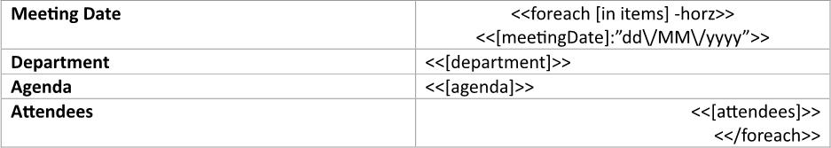

9. Build your table using LINQ Reporting Engine by running the following C# code:\


## Horizontal Table Report Example

After taking all the steps, LINQ Reporting Engine creates a table report as follows:\
\
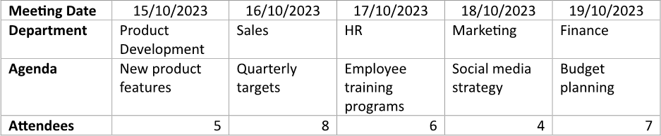

{}

You can download the [template
](https://github.com/aspose-words/Aspose.Words-for-.NET/raw/ivan.lyagin/UEX-331/Examples/Data/LINQ/Horizontal%20Table%20Template.docx)
and [data
](https://github.com/aspose-words/Aspose.Words-for-.NET/raw/ivan.lyagin/UEX-331/Examples/Data/LINQ/Horizontal%20Table%20Data.json)
from the example, and try to make a horizontal table online for free by using one of the options:\
<a class="product-item docs-btn" href="https://products.aspose.app/words/assembly" >APP </a>
<a class="product-item docs-btn" href="https://products.aspose.com/words/net/report/" >.NET API </a>
<a class="product-item docs-btn" href="https://products.aspose.com/words/python-net/report/" >
PYTHON via <em class="docs-vianet">net</em> API</a>
 
 

{}

## How to Add a Total to a Horizontal Table

1. Prepare data for your table in one of [formats supported by LINQ Reporting Engine](),
for example, a JSON file as follows:




2. In Microsoft Word, [create a
table](https://support.microsoft.com/en-us/office/insert-a-table-a138f745-73ef-4879-b99a-2f3d38be612a#platform=Windows)
with a necessary number of rows and [format its
elements](https://support.microsoft.com/en-us/office/format-a-table-e6e77bc6-1f4e-467e-b818-2e2acc488006)
to use it as a template.

3. Consider applying [automatical resizing to columns of
the table](https://support.microsoft.com/en-us/office/resize-a-table-row-or-column-9340d478-21be-4392-81cf-488f7bbd6715#__toc293661261).

4. Add static content like headers to the table, if needed.

5. Bind the table to a data collection by adding an opening `foreach` tag with a `horz` switch to the beginning of a column
to be repeated for every item of the collection as per the example:

<<foreach [in items] -horz>>


6. Add a closing `foreach` tag to the end of a column to be repeated for every item of the collection like so:

<</foreach>>


{}

With a `horz` switch applied, opening and closing `foreach` tags can be located in a single column or different columns of
a single table to capture one or more columns for repeating.

{}

7. Within the range between the opening and closing `foreach` tags, bind cells of the table to values calculated upon an item
of the collection by adding expression tags to the cells such as the following ones:

<<[campaignName]>>


<<[startDate]:"dd\/MM\/yyyy">>


<<[endDate]:"dd\/MM\/yyyy">>


<<[budget]>>


8. Bind a cell of the table's total column to a cumulative value calculated upon the collection by adding an expression tag to
the cell and [applying an aggregate function](),
for instance, this way:

<<[items.Sum(i => i.budget)]>>


9. Review your table template before saving, it should look like this:\
\
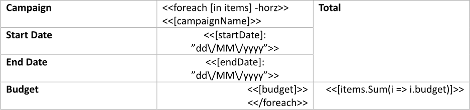

10. Build your table using LINQ Reporting Engine by running the following C# code:\


## Horizontal Table with a Total Report Example

After taking all the steps, LINQ Reporting Engine creates a table report as follows:\
\
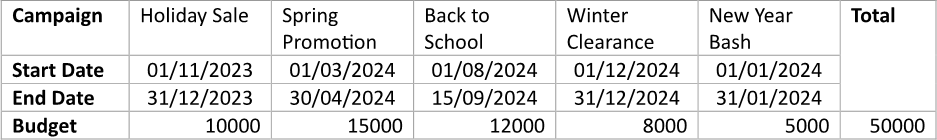

{}

You can download the [template
](https://github.com/aspose-words/Aspose.Words-for-.NET/raw/ivan.lyagin/UEX-331/Examples/Data/LINQ/Horizontal%20Table%20with%20Total%20Template.docx)
and [data
](https://github.com/aspose-words/Aspose.Words-for-.NET/raw/ivan.lyagin/UEX-331/Examples/Data/LINQ/Horizontal%20Table%20with%20Total%20Data.json)
from the example, and try to make a horizontal table with a total online for free by using one of the options:\
<a class="product-item docs-btn" href="https://products.aspose.app/words/assembly" >APP </a>
<a class="product-item docs-btn" href="https://products.aspose.com/words/net/report/" >.NET API </a>
<a class="product-item docs-btn" href="https://products.aspose.com/words/python-net/report/" >
PYTHON via <em class="docs-vianet">net</em> API</a>
 
 

{}

## How to Display a Message for an Empty Horizontal Table

1. Prepare data for your table in one of [formats supported by LINQ Reporting Engine](),
for example, a JSON file as follows:




2. In Microsoft Word, [create a
table](https://support.microsoft.com/en-us/office/insert-a-table-a138f745-73ef-4879-b99a-2f3d38be612a#platform=Windows)
with a necessary number of rows and [format its
elements](https://support.microsoft.com/en-us/office/format-a-table-e6e77bc6-1f4e-467e-b818-2e2acc488006)
to use it as a template.

3. Consider applying [automatical resizing to columns of
the table](https://support.microsoft.com/en-us/office/resize-a-table-row-or-column-9340d478-21be-4392-81cf-488f7bbd6715#__toc293661261).

4. Add static content like headers to the table, if needed.

5. [Merge all cells](https://support.microsoft.com/en-us/office/merge-or-split-cells-in-a-table-8b458deb-0fc5-4c8d-8d94-2d4da98193f8)
in a column coming after the table's header column.

6. Bind the merged cell's visibility to a Boolean value indicating whether a data collection is empty by adding an opening
`if` tag with a `horz` switch to the beginning of the cell and [applying the `Any()` extension
method](), for instance, this way:

<<if [!items.Any()] -horz>>


7. Append a message to be displayed when the collection has no items to the cell.

8. Make the rest of the table's columns visible only when the collection contains items by adding an `else` tag to the beginning
of the first such column as follows:

<<else>>


9. Add a closing `if` tag to the end of the last such column like this:

<</if>>


10. Bind the table to the data collection by adding an opening `foreach` tag with a `horz` switch to the beginning of a column
to be repeated for every item of the collection after the `else` tag as per the example:

<<foreach [in items] -horz>>


11. Add a closing `foreach` tag to the end of a column to be repeated for every item of the collection before the closing `if` tag
like so:

<</foreach>>


{}

With a `horz` switch applied, opening and closing `foreach` tags can be located in a single column or different columns of
a single table to capture one or more columns for repeating.

{}

12. Within the range between the opening and closing `foreach` tags, bind cells of the table to values calculated upon an item
of the collection by adding expression tags to the cells such as the following ones:

<<[supplierName]>>


<<[contactPerson]>>


<<[phone]>>


<<[email]>>


13. Review your table template before saving, it should look like this:\
\
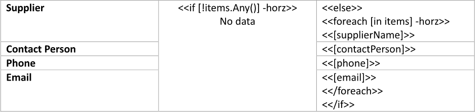

14. Build your table using LINQ Reporting Engine by running the following C# code:\


## Horizontal Table with a Message, If Empty, Report Example

After taking all the steps, LINQ Reporting Engine creates a table report with all the data shown as follows:\
\
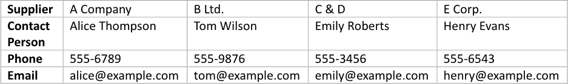

Now, let us consider the alternative case where data for the table is missing, for example, like so:




After running the same code with the JSON file being used instead, LINQ Reporting Engine generates a table report with
a message being displayed like this:\
\
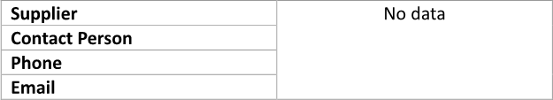

{}

You can download the [template
](https://github.com/aspose-words/Aspose.Words-for-.NET/raw/ivan.lyagin/UEX-331/Examples/Data/LINQ/Horizontal%20Table%20with%20Message%20If%20Empty%20Template.docx)
and [data
](https://github.com/aspose-words/Aspose.Words-for-.NET/raw/ivan.lyagin/UEX-331/Examples/Data/LINQ/Horizontal%20Table%20with%20Message%20If%20Empty%20Data%201.json)
from the example, and try to make a horizontal table with a message, if empty, online for free by using one of the options:\
<a class="product-item docs-btn" href="https://products.aspose.app/words/assembly" >APP </a>
<a class="product-item docs-btn" href="https://products.aspose.com/words/net/report/" >.NET API </a>
<a class="product-item docs-btn" href="https://products.aspose.com/words/python-net/report/" >
PYTHON via <em class="docs-vianet">net</em> API</a>
 
 

{}

## How to Display Master-Detail Data in One Horizontal Table (Option 1)

{}

This option implies layout of detail data in separate table columns.

{}

1. Prepare data for your table in one of [formats supported by LINQ Reporting Engine](),
for example, a JSON file as follows:




2. In Microsoft Word, [create a
table](https://support.microsoft.com/en-us/office/insert-a-table-a138f745-73ef-4879-b99a-2f3d38be612a#platform=Windows)
with a necessary number of rows and [format its
elements](https://support.microsoft.com/en-us/office/format-a-table-e6e77bc6-1f4e-467e-b818-2e2acc488006)
to use it as a template.

3. Consider applying [automatical resizing to columns of
the table](https://support.microsoft.com/en-us/office/resize-a-table-row-or-column-9340d478-21be-4392-81cf-488f7bbd6715#__toc293661261).

4. Add static content like headers to the table, if needed.

5. Bind the table to a master data collection by adding an opening `foreach` tag with a `horz` switch to the beginning of
a column to be repeated for every item of the collection as per the example:

<<foreach [in items] -horz>>


6. Add a closing `foreach` tag to the end of the next table column like so:

<</foreach>>


{}

With a `horz` switch applied, opening and closing `foreach` tags can be located in a single column or different columns of
a single table to capture one or more columns for repeating. In this example, two table columns are captured for an item of
the master data collection to use one of the columns for displaying master data itself and the other one for displaying details.

{}

7. Bind cells of the table column containing the opening `foreach` tag to values calculated upon an item of the master
data collection by adding expression tags to the cells after the opening `foreach` tag such as the following ones:

<<[division]>>


<<[orders.Sum(o => o.delivered)]>>


<<[orders.Sum(o => o.cancelled)]>>


8. Bind the table column containing the closing `foreach` tag to a detail data collection calculated upon an item of the master
data collection to repeat the column for every item of the detail collection by adding an inner opening `foreach` tag with
a `horz` switch to the beginning of the column, for instance, as follows:

<<foreach [in orders] -horz>>


9. Add an inner closing `foreach` tag to the end of the column before the outer closing `foreach` tag this way:

<</foreach>>


10. Within the range between the inner opening and closing `foreach` tags, bind cells of the column to values calculated upon
an item of the detail collection by adding expression tags to the cells similar to these:

<<[quarter]>>


<<[delivered]>>


<<[cancelled]>>


11. Review your table template before saving, it should look like this:\
\
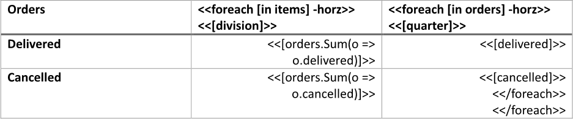

12. Build your table using LINQ Reporting Engine by running the following C# code:\


## Horizontal Table with Master-Detail Data (Option 1) Report Example

After taking all the steps, LINQ Reporting Engine creates a table report as follows:\
\
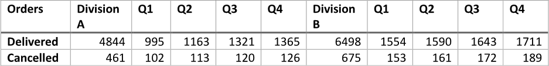

{}

You can download the [template
](https://github.com/aspose-words/Aspose.Words-for-.NET/raw/ivan.lyagin/UEX-331/Examples/Data/LINQ/Horizontal%20Table%20with%20Master-Detail%20Data%20Option%201%20Template.docx)
and [data
](https://github.com/aspose-words/Aspose.Words-for-.NET/raw/ivan.lyagin/UEX-331/Examples/Data/LINQ/Horizontal%20Table%20with%20Master-Detail%20Data%20Option%201%20Data.json)
from the example, and try to make a horizontal table with master-detail data online for free by using one of the options:\
<a class="product-item docs-btn" href="https://products.aspose.app/words/assembly" >APP </a>
<a class="product-item docs-btn" href="https://products.aspose.com/words/net/report/" >.NET API </a>
<a class="product-item docs-btn" href="https://products.aspose.com/words/python-net/report/" >
PYTHON via <em class="docs-vianet">net</em> API</a>
 
 

{}

## How to Display Master-Detail Data in One Horizontal Table (Option 2)

{}

This option suggests using of a bulleted list to display details in the same table column with master data.

{}

1. Prepare data for your table in one of [formats supported by LINQ Reporting Engine](),
for example, a JSON file as follows:




2. In Microsoft Word, [create a
table](https://support.microsoft.com/en-us/office/insert-a-table-a138f745-73ef-4879-b99a-2f3d38be612a#platform=Windows)
with a necessary number of rows and [format its
elements](https://support.microsoft.com/en-us/office/format-a-table-e6e77bc6-1f4e-467e-b818-2e2acc488006)
to use it as a template.

3. Consider applying [automatical resizing to columns of
the table](https://support.microsoft.com/en-us/office/resize-a-table-row-or-column-9340d478-21be-4392-81cf-488f7bbd6715#__toc293661261).

4. Add static content like headers to the table, if needed.

5. Bind the table to a master data collection by adding an opening `foreach` tag with a `horz` switch to the beginning of
a column to be repeated for every item of the collection as per the example:

<<foreach [in items] -horz>>


6. Add a closing `foreach` tag to the end of a column to be repeated for every item of the collection like so:

<</foreach>>


{}

With a `horz` switch applied, opening and closing `foreach` tags can be located in a single column or different columns of
a single table to capture one or more columns for repeating.

{}

7. Within the range between the opening and closing `foreach` tags, bind cells of the table to values calculated upon an item
of the master collection by adding expression tags to the cells such as the following one:

<<[name]>>


8. Use one of the cells to [display details in a bulleted list]()
by taking the following steps:

    * Add a paragraph to the cell (the paragraph should be located after the opening and before the closing `foreach` tags) and
[create a bulleted
list](https://support.microsoft.com/en-us/office/create-a-bulleted-or-numbered-list-9ff81241-58a8-4d88-8d8c-acab3006a23e)
for the paragraph.

    * Bind the paragraph to a detail data collection calculated upon an item of the master data collection to repeat
the paragraph for every item of the detail collection by adding an inner opening `foreach` tag to the beginning of
the paragraph, for instance, as follows:

<<foreach [in sectors]>>


    * Bind the paragraph to values calculated upon an item of the detail data collection by adding expression tags after
the inner opening `foreach` tag similar to these:

<<[name]>>


<<[sales]>>


    * Right after the paragraph, add one more paragraph without a bulleted list and put an inner closing `foreach` tag into
the new paragraph this way:

<</foreach>>


9. Review your table template before saving, it should look like this:\
\
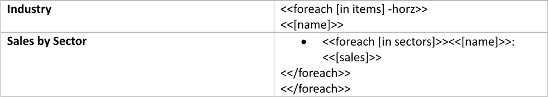

10. Build your table using LINQ Reporting Engine by running the following C# code:\


## Horizontal Table with Master-Detail Data (Option 2) Report Example

After taking all the steps, LINQ Reporting Engine creates a table report as follows:\
\
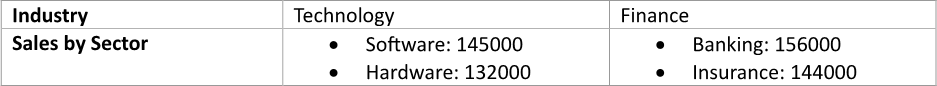

{}

You can download the [template
](https://github.com/aspose-words/Aspose.Words-for-.NET/raw/ivan.lyagin/UEX-331/Examples/Data/LINQ/Horizontal%20Table%20with%20Master-Detail%20Data%20Option%202%20Template.docx)
and [data
](https://github.com/aspose-words/Aspose.Words-for-.NET/raw/ivan.lyagin/UEX-331/Examples/Data/LINQ/Horizontal%20Table%20with%20Master-Detail%20Data%20Option%202%20Data.json)
from the example, and try to make a horizontal table with master-detail data online for free by using one of the options:\
<a class="product-item docs-btn" href="https://products.aspose.app/words/assembly" >APP </a>
<a class="product-item docs-btn" href="https://products.aspose.com/words/net/report/" >.NET API </a>
<a class="product-item docs-btn" href="https://products.aspose.com/words/python-net/report/" >
PYTHON via <em class="docs-vianet">net</em> API</a>
 
 

{}

## See Also

- [Building Tables]()
- [Binding Collections]()
- [Formatting Data]()
- [LINQ Reporting Engine]()
- [ReportingEngine Class](https://reference.aspose.com/words/net/aspose.words.reporting/reportingengine/)

{}