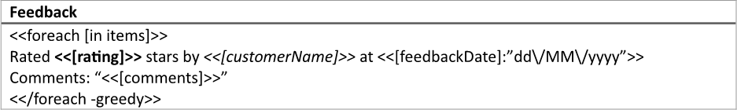
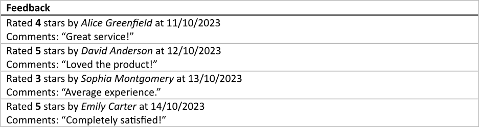
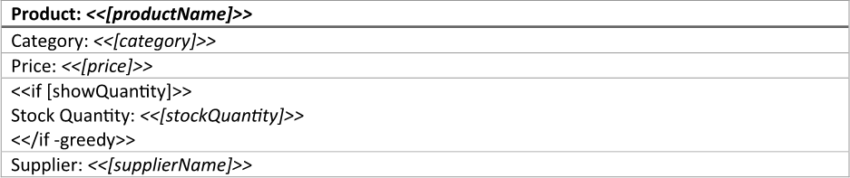
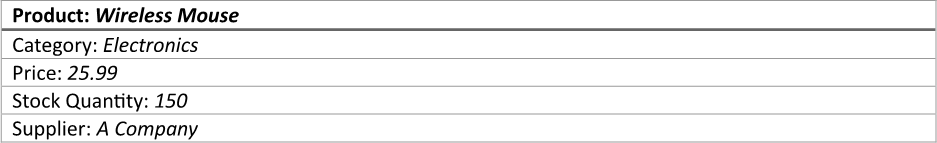
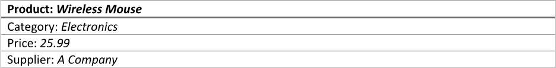
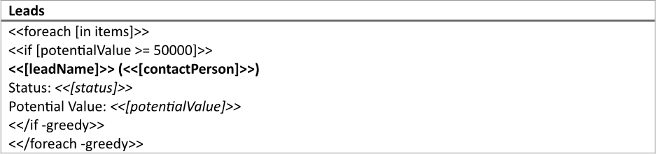
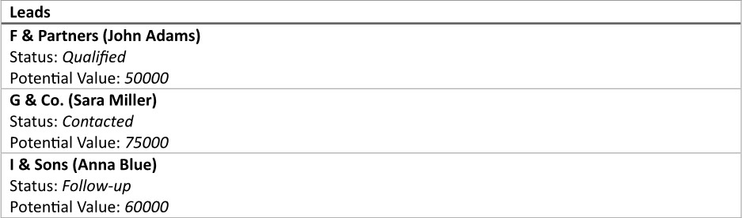

A single-column table provides a straightforward way to present information that requires minimal comparison, such as lists of
items, names, or categories. This simplicity enhances readability and focus, allowing users to quickly scan through the content
without the distraction of multiple columns or complex layouts. You can make a single-column table using LINQ Reporting Engine
in C#.

## How to Build a Single-Column Table

1. Prepare data for your table in one of [formats supported by LINQ Reporting Engine](),
for example, a JSON file as follows:




2. In Microsoft Word, [create a
table](https://support.microsoft.com/en-us/office/insert-a-table-a138f745-73ef-4879-b99a-2f3d38be612a#platform=Windows)
with one column and [format
elements of the table](https://support.microsoft.com/en-us/office/format-a-table-e6e77bc6-1f4e-467e-b818-2e2acc488006)
to use it as a template.

3. Add static content like a column header to the table, if needed.

4. Bind the table to a data collection by adding an opening `foreach` tag to the beginning of a row to be repeated for every
item of the collection as per the example:

<<foreach [in items]>>


5. Add a closing `foreach` tag with a `greedy` switch to the end of a row to be repeated for every item of the collection
like so:

<</foreach -greedy>>


{}

Opening and closing `foreach` tags can be located in a single row or different rows of a single table to capture one or more
rows for repeating.

{}

6. Within the range between the opening and closing `foreach` tags, bind cells of the table (it can be just a single cell) to
values calculated upon an item of the collection by adding expression tags to the cells such as the following ones:

<<[rating]>>


<<[customerName]>>


<<[feedbackDate]:"dd\/MM\/yyyy">>


<<[comments]>>


7. Review your table template before saving, it should look like this:\
\

8. Build your table using LINQ Reporting Engine by running the following C# code:\


## Single-Column Table Report Example

After taking all the steps, LINQ Reporting Engine creates a table report as follows:\
\

{}

You can download the [template
](https://github.com/aspose-words/Aspose.Words-for-.NET/raw/ivan.lyagin/UEX-331/Examples/Data/LINQ/Single-Column%20Table%20Template.docx)
and [data
](https://github.com/aspose-words/Aspose.Words-for-.NET/raw/ivan.lyagin/UEX-331/Examples/Data/LINQ/Single-Column%20Table%20Data.json)
from the example, and try to make a single-column table online for free by using one of the options:\
<a class="product-item docs-btn" href="https://products.aspose.app/words/assembly" >APP </a>
<a class="product-item docs-btn" href="https://products.aspose.com/words/net/report/" >.NET API </a>
<a class="product-item docs-btn" href="https://products.aspose.com/words/python-net/report/" >
PYTHON via <em class="docs-vianet">net</em> API</a>
 
 

{}

## How to Show a Single-Column Table Row Based on a Condition

1. Prepare data for your table in one of [formats supported by LINQ Reporting Engine](),
for example, a JSON file as follows:




2. In Microsoft Word, [create a
table](https://support.microsoft.com/en-us/office/insert-a-table-a138f745-73ef-4879-b99a-2f3d38be612a#platform=Windows)
with a maximum necessary number of rows and one column, and [format
elements of the table](https://support.microsoft.com/en-us/office/format-a-table-e6e77bc6-1f4e-467e-b818-2e2acc488006)
to use it as a template.

3. Add static content like a column header to the table, if needed.

4. Bind cells of the table to values by adding expression tags to the cells such as the following ones:

<<[productName]>>


<<[category]>>


<<[price]>>


<<[stockQuantity]>>


<<[supplierName]>>


5. Bind visibility of a row of the table to be shown based on a condition to a Boolean value by adding an opening `if` tag to
the beginning of the row as per the example:

<<if [showQuantity]>>


6. Add a closing `if` tag with a `greedy` switch to the end of a row of the table to be shown based on a condition like so:

<</if -greedy>>


{}

Opening and closing `if` tags can be located in a single row or different rows of a single table to capture one or more rows
for showing based on the same condition.

{}

7. Review your table template before saving, it should look like this:\
\

8. Build your table using LINQ Reporting Engine by running the following C# code:\


## Single-Column Table with a Row Shown Based on a Condition Report Example

After taking all the steps, LINQ Reporting Engine creates a table report with all the rows shown as follows:\
\

Now, let us consider the alternative case where data for the table implies exclusion of one of the rows, for example, like so:




After running the same code with the JSON file being used instead, LINQ Reporting Engine generates a table report with
one of the rows excluded like this:\
\

Thus, you can control which single-column table rows to show or hide based on conditions.

{}

You can download the [template
](https://github.com/aspose-words/Aspose.Words-for-.NET/raw/ivan.lyagin/UEX-331/Examples/Data/LINQ/Single-Column%20Table%20with%20Row%20Shown%20Based%20on%20Condition%20Template.docx)
and [data
](https://github.com/aspose-words/Aspose.Words-for-.NET/raw/ivan.lyagin/UEX-331/Examples/Data/LINQ/Single-Column%20Table%20with%20Row%20Shown%20Based%20on%20Condition%20Data%201.json)
from the example, and try to make a single-column table with a row shown based on a condition online for free by using one of
the options:\
<a class="product-item docs-btn" href="https://products.aspose.app/words/assembly" >APP </a>
<a class="product-item docs-btn" href="https://products.aspose.com/words/net/report/" >.NET API </a>
<a class="product-item docs-btn" href="https://products.aspose.com/words/python-net/report/" >
PYTHON via <em class="docs-vianet">net</em> API</a>
 
 

{}

## How to Bind Single-Column Table Rows to a Collection Based on a Condition

{}

This guide focuses on usage of `if` tags nested to `foreach` tags within single-column tables. However, binding of
single-column table rows to a collection based on a condition can also be done using `foreach` tags with [filtering of
the collection]() applied.

{}

1. Prepare data for your table in one of [formats supported by LINQ Reporting Engine](),
for example, a JSON file as follows:




2. In Microsoft Word, [create a
table](https://support.microsoft.com/en-us/office/insert-a-table-a138f745-73ef-4879-b99a-2f3d38be612a#platform=Windows)
with one column and [format
elements of the table](https://support.microsoft.com/en-us/office/format-a-table-e6e77bc6-1f4e-467e-b818-2e2acc488006)
to use it as a template.

3. Add static content like a column header to the table, if needed.

4. Bind the table to a data collection by adding an opening `foreach` tag to the beginning of a row to be repeated for every
item of the collection as per the example:

<<foreach [in items]>>


5. Add a closing `foreach` tag with a `greedy` switch to the end of a row to be repeated for every item of the collection
like so:

<</foreach -greedy>>


{}

Opening and closing `foreach` tags can be located in a single row or different rows of a single table to capture one or more
rows for repeating.

{}

6. Bind visibility of a row of the table to be shown based on a condition to a Boolean value calculated upon an item of
the collection by adding an opening `if` tag to the beginning of the row after the opening `foreach` tag, for instance,
like this:

<<if [potentialValue >= 50000]>>


7. Add a closing `if` tag with a `greedy` switch to the end of a row of the table to be shown based on a condition before
the closing `foreach` tag as follows:

<</if -greedy>>


{}

Opening and closing `if` tags can be located in a single row or different rows of a single table to capture one or more rows
for showing based on the same condition.

{}

8. Within the range between the opening and closing `if` tags, bind cells of the table (it can be just a single cell) to values
calculated upon an item of the data collection by adding expression tags to the cells such as the following ones:

<<[leadName]>>


<<[contactPerson]>>


<<[status]>>


<<[potentialValue]>>


9. Review your table template before saving, it should look like this:\
\

10. Build your table using LINQ Reporting Engine by running the following C# code:\


## Single-Column Table with Rows Bound to a Collection Based on a Condition Report Example

After taking all the steps, LINQ Reporting Engine creates a table report as follows:\
\

{}

You can download the [template
](https://github.com/aspose-words/Aspose.Words-for-.NET/raw/ivan.lyagin/UEX-331/Examples/Data/LINQ/Single-Column%20Table%20with%20Rows%20Bound%20to%20Collection%20Based%20on%20Condition%20Template.docx)
and [data
](https://github.com/aspose-words/Aspose.Words-for-.NET/raw/ivan.lyagin/UEX-331/Examples/Data/LINQ/Single-Column%20Table%20with%20Rows%20Bound%20to%20Collection%20Based%20on%20Condition%20Data.json)
from the example, and try to make a single-column table with rows bound to a collection based on a condition online for free
by using one of the options:\
<a class="product-item docs-btn" href="https://products.aspose.app/words/assembly" >APP </a>
<a class="product-item docs-btn" href="https://products.aspose.com/words/net/report/" >.NET API </a>
<a class="product-item docs-btn" href="https://products.aspose.com/words/python-net/report/" >
PYTHON via <em class="docs-vianet">net</em> API</a>
 
 

{}

## See Also

- [Building Tables]()
- [Binding Collections]()
- [Formatting Data]()
- [LINQ Reporting Engine]()
- [ReportingEngine Class](https://reference.aspose.com/words/net/aspose.words.reporting/reportingengine/)

{}