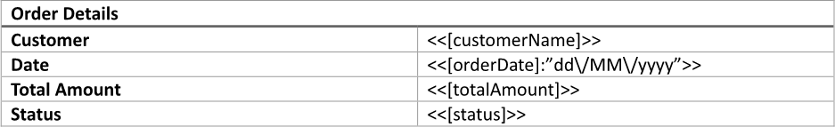
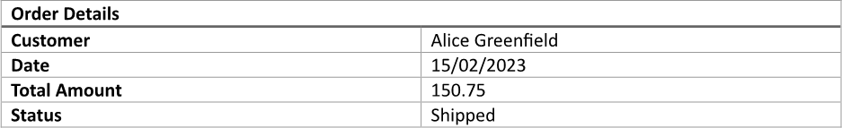
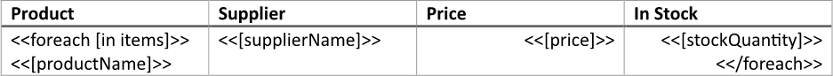
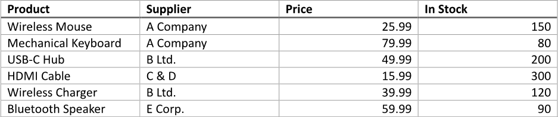

Utilizing [tables](https://en.wikipedia.org/wiki/Table_(information)) for data presentation enhances readability and
facilitates quick access to specific information, making it easier for audiences to interpret complex datasets. Their
systematic layout aids in the efficient communication of quantitative data, ensuring that key insights are readily accessible.
You can make a table using LINQ Reporting Engine in C#.

## How to Build a Table

1. Prepare data for your table in one of [formats supported by LINQ Reporting Engine](),
for example, a JSON file as follows:




2. In Microsoft Word, [create a
table](https://support.microsoft.com/en-us/office/insert-a-table-a138f745-73ef-4879-b99a-2f3d38be612a#platform=Windows)
of a necessary size and [format its
elements](https://support.microsoft.com/en-us/office/format-a-table-e6e77bc6-1f4e-467e-b818-2e2acc488006)
to use it as a template.

3. Add static content like headers to the table, if needed.

4. Bind cells of the table to values by adding expression tags to the cells such as the following ones:

<<[customerName]>>


<<[orderDate]:"dd\/MM\/yyyy">>


<<[totalAmount]>>


<<[status]>>


5. Review your table template before saving, it should look like this:\
\

6. Build your table using LINQ Reporting Engine by running the following C# code:\


## Table Report Example

After taking all the steps, LINQ Reporting Engine creates a table report as follows:\
\

{}

You can download the [template
](https://github.com/aspose-words/Aspose.Words-for-.NET/raw/ivan.lyagin/UEX-331/Examples/Data/LINQ/Table%20Template.docx)
and [data
](https://github.com/aspose-words/Aspose.Words-for-.NET/raw/ivan.lyagin/UEX-331/Examples/Data/LINQ/Table%20Data.json)
from the example, and try to make a table online for free by using one of the options:\
<a class="product-item docs-btn" href="https://products.aspose.app/words/assembly" >APP </a>
<a class="product-item docs-btn" href="https://products.aspose.com/words/net/report/" >.NET API </a>
<a class="product-item docs-btn" href="https://products.aspose.com/words/python-net/report/" >
PYTHON via <em class="docs-vianet">net</em> API</a>
 
 

{}

## How to Bind Table Rows to a Collection

1. Prepare data for your table in one of [formats supported by LINQ Reporting Engine](),
for example, a JSON file as follows:




2. In Microsoft Word, [create a
table](https://support.microsoft.com/en-us/office/insert-a-table-a138f745-73ef-4879-b99a-2f3d38be612a#platform=Windows)
with a necessary number of columns and [format its
elements](https://support.microsoft.com/en-us/office/format-a-table-e6e77bc6-1f4e-467e-b818-2e2acc488006)
to use it as a template.

3. Add static content like headers to the table, if needed.

4. Bind the table to a data collection by adding an opening `foreach` tag to the beginning of a row to be repeated for every
item of the collection as per the example:

<<foreach [in items]>>


5. Add a closing `foreach` tag to the end of a row to be repeated for every item of the collection like so:

<</foreach>>


{}

Opening and closing `foreach` tags can be located in a single row or different rows of a single table to capture one or more
rows for repeating.

{}

6. Within the range between the opening and closing `foreach` tags, bind cells of the table to values calculated upon an item
of the collection by adding expression tags to the cells such as the following ones:

<<[productName]>>


<<[supplierName]>>


<<[price]>>


<<[stockQuantity]>>


7. Review your table template before saving, it should look like this:\
\

8. Build your table using LINQ Reporting Engine by running the following C# code:\


## Table with Rows Bound to a Collection Report Example

After taking all the steps, LINQ Reporting Engine creates a table report as follows:\
\

{}

You can download the [template
](https://github.com/aspose-words/Aspose.Words-for-.NET/raw/ivan.lyagin/UEX-331/Examples/Data/LINQ/Table%20with%20Rows%20Bound%20to%20Collection%20Template.docx)
and [data
](https://github.com/aspose-words/Aspose.Words-for-.NET/raw/ivan.lyagin/UEX-331/Examples/Data/LINQ/Table%20with%20Rows%20Bound%20to%20Collection%20Data.json)
from the example, and try to make a table with rows bound to a collection online for free by using one of the options:\
<a class="product-item docs-btn" href="https://products.aspose.app/words/assembly" >APP </a>
<a class="product-item docs-btn" href="https://products.aspose.com/words/net/report/" >.NET API </a>
<a class="product-item docs-btn" href="https://products.aspose.com/words/python-net/report/" >
PYTHON via <em class="docs-vianet">net</em> API</a>
 
 

{}

## See Also

- [Building Tables]()
- [Binding Collections]()
- [Formatting Data]()
- [LINQ Reporting Engine]()
- [ReportingEngine Class](https://reference.aspose.com/words/net/aspose.words.reporting/reportingengine/)

{}