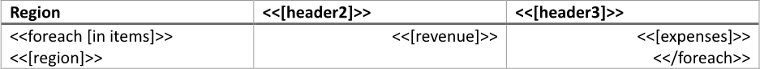
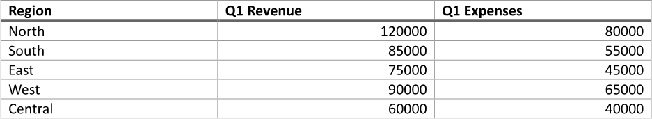

Changing table headers allows for the customization of column titles to better reflect the content and context of the data
presented. This flexibility enhances clarity and understanding for users, ensuring that they can quickly grasp the significance
of each column and the information it contains, leading to more effective data interpretation. You can build a table with
changing headers using LINQ Reporting Engine in C#.

## How to Change Table Headers

1. Prepare data for your table in one of [formats supported by LINQ Reporting Engine](),
for example, a JSON file as follows:




2. In Microsoft Word, [create a
table](https://support.microsoft.com/en-us/office/insert-a-table-a138f745-73ef-4879-b99a-2f3d38be612a#platform=Windows)
with a necessary number of columns and [format its
elements](https://support.microsoft.com/en-us/office/format-a-table-e6e77bc6-1f4e-467e-b818-2e2acc488006)
to use it as a template.

3. Add static content like some of headers to the table, if needed.

4. Bind header cells of the table to values by adding expression tags to the cells, for instance, like these:

<<[header2]>>


<<[header3]>>


5. Bind the table to a data collection by adding an opening `foreach` tag to the beginning of a row to be repeated for every
item of the collection as per the example:

<<foreach [in items]>>


6. Add a closing `foreach` tag to the end of a row to be repeated for every item of the collection like so:

<</foreach>>


{}

Opening and closing `foreach` tags can be located in a single row or different rows of a single table to capture one or more
rows for repeating.

{}

7. Within the range between the opening and closing `foreach` tags, bind cells of the table to values calculated upon an item
of the collection by adding expression tags to the cells such as the following ones:

<<[region]>>


<<[revenue]>>


<<[expenses]>>


8. Review your table template before saving, it should look like this:\
\

9. Build your table using LINQ Reporting Engine by running the following C# code:\


## Table with Changing Headers Report Example

After taking all the steps, LINQ Reporting Engine creates a table report as follows:\
\

{}

You can download the [template
](https://github.com/aspose-words/Aspose.Words-for-.NET/raw/ivan.lyagin/UEX-331/Examples/Data/LINQ/Table%20with%20Changing%20Headers%20Template.docx)
and [data
](https://github.com/aspose-words/Aspose.Words-for-.NET/raw/ivan.lyagin/UEX-331/Examples/Data/LINQ/Table%20with%20Changing%20Headers%20Data.json)
from the example, and try to make a table with changing headers online for free by using one of the options:\
<a class="product-item docs-btn" href="https://products.aspose.app/words/assembly" >APP </a>
<a class="product-item docs-btn" href="https://products.aspose.com/words/net/report/" >.NET API </a>
<a class="product-item docs-btn" href="https://products.aspose.com/words/python-net/report/" >
PYTHON via <em class="docs-vianet">net</em> API</a>
 
 

{}

## See Also

- [Building Tables]()
- [Binding Collections]()
- [Formatting Data]()
- [LINQ Reporting Engine]()
- [ReportingEngine Class](https://reference.aspose.com/words/net/aspose.words.reporting/reportingengine/)

{}