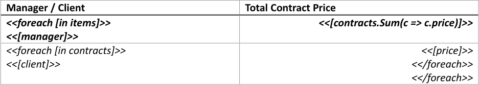
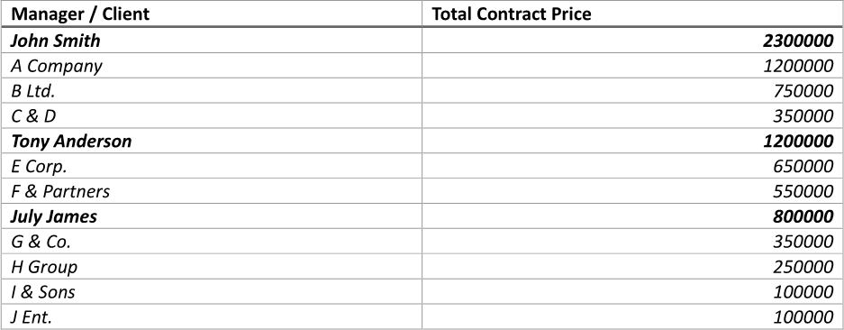
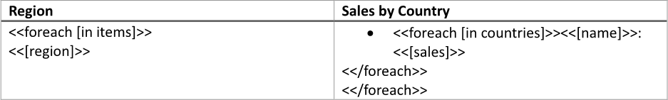
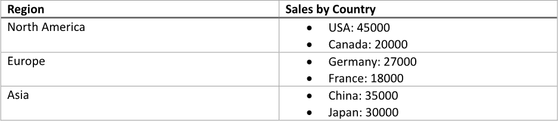

Displaying [master-detail data](https://en.wikipedia.org/wiki/Master%E2%80%93detail_interface#Data_model) in one table allows
users to view hierarchical relationships between data points in a single, cohesive format. This integration simplifies data
navigation, enabling users to easily see the connections between the master records and their corresponding details, which
enhances understanding and facilitates more efficient data analysis. You can build a table with master-detail data using LINQ
Reporting Engine in C#.

## How to Display Master-Detail Data in One Table (Option 1)

{}

This option implies layout of detail data in separate table rows.

{}

1. Prepare data for your table in one of [formats supported by LINQ Reporting Engine](),
for example, a JSON file as follows:




2. In Microsoft Word, [create a
table](https://support.microsoft.com/en-us/office/insert-a-table-a138f745-73ef-4879-b99a-2f3d38be612a#platform=Windows)
with a necessary number of columns and [format its
elements](https://support.microsoft.com/en-us/office/format-a-table-e6e77bc6-1f4e-467e-b818-2e2acc488006)
to use it as a template.

3. Add static content like headers to the table, if needed.

4. Bind the table to a master data collection by adding an opening `foreach` tag to the beginning of a row to be repeated for
every item of the collection as per the example:

<<foreach [in items]>>


5. Add a closing `foreach` tag to the end of the next table row like so:

<</foreach>>


{}

Opening and closing `foreach` tags can be located in a single row or different rows of a single table to capture one or more
rows for repeating. In this example, two table rows are captured for an item of the master data collection to use one of
the rows for displaying master data itself and the other one for displaying details.

{}

6. Bind cells of the table row containing the opening `foreach` tag to values calculated upon an item of the master
data collection by adding expression tags to the cells after the opening `foreach` tag such as the following ones:

<<[manager]>>


<<[contracts.Sum(c => c.price)]>>


7. Bind the table row containing the closing `foreach` tag to a detail data collection calculated upon an item of the master
data collection to repeat the row for every item of the detail collection by adding an inner opening `foreach` tag to
the beginning of the row, for instance, as follows:

<<foreach [in contracts]>>


8. Add an inner closing `foreach` tag to the end of the row before the outer closing `foreach` tag this way:

<</foreach>>


9. Within the range between the inner opening and closing `foreach` tags, bind cells of the row to values calculated upon
an item of the detail collection by adding expression tags to the cells similar to these:

<<[client]>>


<<[price]>>


10. Review your table template before saving, it should look like this:\
\

11. Build your table using LINQ Reporting Engine by running the following C# code:\


## Table with Master-Detail Data (Option 1) Report Example

After taking all the steps, LINQ Reporting Engine creates a table report as follows:\
\

{}

You can download the [template
](https://github.com/aspose-words/Aspose.Words-for-.NET/raw/ivan.lyagin/UEX-331/Examples/Data/LINQ/Table%20with%20Master-Detail%20Data%20Option%201%20Template.docx)
and [data
](https://github.com/aspose-words/Aspose.Words-for-.NET/raw/ivan.lyagin/UEX-331/Examples/Data/LINQ/Table%20with%20Master-Detail%20Data%20Option%201%20Data.json)
from the example, and try to make a table with master-detail data online for free by using one of the options:\
<a class="product-item docs-btn" href="https://products.aspose.app/words/assembly" >APP </a>
<a class="product-item docs-btn" href="https://products.aspose.com/words/net/report/" >.NET API </a>
<a class="product-item docs-btn" href="https://products.aspose.com/words/python-net/report/" >
PYTHON via <em class="docs-vianet">net</em> API</a>
 
 

{}

## How to Display Master-Detail Data in One Table (Option 2)

{}

This option suggests using of a bulleted list to display details in the same table row with master data.

{}

1. Prepare data for your table in one of [formats supported by LINQ Reporting Engine](),
for example, a JSON file as follows:




2. In Microsoft Word, [create a
table](https://support.microsoft.com/en-us/office/insert-a-table-a138f745-73ef-4879-b99a-2f3d38be612a#platform=Windows)
with a necessary number of columns and [format its
elements](https://support.microsoft.com/en-us/office/format-a-table-e6e77bc6-1f4e-467e-b818-2e2acc488006)
to use it as a template.

3. Add static content like headers to the table, if needed.

4. Bind the table to a master data collection by adding an opening `foreach` tag to the beginning of a row to be repeated for
every item of the collection as per the example:

<<foreach [in items]>>


5. Add a closing `foreach` tag to the end of a row to be repeated for every item of the collection like so:

<</foreach>>


{}

Opening and closing `foreach` tags can be located in a single row or different rows of a single table to capture one or more
rows for repeating.

{}

6. Within the range between the opening and closing `foreach` tags, bind cells of the table to values calculated upon an item
of the master collection by adding expression tags to the cells such as the following one:

<<[region]>>


7. Use one of the cells to [display details in a bulleted list]()
by taking the following steps:

    * Add a paragraph to the cell (the paragraph should be located after the opening and before the closing `foreach` tags) and
[create a bulleted
list](https://support.microsoft.com/en-us/office/create-a-bulleted-or-numbered-list-9ff81241-58a8-4d88-8d8c-acab3006a23e)
for the paragraph.

    * Bind the paragraph to a detail data collection calculated upon an item of the master data collection to repeat
the paragraph for every item of the detail collection by adding an inner opening `foreach` tag to the beginning of
the paragraph, for instance, as follows:

<<foreach [in countries]>>


    * Bind the paragraph to values calculated upon an item of the detail data collection by adding expression tags after
the inner opening `foreach` tag similar to these:

<<[name]>>


<<[sales]>>


    * Right after the paragraph, add one more paragraph without a bulleted list and put an inner closing `foreach` tag into
the new paragraph this way:

<</foreach>>


8. Review your table template before saving, it should look like this:\
\

9. Build your table using LINQ Reporting Engine by running the following C# code:\


## Table with Master-Detail Data (Option 2) Report Example

After taking all the steps, LINQ Reporting Engine creates a table report as follows:\
\

{}

You can download the [template
](https://github.com/aspose-words/Aspose.Words-for-.NET/raw/ivan.lyagin/UEX-331/Examples/Data/LINQ/Table%20with%20Master-Detail%20Data%20Option%202%20Template.docx)
and [data
](https://github.com/aspose-words/Aspose.Words-for-.NET/raw/ivan.lyagin/UEX-331/Examples/Data/LINQ/Table%20with%20Master-Detail%20Data%20Option%202%20Data.json)
from the example, and try to make a table with master-detail data online for free by using one of the options:\
<a class="product-item docs-btn" href="https://products.aspose.app/words/assembly" >APP </a>
<a class="product-item docs-btn" href="https://products.aspose.com/words/net/report/" >.NET API </a>
<a class="product-item docs-btn" href="https://products.aspose.com/words/python-net/report/" >
PYTHON via <em class="docs-vianet">net</em> API</a>
 
 

{}

## See Also

- [Building Tables]()
- [Binding Collections]()
- [Formatting Data]()
- [LINQ Reporting Engine]()
- [ReportingEngine Class](https://reference.aspose.com/words/net/aspose.words.reporting/reportingengine/)

{}