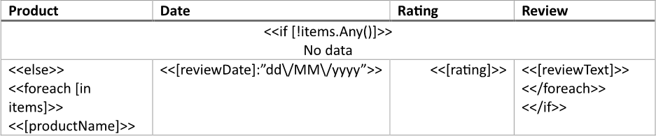
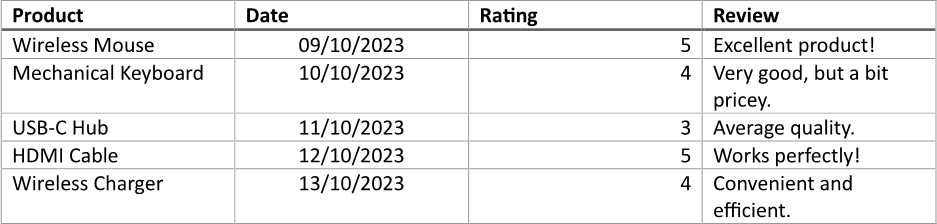
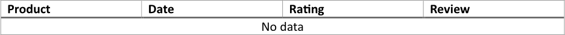

Displaying a message for an empty table in a report provides clarity to users, indicating that there is currently no data
available rather than leaving them confused or misled. This transparency allows users to understand the context of the report
better and can prompt them to consider why the data is missing, whether due to lack of information, data collection issues,
or other factors. You can build a table with a message, if empty, using LINQ Reporting Engine in C#.

## How to Display a Message for an Empty Table

1. Prepare data for your table in one of [formats supported by LINQ Reporting Engine](),
for example, a JSON file as follows:




2. In Microsoft Word, [create a
table](https://support.microsoft.com/en-us/office/insert-a-table-a138f745-73ef-4879-b99a-2f3d38be612a#platform=Windows)
with a necessary number of columns and [format its
elements](https://support.microsoft.com/en-us/office/format-a-table-e6e77bc6-1f4e-467e-b818-2e2acc488006)
to use it as a template.

3. Add static content like headers to the table, if needed.

4. [Merge all cells](https://support.microsoft.com/en-us/office/merge-or-split-cells-in-a-table-8b458deb-0fc5-4c8d-8d94-2d4da98193f8)
in a row coming after the table's header row.

5. Bind the merged cell's visibility to a Boolean value indicating whether a data collection is empty by adding an opening
`if` tag to the beginning of the cell and [applying the `Any()` extension
method](), for instance, this way:

<<if [!items.Any()]>>


6. Append a message to be displayed when the collection has no items to the cell.

7. Make the rest of the table's rows visible only when the collection contains items by adding an `else` tag to the beginning
of the first such row as follows:

<<else>>


8. Add a closing `if` tag to the end of the last such row like this:

<</if>>


9. Bind the table to the data collection by adding an opening `foreach` tag to the beginning of a row to be repeated for every
item of the collection after the `else` tag as per the example:

<<foreach [in items]>>


10. Add a closing `foreach` tag to the end of a row to be repeated for every item of the collection before the closing `if` tag
like so:

<</foreach>>


{}

Opening and closing `foreach` tags can be located in a single row or different rows of a single table to capture one or more
rows for repeating.

{}

11. Within the range between the opening and closing `foreach` tags, bind cells of the table to values calculated upon an item
of the collection by adding expression tags to the cells such as the following ones:

<<[productName]>>


<<[reviewDate]:"dd\/MM\/yyyy">>


<<[rating]>>


<<[reviewText]>>


12. Review your table template before saving, it should look like this:\
\

13. Build your table using LINQ Reporting Engine by running the following C# code:\


## Table with a Message, If Empty, Report Example

After taking all the steps, LINQ Reporting Engine creates a table report with all the data shown as follows:\
\

Now, let us consider the alternative case where data for the table is missing, for example, like so:




After running the same code with the JSON file being used instead, LINQ Reporting Engine generates a table report with
a message being displayed like this:\
\

{}

You can download the [template
](https://github.com/aspose-words/Aspose.Words-for-.NET/raw/ivan.lyagin/UEX-331/Examples/Data/LINQ/Table%20with%20Message%20If%20Empty%20Template.docx)
and [data
](https://github.com/aspose-words/Aspose.Words-for-.NET/raw/ivan.lyagin/UEX-331/Examples/Data/LINQ/Table%20with%20Message%20If%20Empty%20Data%201.json)
from the example, and try to make a table with a message, if empty, online for free by using one of the options:\
<a class="product-item docs-btn" href="https://products.aspose.app/words/assembly" >APP </a>
<a class="product-item docs-btn" href="https://products.aspose.com/words/net/report/" >.NET API </a>
<a class="product-item docs-btn" href="https://products.aspose.com/words/python-net/report/" >
PYTHON via <em class="docs-vianet">net</em> API</a>
 
 

{}

## See Also

- [Building Tables]()
- [Binding Collections]()
- [Formatting Data]()
- [LINQ Reporting Engine]()
- [ReportingEngine Class](https://reference.aspose.com/words/net/aspose.words.reporting/reportingengine/)

{}