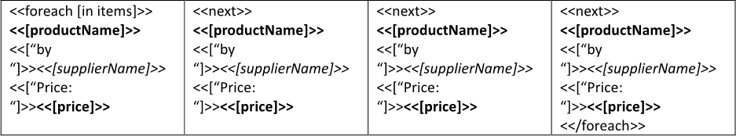
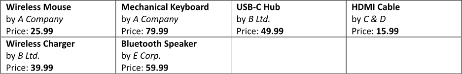

Displaying several items per table row allows for a more compact and comprehensive view of related data, enabling users to
compare multiple attributes or categories at once. This format enhances clarity and efficiency by consolidating information,
making it easier for users to analyze relationships and draw insights without needing to navigate through multiple rows or
tables. You can build a table with several items displayed per row using LINQ Reporting Engine in C#.

## How to Display Several Items per Table Row

1. Prepare data for your table in one of [formats supported by LINQ Reporting Engine](),
for example, a JSON file as follows:




2. In Microsoft Word, [create a single-row
table](https://support.microsoft.com/en-us/office/insert-a-table-a138f745-73ef-4879-b99a-2f3d38be612a#platform=Windows)
with the number of columns equal to the number of items to display per row and [format
elements of the table](https://support.microsoft.com/en-us/office/format-a-table-e6e77bc6-1f4e-467e-b818-2e2acc488006)
to use it as a template.

3. Bind the table to a data collection by adding an opening `foreach` tag to the beginning of the table's single row (that is
to be repeated until all items of the collection are visited) as per the example:

<<foreach [in items]>>


4. Add a closing `foreach` tag to the end of the row like so:

<</foreach>>


5. Bind the first cell of the row to values calculated upon an item of the collection by adding expression tags to the cell
such as the following ones:

<<[productName]>>


<<[supplierName]>>


<<[price]>>


6. Use literal-string expression tags to form static parts of the cell's content, for instance, this way:

<<["by "]>>


<<["Price: "]>>


7. Starting from the second cell, add a `next` tag to the beginning of every cell of the table's single row as follows:

<<next>>


8. Copy content of the first cell of the row after the opening `foreach` tag to every of the rest of the row's cells after
a `next` tag and before the closing `foreach` tag, if any.

9. Review your table template before saving, it should look like this:\
\

10. Build your table using LINQ Reporting Engine by running the following C# code:\


## Table with Several Items Displayed per Row Report Example

After taking all the steps, LINQ Reporting Engine creates a table report as follows:\
\

{}

You can download the [template
](https://github.com/aspose-words/Aspose.Words-for-.NET/raw/ivan.lyagin/UEX-331/Examples/Data/LINQ/Table%20with%20Several%20Items%20Displayed%20per%20Row%20Template.docx)
and [data
](https://github.com/aspose-words/Aspose.Words-for-.NET/raw/ivan.lyagin/UEX-331/Examples/Data/LINQ/Table%20with%20Several%20Items%20Displayed%20per%20Row%20Data.json)
from the example, and try to make a table with several items displayed per row online for free by using one of the options:\
<a class="product-item docs-btn" href="https://products.aspose.app/words/assembly" >APP </a>
<a class="product-item docs-btn" href="https://products.aspose.com/words/net/report/" >.NET API </a>
<a class="product-item docs-btn" href="https://products.aspose.com/words/python-net/report/" >
PYTHON via <em class="docs-vianet">net</em> API</a>
 
 

{}

## See Also

- [Building Tables]()
- [Binding Collections]()
- [Formatting Data]()
- [LINQ Reporting Engine]()
- [ReportingEngine Class](https://reference.aspose.com/words/net/aspose.words.reporting/reportingengine/)

{}