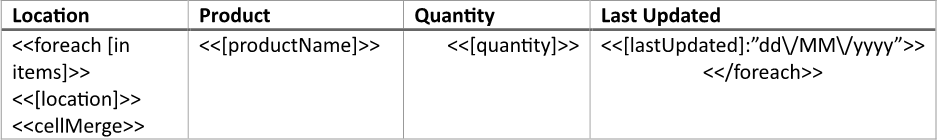
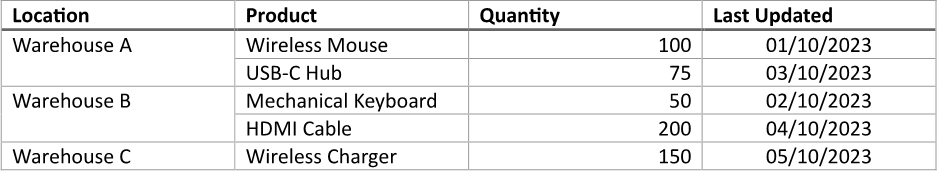
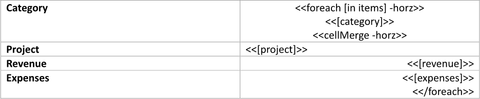
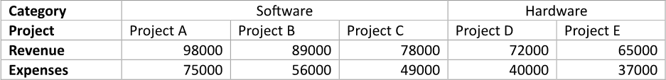
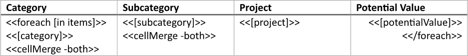
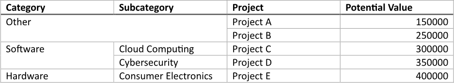
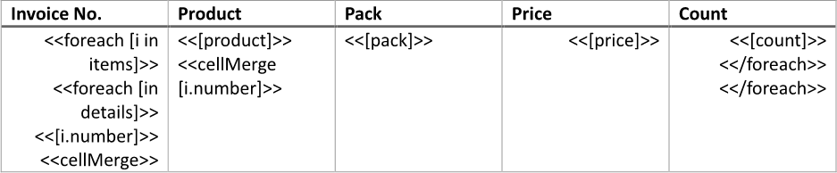
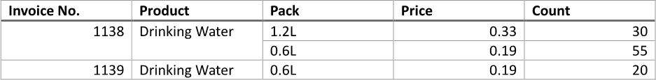

Merging table cells allows for the consolidation of related information into a single cell, which can help clarify
the relationships between data points and reduce visual clutter. This technique is particularly beneficial for creating
headers or grouping related data, making the table more organized and easier for users to read and understand. You can
build a table with merged cells using LINQ Reporting Engine in C#.

## How to Merge Table Cells Vertically

{}

This guide deals with a table with rows bound to a collection. However, you can apply a similar approach to tables of any type
including ones with static structure.

{}

1. Prepare data for your table in one of [formats supported by LINQ Reporting Engine](),
for example, a JSON file as follows:




2. In Microsoft Word, [create a
table](https://support.microsoft.com/en-us/office/insert-a-table-a138f745-73ef-4879-b99a-2f3d38be612a#platform=Windows)
with a necessary number of columns and [format its
elements](https://support.microsoft.com/en-us/office/format-a-table-e6e77bc6-1f4e-467e-b818-2e2acc488006)
to use it as a template.

3. Add static content like headers to the table, if needed.

4. Bind the table to a data collection by adding an opening `foreach` tag to the beginning of a row to be repeated for every
item of the collection as per the example:

<<foreach [in items]>>


5. Add a closing `foreach` tag to the end of a row to be repeated for every item of the collection like so:

<</foreach>>


{}

Opening and closing `foreach` tags can be located in a single row or different rows of a single table to capture one or more
rows for repeating.

{}

6. Within the range between the opening and closing `foreach` tags, bind cells of the table to values calculated upon an item
of the collection by adding expression tags to the cells such as the following ones:

<<[location]>>


<<[productName]>>


<<[quantity]>>


<<[lastUpdated]:"dd\/MM\/yyyy">>


7. For cells to be merged vertically in a result table, append `cellMerge` tags this way:

<<cellMerge>>


{}

In order to vertically merge two or more neighbor cells, all the cells should contain a `cellMerge` tag without any switches,
have equal textual contents in a result table (ignoring surrounding whitespaces), and be not already merged horizontally.

{}

8. Review your table template before saving, it should look like this:\
\

9. Build your table using LINQ Reporting Engine by running the following C# code:\


## Table with Cells Merged Vertically Report Example

After taking all the steps, LINQ Reporting Engine creates a table report as follows:\
\

{}

You can download the [template
](https://github.com/aspose-words/Aspose.Words-for-.NET/raw/ivan.lyagin/UEX-331/Examples/Data/LINQ/Table%20with%20Cells%20Merged%20Vertically%20Template.docx)
and [data
](https://github.com/aspose-words/Aspose.Words-for-.NET/raw/ivan.lyagin/UEX-331/Examples/Data/LINQ/Table%20with%20Cells%20Merged%20Vertically%20Data.json)
from the example, and try to make a table with cells merged vertically online for free by using one of the options:\
<a class="product-item docs-btn" href="https://products.aspose.app/words/assembly" >APP </a>
<a class="product-item docs-btn" href="https://products.aspose.com/words/net/report/" >.NET API </a>
<a class="product-item docs-btn" href="https://products.aspose.com/words/python-net/report/" >
PYTHON via <em class="docs-vianet">net</em> API</a>
 
 

{}

## How to Merge Table Cells Horizontally

{}

Although this guide shows working with a table with columns bound to a collection, you can apply a similar technique to tables
of any type including tables of static structure.

{}

1. Prepare data for your table in one of [formats supported by LINQ Reporting Engine](),
for example, a JSON file as follows:




2. In Microsoft Word, [create a
table](https://support.microsoft.com/en-us/office/insert-a-table-a138f745-73ef-4879-b99a-2f3d38be612a#platform=Windows)
with a necessary number of rows and [format its
elements](https://support.microsoft.com/en-us/office/format-a-table-e6e77bc6-1f4e-467e-b818-2e2acc488006)
to use it as a template.

3. Consider applying [automatical resizing to columns of
the table](https://support.microsoft.com/en-us/office/resize-a-table-row-or-column-9340d478-21be-4392-81cf-488f7bbd6715#__toc293661261).

4. Add static content like headers to the table, if needed.

5. Bind the table to a data collection by adding an opening `foreach` tag with a `horz` switch to the beginning of a column
to be repeated for every item of the collection as per the example:

<<foreach [in items] -horz>>


6. Add a closing `foreach` tag to the end of a column to be repeated for every item of the collection like so:

<</foreach>>


{}

With a `horz` switch applied, opening and closing `foreach` tags can be located in a single column or different columns of
a single table to capture one or more columns for repeating.

{}

7. Within the range between the opening and closing `foreach` tags, bind cells of the table to values calculated upon an item
of the collection by adding expression tags to the cells such as the following ones:

<<[category]>>


<<[project]>>


<<[revenue]>>


<<[expenses]>>


8. For cells to be merged horizontally in a result table, append `cellMerge` tags with `horz` switches this way:

<<cellMerge -horz>>


{}

In order to horizontally merge two or more neighbor cells, all the cells should contain a `cellMerge` tag with a `horz` switch,
have equal textual contents in a result table (ignoring surrounding whitespaces), and be not already merged vertically.

{}

9. Review your table template before saving, it should look like this:\
\

10. Build your table using LINQ Reporting Engine by running the following C# code:\


## Table with Cells Merged Horizontally Report Example

After taking all the steps, LINQ Reporting Engine creates a table report as follows:\
\

{}

You can download the [template
](https://github.com/aspose-words/Aspose.Words-for-.NET/raw/ivan.lyagin/UEX-331/Examples/Data/LINQ/Table%20with%20Cells%20Merged%20Horizontally%20Template.docx)
and [data
](https://github.com/aspose-words/Aspose.Words-for-.NET/raw/ivan.lyagin/UEX-331/Examples/Data/LINQ/Table%20with%20Cells%20Merged%20Horizontally%20Data.json)
from the example, and try to make a table with cells merged horizontally online for free by using one of the options:\
<a class="product-item docs-btn" href="https://products.aspose.app/words/assembly" >APP </a>
<a class="product-item docs-btn" href="https://products.aspose.com/words/net/report/" >.NET API </a>
<a class="product-item docs-btn" href="https://products.aspose.com/words/python-net/report/" >
PYTHON via <em class="docs-vianet">net</em> API</a>
 
 

{}

## How to Merge Table Cells Vertically and Horizontally

{}

This guide uses a table with rows bound to a collection as an example, but you can apply the same approach to tables of any type
including static-structure ones.

{}

1. Prepare data for your table in one of [formats supported by LINQ Reporting Engine](),
for example, a JSON file as follows:




2. In Microsoft Word, [create a
table](https://support.microsoft.com/en-us/office/insert-a-table-a138f745-73ef-4879-b99a-2f3d38be612a#platform=Windows)
with a necessary number of columns and [format its
elements](https://support.microsoft.com/en-us/office/format-a-table-e6e77bc6-1f4e-467e-b818-2e2acc488006)
to use it as a template.

3. Add static content like headers to the table, if needed.

4. Bind the table to a data collection by adding an opening `foreach` tag to the beginning of a row to be repeated for every
item of the collection as per the example:

<<foreach [in items]>>


5. Add a closing `foreach` tag to the end of a row to be repeated for every item of the collection like so:

<</foreach>>


{}

Opening and closing `foreach` tags can be located in a single row or different rows of a single table to capture one or more
rows for repeating.

{}

6. Within the range between the opening and closing `foreach` tags, bind cells of the table to values calculated upon an item
of the collection by adding expression tags to the cells such as the following ones:

<<[category]>>


<<[subcategory]>>


<<[project]>>


<<[potentialValue]>>


7. For cells to be merged vertically and horizontally in a result table, append `cellMerge` tags with `both` switches this way:

<<cellMerge -both>>


{}

In order to merge two or more neighbor cells both vertically and horizontally, all the cells should contain a `cellMerge` tag
with a `both` switch and have equal textual contents in a result table (ignoring surrounding whitespaces).

{}

8. Review your table template before saving, it should look like this:\
\

9. Build your table using LINQ Reporting Engine by running the following C# code:\


## Table with Cells Merged Vertically and Horizontally Report Example

After taking all the steps, LINQ Reporting Engine creates a table report as follows:\
\

{}

You can download the [template
](https://github.com/aspose-words/Aspose.Words-for-.NET/raw/ivan.lyagin/UEX-331/Examples/Data/LINQ/Table%20with%20Cells%20Merged%20Vertically%20and%20Horizontally%20Template.docx)
and [data
](https://github.com/aspose-words/Aspose.Words-for-.NET/raw/ivan.lyagin/UEX-331/Examples/Data/LINQ/Table%20with%20Cells%20Merged%20Vertically%20and%20Horizontally%20Data.json)
from the example, and try to make a table with cells merged vertically and horizontally online for free by using one of
the options:\
<a class="product-item docs-btn" href="https://products.aspose.app/words/assembly" >APP </a>
<a class="product-item docs-btn" href="https://products.aspose.com/words/net/report/" >.NET API </a>
<a class="product-item docs-btn" href="https://products.aspose.com/words/python-net/report/" >
PYTHON via <em class="docs-vianet">net</em> API</a>
 
 

{}

## How to Restrict Table Cell Merging

{}

Although this guide focuses on vertical cell merging for a table with rows bound to master-detail data, you can apply a similar
method to any direction of cell merging, tables of any type (including those with static structure), and data structured any
other way.

{}

1. Prepare data for your table in one of [formats supported by LINQ Reporting Engine](),
for example, a JSON file as follows:




2. In Microsoft Word, [create a
table](https://support.microsoft.com/en-us/office/insert-a-table-a138f745-73ef-4879-b99a-2f3d38be612a#platform=Windows)
with a necessary number of columns and [format its
elements](https://support.microsoft.com/en-us/office/format-a-table-e6e77bc6-1f4e-467e-b818-2e2acc488006)
to use it as a template.

3. Add static content like headers to the table, if needed.

4. Bind the table to a master data collection by adding an opening `foreach` tag to the beginning of a row to be repeated for
every item of the collection as per the example:

<<foreach [i in items]>>


5. Add a closing `foreach` tag to the end of a row to be repeated for every item of the collection like so:

<</foreach>>


{}

Opening and closing `foreach` tags can be located in a single row or different rows of a single table to capture one or more
rows for repeating.

{}

6. Bind the table row containing the opening `foreach` tag to a detail data collection calculated upon an item of the master
data collection to repeat the row for every item of the detail collection by adding an inner opening `foreach` tag to
the beginning of the row after the outer opening `foreach` tag, for instance, as follows:

<<foreach [in details]>>


7. Add an inner closing `foreach` tag to the end of the row containing the outer closing `foreach` tag before the tag this way:

<</foreach>>


{}

In this example, outer and inner `foreach` tags capture the same row for repeating.

{}

8. Within the range between the inner opening and closing `foreach` tags, bind cells of the row to values calculated upon
an item of the detail collection by adding expression tags to the cells such as the following ones:

<<[i.number]>>


<<[product]>>


<<[pack]>>


<<[price]>>


<<[count]>>


{}

Since between the inner opening and closing `foreach` tags, expression values are calculated upon an item of the detail
collection, an explicit reference to an item of the master collection - such as `i` - is required when accessing master data.

{}

9. For cells to be merged vertically in a result table, append `cellMerge` tags like so:

<<cellMerge>>


{}

In order to vertically merge two or more neighbor cells, all the cells should contain a `cellMerge` tag without any switches,
have equal textual contents in a result table (ignoring surrounding whitespaces), and be not already merged horizontally.

{}

10. To additionally restrict merging of cells to those for which a particular expression evaluates to the same value, append
the expression to corresponding `cellMerge` tags, for instance, as per the snippet:

<<cellMerge [i.number]>>


{}

When an expression defined at a `cellMerge` tag evalutes to the same value for neighbor cells, the cells are merged if all
other conditions for merging - such as equal cell textual contents - are met.

{}

11. Review your table template before saving, it should look like this:\
\

12. Build your table using LINQ Reporting Engine by running the following C# code:\


## Table with a Cell Merging Restriction Report Example

After taking all the steps, LINQ Reporting Engine creates a table report as follows:\
\

{}

You can download the [template
](https://github.com/aspose-words/Aspose.Words-for-.NET/raw/ivan.lyagin/UEX-331/Examples/Data/LINQ/Table%20with%20Cell%20Merging%20Restriction%20Template.docx)
and [data
](https://github.com/aspose-words/Aspose.Words-for-.NET/raw/ivan.lyagin/UEX-331/Examples/Data/LINQ/Table%20with%20Cell%20Merging%20Restriction%20Data.json)
from the example, and try to make a table with a cell merging restriction online for free by using one of the options:\
<a class="product-item docs-btn" href="https://products.aspose.app/words/assembly" >APP </a>
<a class="product-item docs-btn" href="https://products.aspose.com/words/net/report/" >.NET API </a>
<a class="product-item docs-btn" href="https://products.aspose.com/words/python-net/report/" >
PYTHON via <em class="docs-vianet">net</em> API</a>
 
 

{}

## See Also

- [Building Tables]()
- [Binding Collections]()
- [Formatting Data]()
- [LINQ Reporting Engine]()
- [ReportingEngine Class](https://reference.aspose.com/words/net/aspose.words.reporting/reportingengine/)

{}