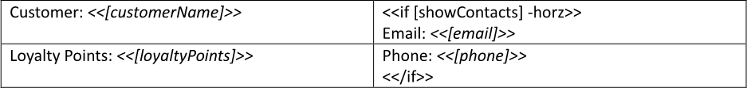
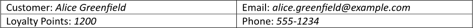
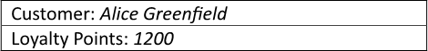
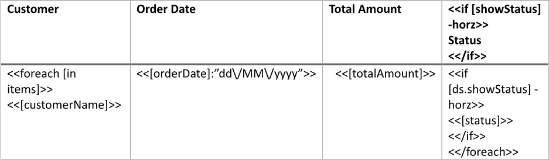
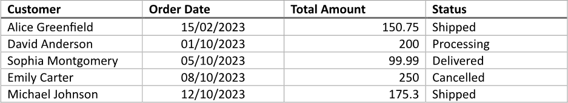
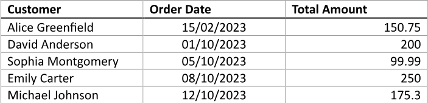
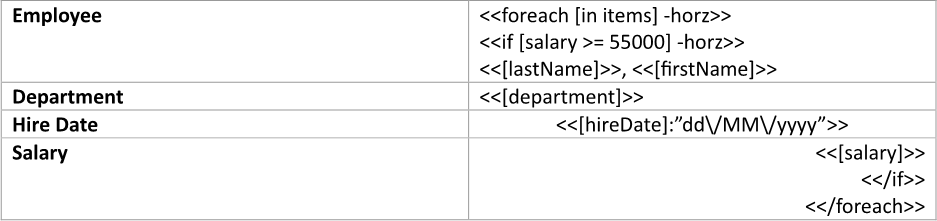
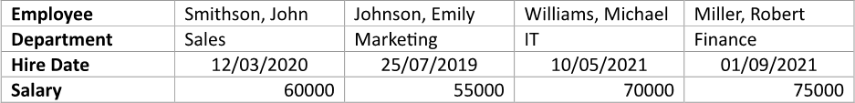

Showing a table column based on a condition allows users to focus on the most relevant information by displaying only
the columns that meet specific criteria. This targeted approach reduces visual clutter, enhances data interpretation, and
ensures that users can easily access and analyze the information that matters most to their needs or objectives. You can
build a table with a column shown based on a condition using LINQ Reporting Engine in C#.

## How to Show a Table Column Based on a Condition

1. Prepare data for your table in one of [formats supported by LINQ Reporting Engine](),
for example, a JSON file as follows:




2. In Microsoft Word, [create a
table](https://support.microsoft.com/en-us/office/insert-a-table-a138f745-73ef-4879-b99a-2f3d38be612a#platform=Windows)
of a necessary size and [format its
elements](https://support.microsoft.com/en-us/office/format-a-table-e6e77bc6-1f4e-467e-b818-2e2acc488006)
to use it as a template.

3. Consider applying [automatical resizing to columns of
the table](https://support.microsoft.com/en-us/office/resize-a-table-row-or-column-9340d478-21be-4392-81cf-488f7bbd6715#__toc293661261).

4. Add static content like headers to the table, if needed.

5. Bind cells of the table to values by adding expression tags to the cells such as the following ones:

<<[customerName]>>


<<[loyaltyPoints]>>


<<[email]>>


<<[phone]>>


6. Bind visibility of a column of the table to be shown based on a condition to a Boolean value by adding an opening `if` tag
with a `horz` switch to the beginning of the column as per the example:

<<if [showContacts] -horz>>


7. Add a closing `if` tag to the end of a column of the table to be shown based on a condition like so:

<</if>>


{}

With a `horz` switch applied, opening and closing `if` tags can be located in a single column or different columns of a single
table to capture one or more columns for showing based on the same condition.

{}

8. Review your table template before saving, it should look like this:\
\

9. Build your table using LINQ Reporting Engine by running the following C# code:\


## Table with a Column Shown Based on a Condition Report Example

After taking all the steps, LINQ Reporting Engine creates a table report with all the columns shown as follows:\
\

Now, let us consider the alternative case where data for the table implies exclusion of one of the columns, for example, like so:




After running the same code with the JSON file being used instead, LINQ Reporting Engine generates a table report with
one of the columns excluded like this:\
\

Thus, you can control which table columns to show or hide based on conditions.

{}

You can download the [template
](https://github.com/aspose-words/Aspose.Words-for-.NET/raw/ivan.lyagin/UEX-331/Examples/Data/LINQ/Table%20with%20Column%20Shown%20Based%20on%20Condition%20Template.docx)
and [data
](https://github.com/aspose-words/Aspose.Words-for-.NET/raw/ivan.lyagin/UEX-331/Examples/Data/LINQ/Table%20with%20Column%20Shown%20Based%20on%20Condition%20Data%201.json)
from the example, and try to make a table with a column shown based on a condition online for free by using one of the options:\
<a class="product-item docs-btn" href="https://products.aspose.app/words/assembly" >APP </a>
<a class="product-item docs-btn" href="https://products.aspose.com/words/net/report/" >.NET API </a>
<a class="product-item docs-btn" href="https://products.aspose.com/words/python-net/report/" >
PYTHON via <em class="docs-vianet">net</em> API</a>
 
 

{}

## How to Show a Column of a Table with Rows Bound to a Collection Based on a Condition

1. Prepare data for your table in one of [formats supported by LINQ Reporting Engine](),
for example, a JSON file as follows:




2. In Microsoft Word, [create a
table](https://support.microsoft.com/en-us/office/insert-a-table-a138f745-73ef-4879-b99a-2f3d38be612a#platform=Windows)
with a necessary number of columns and [format its
elements](https://support.microsoft.com/en-us/office/format-a-table-e6e77bc6-1f4e-467e-b818-2e2acc488006)
to use it as a template.

3. Consider applying [automatical resizing to columns of
the table](https://support.microsoft.com/en-us/office/resize-a-table-row-or-column-9340d478-21be-4392-81cf-488f7bbd6715#__toc293661261).

4. Add static content like headers to the table, if needed.

5. For every row of the table that is not going to be bound to a data collection (such as a header row), bind visibility of
a cell intersecting the row and a column of the table to be shown based on a condition to the same Boolean value by taking
the following steps:

    * Add an opening `if` tag with a `horz` switch to the beginning of the cell similarly to this:

<<if [showStatus] -horz>>


    * Add a closing `if` tag to the end of the cell this way:

<</if>>


6. Bind the table to a data collection by adding an opening `foreach` tag to the beginning of a row to be repeated for every
item of the collection as per the example:

<<foreach [in items]>>


7. Add a closing `foreach` tag to the end of a row to be repeated for every item of the collection like so:

<</foreach>>


{}

Opening and closing `foreach` tags can be located in a single row or different rows of a single table to capture one or more
rows for repeating.

{}

8. Within the range between the opening and closing `foreach` tags, bind cells of the table to values calculated upon an item
of the collection by adding expression tags to the cells such as the following ones:

<<[customerName]>>


<<[orderDate]:"dd\/MM\/yyyy">>


<<[totalAmount]>>


<<[status]>>


9. For every row of the table to be repeated for every item of the collection, bind visibility of a cell intersecting the row
and a column of the table to be shown based on a condition to the same Boolean value by acting as follows:

    * Add an opening `if` tag with a `horz` switch to the beginning of the cell after the opening `foreach` tag, for instance,
as per the snippet:

<<if [ds.showStatus] -horz>>

{}

Since between opening and closing `foreach` tags, expressions are evaluated upon an item of a corresponding data collection,
it is required to explicitly specify the name of a data source - such as `ds` - here, in order to reference the same Boolean
value for all the table's rows: both unbound and bound to the collection.

{}

    * Add a closing `if` tag to the end of the cell before the closing `foreach` tag in this fashion:

<</if>>


10. Review your table template before saving, it should look like this:\
\

11. Build your table using LINQ Reporting Engine by running the following C# code:\


## Table with a Column Shown Based on a Condition and Rows Bound to a Collection Report Example

After taking all the steps, LINQ Reporting Engine creates a table report with all the columns shown as follows:\
\

Now, let us consider the alternative case where data for the table implies exclusion of one of the columns, for example, like so:




After running the same code with the JSON file being used instead, LINQ Reporting Engine generates a table report with
one of the columns excluded like this:\
\

Thus, for a table with rows bound to a collection, you can control which columns to show or hide based on conditions as well.

{}

You can download the [template
](https://github.com/aspose-words/Aspose.Words-for-.NET/raw/ivan.lyagin/UEX-331/Examples/Data/LINQ/Table%20with%20Column%20Shown%20Based%20on%20Condition%20and%20Rows%20Bound%20to%20Collection%20Template.docx)
and [data
](https://github.com/aspose-words/Aspose.Words-for-.NET/raw/ivan.lyagin/UEX-331/Examples/Data/LINQ/Table%20with%20Column%20Shown%20Based%20on%20Condition%20and%20Rows%20Bound%20to%20Collection%20Data%201.json)
from the example, and try to make a table with a column shown based on a condition and rows bound to a collection online
for free by using one of the options:\
<a class="product-item docs-btn" href="https://products.aspose.app/words/assembly" >APP </a>
<a class="product-item docs-btn" href="https://products.aspose.com/words/net/report/" >.NET API </a>
<a class="product-item docs-btn" href="https://products.aspose.com/words/python-net/report/" >
PYTHON via <em class="docs-vianet">net</em> API</a>
 
 

{}

## How to Bind Table Columns to a Collection Based on a Condition

{}

This guide focuses on usage of `if` tags with `horz` switches nested to `foreach` tags with `horz` switches within tables.
However, binding of table columns to a collection based on a condition can also be done using `foreach` tags with `horz`
switches and [filtering of
the collection]() applied.

{}

1. Prepare data for your table in one of [formats supported by LINQ Reporting Engine](),
for example, a JSON file as follows:




2. In Microsoft Word, [create a
table](https://support.microsoft.com/en-us/office/insert-a-table-a138f745-73ef-4879-b99a-2f3d38be612a#platform=Windows)
with a necessary number of rows and [format its
elements](https://support.microsoft.com/en-us/office/format-a-table-e6e77bc6-1f4e-467e-b818-2e2acc488006)
to use it as a template.

3. Consider applying [automatical resizing to columns of
the table](https://support.microsoft.com/en-us/office/resize-a-table-row-or-column-9340d478-21be-4392-81cf-488f7bbd6715#__toc293661261).

4. Add static content like headers to the table, if needed.

5. Bind the table to a data collection by adding an opening `foreach` tag with a `horz` switch to the beginning of a column
to be repeated for every item of the collection as per the example:

<<foreach [in items] -horz>>


6. Add a closing `foreach` tag to the end of a column to be repeated for every item of the collection like so:

<</foreach>>


{}

With a `horz` switch applied, opening and closing `foreach` tags can be located in a single column or different columns of
a single table to capture one or more columns for repeating.

{}

7. Bind visibility of a column of the table to be shown based on a condition to a Boolean value calculated upon an item of
the collection by adding an opening `if` tag with a `horz` switch to the beginning of the column after the opening `foreach`
tag, for instance, like this:

<<if [salary >= 55000] -horz>>


8. Add a closing `if` tag to the end of a column of the table to be shown based on a condition before the closing `foreach` tag
as follows:

<</if>>


{}

With a `horz` switch applied, opening and closing `if` tags can be located in a single column or different columns of a single
table to capture one or more columns for showing based on the same condition.

{}

9. Within the range between the opening and closing `if` tags, bind cells of the table to values calculated upon an item
of the data collection by adding expression tags to the cells such as the following ones:

<<[lastName]>>


<<[firstName]>>


<<[department]>>


<<[hireDate]:"dd\/MM\/yyyy">>


<<[salary]>>


10. Review your table template before saving, it should look like this:\
\

11. Build your table using LINQ Reporting Engine by running the following C# code:\


## Table with Columns Bound to a Collection Based on a Condition Report Example

After taking all the steps, LINQ Reporting Engine creates a table report as follows:\
\

{}

You can download the [template
](https://github.com/aspose-words/Aspose.Words-for-.NET/raw/ivan.lyagin/UEX-331/Examples/Data/LINQ/Table%20with%20Columns%20Bound%20to%20Collection%20Based%20on%20Condition%20Template.docx)
and [data
](https://github.com/aspose-words/Aspose.Words-for-.NET/raw/ivan.lyagin/UEX-331/Examples/Data/LINQ/Table%20with%20Columns%20Bound%20to%20Collection%20Based%20on%20Condition%20Data.json)
from the example, and try to make a table with columns bound to a collection based on a condition online for free by using one of
the options:\
<a class="product-item docs-btn" href="https://products.aspose.app/words/assembly" >APP </a>
<a class="product-item docs-btn" href="https://products.aspose.com/words/net/report/" >.NET API </a>
<a class="product-item docs-btn" href="https://products.aspose.com/words/python-net/report/" >
PYTHON via <em class="docs-vianet">net</em> API</a>
 
 

{}

## See Also

- [Building Tables]()
- [Binding Collections]()
- [Formatting Data]()
- [LINQ Reporting Engine]()
- [ReportingEngine Class](https://reference.aspose.com/words/net/aspose.words.reporting/reportingengine/)

{}