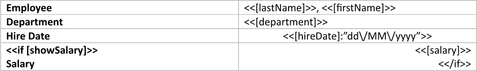
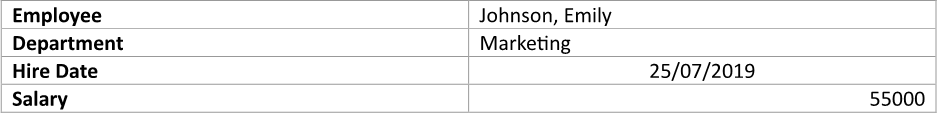
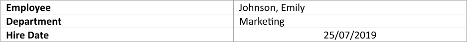
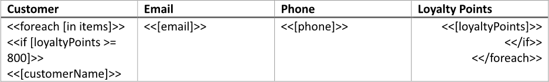
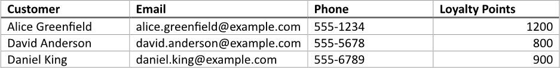

Showing a table row based on a condition allows for the dynamic presentation of relevant data, ensuring that users only see
information that meets specific criteria. This targeted approach enhances readability and usability, enabling users to focus
on the most pertinent data without being overwhelmed by extraneous details. You can build a table with a row shown based on
a condition using LINQ Reporting Engine in C#.

## How to Show a Table Row Based on a Condition

1. Prepare data for your table in one of [formats supported by LINQ Reporting Engine](),
for example, a JSON file as follows:




2. In Microsoft Word, [create a
table](https://support.microsoft.com/en-us/office/insert-a-table-a138f745-73ef-4879-b99a-2f3d38be612a#platform=Windows)
of a necessary size and [format its
elements](https://support.microsoft.com/en-us/office/format-a-table-e6e77bc6-1f4e-467e-b818-2e2acc488006)
to use it as a template.

3. Add static content like headers to the table, if needed.

4. Bind cells of the table to values by adding expression tags to the cells such as the following ones:

<<[lastName]>>


<<[firstName]>>


<<[department]>>


<<[hireDate]:"dd\/MM\/yyyy">>


<<[salary]>>


5. Bind visibility of a row of the table to be shown based on a condition to a Boolean value by adding an opening `if` tag to
the beginning of the row as per the example:

<<if [showSalary]>>


6. Add a closing `if` tag to the end of a row of the table to be shown based on a condition like so:

<</if>>


{}

Opening and closing `if` tags can be located in a single row or different rows of a single table to capture one or more rows
for showing based on the same condition.

{}

7. Review your table template before saving, it should look like this:\
\

8. Build your table using LINQ Reporting Engine by running the following C# code:\


## Table with a Row Shown Based on a Condition Report Example

After taking all the steps, LINQ Reporting Engine creates a table report with all the rows shown as follows:\
\

Now, let us consider the alternative case where data for the table implies exclusion of one of the rows, for example, like so:




After running the same code with the JSON file being used instead, LINQ Reporting Engine generates a table report with
one of the rows excluded like this:\
\

Thus, you can control which table rows to show or hide based on conditions.

{}

You can download the [template
](https://github.com/aspose-words/Aspose.Words-for-.NET/raw/ivan.lyagin/UEX-331/Examples/Data/LINQ/Table%20with%20Row%20Shown%20Based%20on%20Condition%20Template.docx)
and [data
](https://github.com/aspose-words/Aspose.Words-for-.NET/raw/ivan.lyagin/UEX-331/Examples/Data/LINQ/Table%20with%20Row%20Shown%20Based%20on%20Condition%20Data%201.json)
from the example, and try to make a table with a row shown based on a condition online for free by using one of the options:\
<a class="product-item docs-btn" href="https://products.aspose.app/words/assembly" >APP </a>
<a class="product-item docs-btn" href="https://products.aspose.com/words/net/report/" >.NET API </a>
<a class="product-item docs-btn" href="https://products.aspose.com/words/python-net/report/" >
PYTHON via <em class="docs-vianet">net</em> API</a>
 
 

{}

## How to Bind Table Rows to a Collection Based on a Condition

{}

This guide focuses on usage of `if` tags nested to `foreach` tags within tables. However, binding of table rows to a collection
based on a condition can also be done using `foreach` tags with [filtering of
the collection]() applied.

{}

1. Prepare data for your table in one of [formats supported by LINQ Reporting Engine](),
for example, a JSON file as follows:




2. In Microsoft Word, [create a
table](https://support.microsoft.com/en-us/office/insert-a-table-a138f745-73ef-4879-b99a-2f3d38be612a#platform=Windows)
with a necessary number of columns and [format its
elements](https://support.microsoft.com/en-us/office/format-a-table-e6e77bc6-1f4e-467e-b818-2e2acc488006)
to use it as a template.

3. Add static content like headers to the table, if needed.

4. Bind the table to a data collection by adding an opening `foreach` tag to the beginning of a row to be repeated for every
item of the collection as per the example:

<<foreach [in items]>>


5. Add a closing `foreach` tag to the end of a row to be repeated for every item of the collection like so:

<</foreach>>


{}

Opening and closing `foreach` tags can be located in a single row or different rows of a single table to capture one or more
rows for repeating.

{}

6. Bind visibility of a row of the table to be shown based on a condition to a Boolean value calculated upon an item of
the collection by adding an opening `if` tag to the beginning of the row after the opening `foreach` tag, for instance,
like this:

<<if [loyaltyPoints >= 800]>>


7. Add a closing `if` tag to the end of a row of the table to be shown based on a condition before the closing `foreach` tag
as follows:

<</if>>


{}

Opening and closing `if` tags can be located in a single row or different rows of a single table to capture one or more rows
for showing based on the same condition.

{}

8. Within the range between the opening and closing `if` tags, bind cells of the table to values calculated upon an item
of the data collection by adding expression tags to the cells such as the following ones:

<<[customerName]>>


<<[email]>>


<<[phone]>>


<<[loyaltyPoints]>>


9. Review your table template before saving, it should look like this:\
\

10. Build your table using LINQ Reporting Engine by running the following C# code:\


## Table with Rows Bound to a Collection Based on a Condition Report Example

After taking all the steps, LINQ Reporting Engine creates a table report as follows:\
\

{}

You can download the [template
](https://github.com/aspose-words/Aspose.Words-for-.NET/raw/ivan.lyagin/UEX-331/Examples/Data/LINQ/Table%20with%20Rows%20Bound%20to%20Collection%20Based%20on%20Condition%20Template.docx)
and [data
](https://github.com/aspose-words/Aspose.Words-for-.NET/raw/ivan.lyagin/UEX-331/Examples/Data/LINQ/Table%20with%20Rows%20Bound%20to%20Collection%20Based%20on%20Condition%20Data.json)
from the example, and try to make a table with rows bound to a collection based on a condition online for free by using one of
the options:\
<a class="product-item docs-btn" href="https://products.aspose.app/words/assembly" >APP </a>
<a class="product-item docs-btn" href="https://products.aspose.com/words/net/report/" >.NET API </a>
<a class="product-item docs-btn" href="https://products.aspose.com/words/python-net/report/" >
PYTHON via <em class="docs-vianet">net</em> API</a>
 
 

{}

## See Also

- [Building Tables]()
- [Binding Collections]()
- [Formatting Data]()
- [LINQ Reporting Engine]()
- [ReportingEngine Class](https://reference.aspose.com/words/net/aspose.words.reporting/reportingengine/)

{}