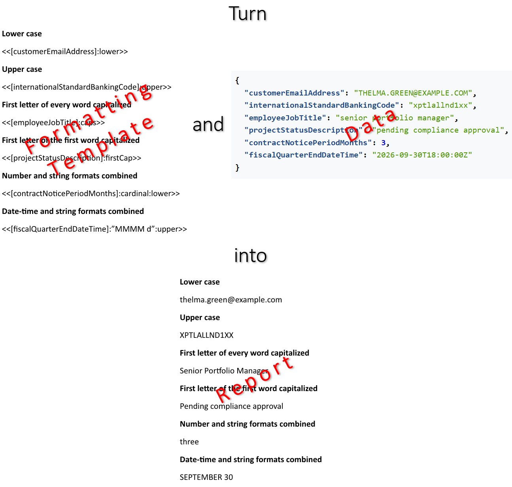

Proper formatting of expressions transforms raw data into a structured and intuitively understandable visual document. This
process eliminates ambiguity when interpreting numerical metrics, timestamps, and textual data, which ensures flawless accuracy
and a professional appearance for the final report. You can make a report with formatted values by defining expressions and
their respective formatting in a template document, and filling the template with data using LINQ Reporting Engine in C#.\
\

The process of building a report with formatted values incorporates the following steps:

1. Preparing data for the report in one of [supported formats]()

2. Creating a template document in Microsoft Word

3. Running C# code invoking [LINQ Reporting Engine
APIs](https://reference.aspose.com/words/net/aspose.words.reporting/reportingengine/)

{}

A typical template formatting data represents a regular Microsoft Word document with expression tags added to it. The tags bind
the document with data values and define formatting for the values.

{}

To learn more on how to format data values of a particular type with LINQ Reporting Engine in C#, please refer to the following
sections:



{}