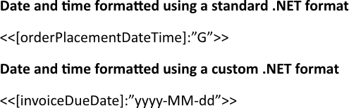
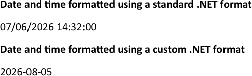

Formatting date and time converts raw timestamps into clear, human-readable values that align with the visual style of the
report. This ensures that temporal information appears consistently across all sections, allowing readers to interpret trends
and schedules without distraction. You can format date and time using LINQ Reporting Engine in C#.

## How to Format Date and Time

1. Prepare data for your report in one of [formats supported by LINQ Reporting Engine](),
for example, a JSON file as follows:




2. In Microsoft Word, bind a template document to date and time values, and apply date and time formatting as per your
requirements by adding expression tags to the template such as the following ones:

    * To format a date and time using a standard .NET format, use [a standard date and time format
string](https://learn.microsoft.com/en-us/dotnet/standard/base-types/standard-date-and-time-format-strings) like so:

<<[orderPlacementDateTime]:"G">>


    * To format a date and time using a custom .NET format, use [a custom date and time format
string](https://learn.microsoft.com/en-us/dotnet/standard/base-types/custom-date-and-time-format-strings) like this:

<<[invoiceDueDate]:"yyyy-MM-dd">>


{}
For standard and custom .NET format strings, enclose the format pattern in double quotes (`"…"`) after the colon.
{}

3. Review your date and time formatting template before saving, it should look like this:\
\

4. Build your report formatting a date and time using LINQ Reporting Engine by running the following C# code:\


## Date and Time Formatting Report Example

After taking all the steps, LINQ Reporting Engine creates a date and time formatting report as follows:\
\

{}

You can download the [template
](https://github.com/aspose-words/Aspose.Words-for-.NET/raw/ivan.lyagin/UEX-331/Examples/Data/LINQ/Date%20and%20Time%20Formatting%20Template.docx)
and [data
](https://github.com/aspose-words/Aspose.Words-for-.NET/raw/ivan.lyagin/UEX-331/Examples/Data/LINQ/Date%20and%20Time%20Formatting%20Data.json)
from the example, and try to format date and time online for free by using one of
the options:\
<a class="product-item docs-btn" href="https://products.aspose.app/words/assembly" >APP </a>
<a class="product-item docs-btn" href="https://products.aspose.com/words/net/report/" >.NET API </a>
<a class="product-item docs-btn" href="https://products.aspose.com/words/python-net/report/" >
PYTHON via <em class="docs-vianet">net</em> API</a>
 
 

{}

## See Also

- [Formatting Data]()
- [LINQ Reporting Engine]()
- [ReportingEngine Class](https://reference.aspose.com/words/net/aspose.words.reporting/reportingengine/)

{}