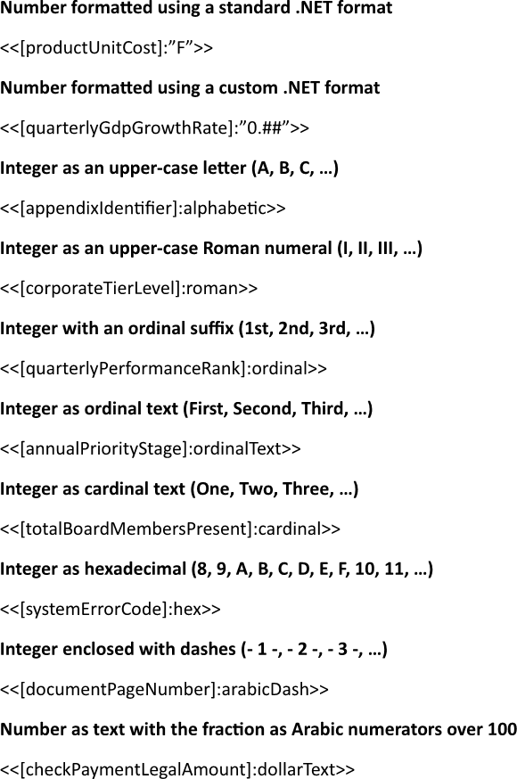
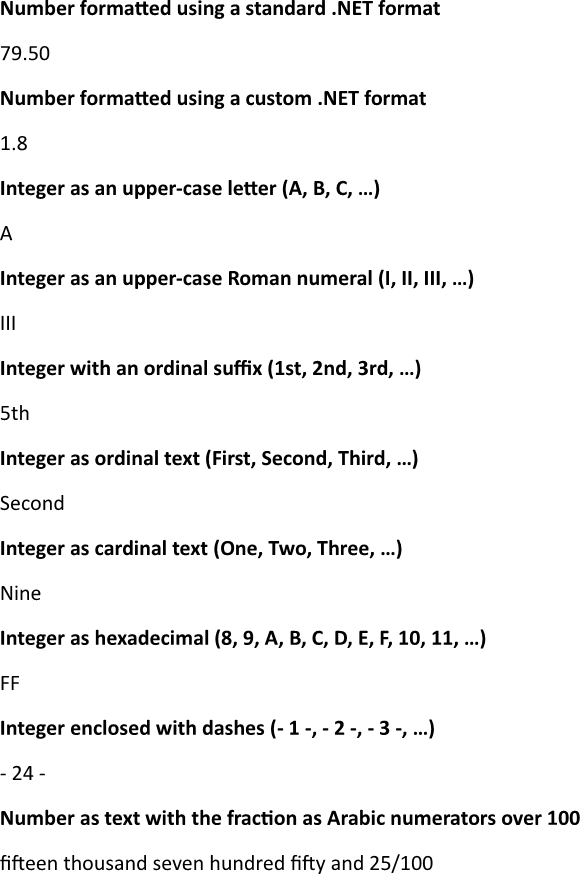

Formatting numbers ensures that all numeric data appear consistently, with appropriate decimal places, thousand separators, and
currency symbols, which enhances readability and professional appearance of the report. The feature can be applied to any
numeric expression, allowing the author to present calculations, totals, and key performance indicators in a way that aligns
with the intended audience’s expectations. You can format numbers using LINQ Reporting Engine in C#.

## How to Format Numbers

1. Prepare data for your report in one of [formats supported by LINQ Reporting Engine](),
for example, a JSON file as follows:




2. In Microsoft Word, bind a template document to numeric values and apply number formatting as per your requirements by adding
expression tags to the template such as the following ones:

    * To format a number using a standard .NET format, use [a standard numeric format
string](https://learn.microsoft.com/en-us/dotnet/standard/base-types/standard-numeric-format-strings) like so:

<<[productUnitCost]:"F">>


    * To format a number using a custom .NET format, use [a custom numeric format
string](https://learn.microsoft.com/en-us/dotnet/standard/base-types/custom-numeric-format-strings) like this:

<<[quarterlyGdpGrowthRate]:"0.##">>


    * To represent an integer as an upper-case letter (A, B, C, …) apply the `alphabetic` format specifier, for example:

<<[appendixIdentifier]:alphabetic>>


    * To represent an integer as an upper-case Roman numeral (I, II, III, …) apply the `roman` format specifier, like that:

<<[corporateTierLevel]:roman>>


    * To represent an integer with an ordinal suffix (1st, 2nd, 3rd, …) use the `ordinal` format specifier, for instance:

<<[quarterlyPerformanceRank]:ordinal>>


    * To represent an integer as ordinal text (First, Second, Third, …) use the `ordinalText` format specifier, as shown:

<<[annualPriorityStage]:ordinalText>>


    * To represent an integer as cardinal text (One, Two, Three, …) use the `cardinal` format specifier, like so:

<<[totalBoardMembersPresent]:cardinal>>


    * To represent an integer as hexadecimal (8, 9, A, B, C, D, E, F, 10, …) use the `hex` format specifier, for example:

<<[systemErrorCode]:hex>>


    * To enclose an integer with dashes (- 1 -, - 2 -, - 3 -, …) use the `arabicDash` format specifier, like this:

<<[documentPageNumber]:arabicDash>>


    * To express a number as text with the fraction shown as Arabic numerators over 100, use the `dollarText` format specifier,
for instance:

<<[checkPaymentLegalAmount]:dollarText>>


{}
For the standard and custom .NET format strings, enclose the format pattern in double quotes (`"…"`) after the colon. The custom
format identifiers (`alphabetic`, `roman`, `ordinal`, `ordinalText`, `cardinal`, `hex`, `arabicDash`, `dollarText`) are specific
to LINQ Reporting Engine and do not require quotes.
{}

3. Review your numbers formatting template before saving, it should look like this:\
\

4. Build your report formatting numbers using LINQ Reporting Engine by running the following C# code:\


## Numbers Formatting Report Example

After taking all the steps, LINQ Reporting Engine creates a numbers formatting report as follows:\
\

{}

You can download the [template
](https://github.com/aspose-words/Aspose.Words-for-.NET/raw/ivan.lyagin/UEX-331/Examples/Data/LINQ/Numbers%20Formatting%20Template.docx)
and [data
](https://github.com/aspose-words/Aspose.Words-for-.NET/raw/ivan.lyagin/UEX-331/Examples/Data/LINQ/Numbers%20Formatting%20Data.json)
from the example, and try to format numbers online for free by using one of
the options:\
<a class="product-item docs-btn" href="https://products.aspose.app/words/assembly" >APP </a>
<a class="product-item docs-btn" href="https://products.aspose.com/words/net/report/" >.NET API </a>
<a class="product-item docs-btn" href="https://products.aspose.com/words/python-net/report/" >
PYTHON via <em class="docs-vianet">net</em> API</a>
 
 

{}

## See Also

- [Formatting Data]()
- [LINQ Reporting Engine]()
- [ReportingEngine Class](https://reference.aspose.com/words/net/aspose.words.reporting/reportingengine/)

{}