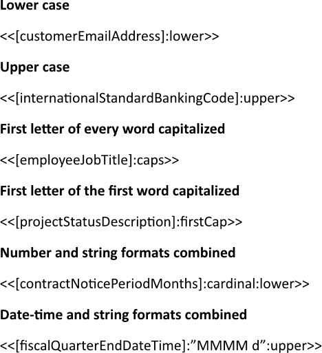
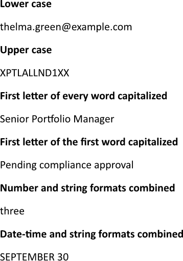

Applying string formatting transforms raw textual data into a standardized structure by automatically modifying case styles.
This process establishes complete consistency across all final documents, ensuring that text-based expressions appear polished
and professional. You can format strings using LINQ Reporting Engine in C#.

## How to Format Strings

1. Prepare data for your report in one of [formats supported by LINQ Reporting Engine](),
for example, a JSON file as follows:




2. In Microsoft Word, bind a template document to values and apply string formatting as per your requirements by adding
expression tags to the template such as the following ones:

    * To convert a string to lower case, apply the `lower` format specifier, for example:

<<[customerEmailAddress]:lower>>


    * To convert a string to upper case, apply the `upper` format specifier, like that:

<<[internationalStandardBankingCode]:upper>>


    * To capitalize the first letter of every word, apply the `caps` format specifier, as shown:

<<[employeeJobTitle]:caps>>


    * To capitalize the first letter of the first word only, apply the `firstCap` format specifier, like so:

<<[projectStatusDescription]:firstCap>>


    * To combine [numeric]() and string formats, chain the format specifiers, for example:

<<[contractNoticePeriodMonths]:cardinal:lower>>


    * To combine [date-time]() and string formats, chain the format specifiers, for
instance:

<<[fiscalQuarterEndDateTime]:"MMMM d":upper>>


{}
For standard and custom .NET format strings, enclose the format pattern in double quotes (`"…"`) after the colon. The custom
string format identifiers (`lower`, `upper`, `caps`, `firstCap`) as well as [numeric ones]()
are specific to LINQ Reporting Engine and do not require quotes.
{}

3. Review your strings formatting template before saving, it should look like this:\
\

4. Build your report formatting strings using LINQ Reporting Engine by running the following C# code:\


## Strings Formatting Report Example

After taking all the steps, LINQ Reporting Engine creates a strings formatting report as follows:\
\

{}

You can download the [template
](https://github.com/aspose-words/Aspose.Words-for-.NET/raw/ivan.lyagin/UEX-331/Examples/Data/LINQ/Strings%20Formatting%20Template.docx)
and [data
](https://github.com/aspose-words/Aspose.Words-for-.NET/raw/ivan.lyagin/UEX-331/Examples/Data/LINQ/Strings%20Formatting%20Data.json)
from the example, and try to format strings online for free by using one of
the options:\
<a class="product-item docs-btn" href="https://products.aspose.app/words/assembly" >APP </a>
<a class="product-item docs-btn" href="https://products.aspose.com/words/net/report/" >.NET API </a>
<a class="product-item docs-btn" href="https://products.aspose.com/words/python-net/report/" >
PYTHON via <em class="docs-vianet">net</em> API</a>
 
 

{}

## See Also

- [Formatting Data]()
- [LINQ Reporting Engine]()
- [ReportingEngine Class](https://reference.aspose.com/words/net/aspose.words.reporting/reportingengine/)

{}