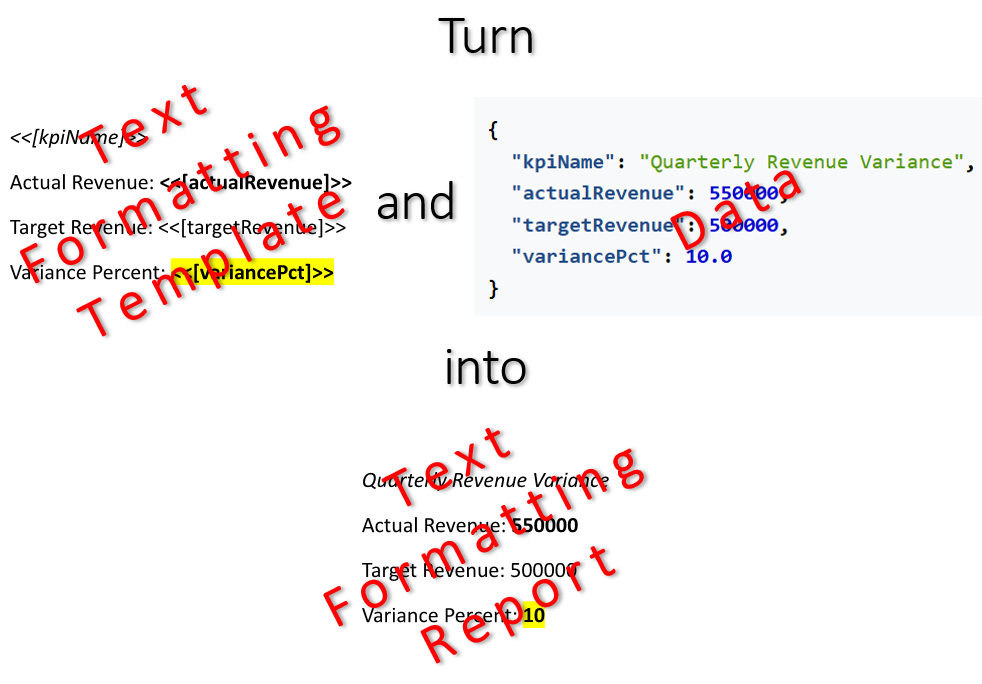

Professional text formatting transforms scattered data into a structured and intuitively understandable visual document. It
allows for the immediate highlighting of key analytical metrics, significantly accelerating the comprehension of critical
information during report review. You can make a report with text formatting by filling a template document with data using
LINQ Reporting Engine in C#.\
\

The process of building a report with text formatting incorporates the following steps:

1. Preparing data for the report in one of [supported formats]()

2. Creating a template document in Microsoft Word

3. Running C# code invoking [LINQ Reporting Engine
APIs](https://reference.aspose.com/words/net/aspose.words.reporting/reportingengine/)

{}

A typical template with text formatting represents a regular Microsoft Word document with expression tags added to it. Textual
representation of an expression result is formatted either by direct applying text attributes to the corresponding expression
tag or by specifying text formatting overrides declaratively using template syntax tags.

{}

To learn more on available options for text formatting using LINQ Reporting Engine in C#, please refer to the following
sections:



{}