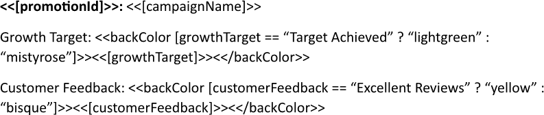
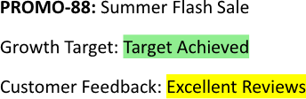

Overriding background color makes it possible to replace the default shading with a custom hue, or to apply an expression that
changes the color based on data values. This flexibility enables each part of the report to be highlighted precisely, improving
readability and emphasizing key data points. You can override background color using LINQ Reporting Engine in C#.

## How to Override Background Color

{}

This guide provides a shortcut method for applying only background colors to output text.

{}

1. Prepare data for your report in one of [formats supported by LINQ Reporting Engine](),
for example, a JSON file as follows:




2. In Microsoft Word, bind a template document to data values that do not require background coloring by adding expression tags
to the template such as the following ones:

<<[promotionId]>>


<<[campaignName]>>


3. Bind the background color of a text fragment to a [color value]() by adding an opening
`backColor` tag to the beginning of the fragment like one of these:

<<backColor [growthTarget == "Target Achieved" ? "lightgreen" : "mistyrose"]>>


<<backColor [customerFeedback == "Excellent Reviews" ? "yellow" : "bisque"]>>


{}

A color value can be directly stored in a data source, for example, as an object property.

{}

4. Bind the text fragment to a data value by adding an expression tag to the fragment after the opening `backColor` tag, such
as:

<<[growthTarget]>>


<<[customerFeedback]>>


5. Add a closing `backColor` tag at the end of the text fragment this way:

<</backColor>>


{}

Such a text fragment may be multi-paragraph or even multi-section.

{}

6. Review your background color overriding template before saving, it should look like this:\
\

7. Build your report overriding a background color using LINQ Reporting Engine by running the following C# code:\


## Background Color Overriding Report Example

After taking all the steps, LINQ Reporting Engine creates a background color overriding report as follows:\
\

{}

You can download the [template
](https://github.com/aspose-words/Aspose.Words-for-.NET/raw/ivan.lyagin/UEX-331/Examples/Data/LINQ/Background%20Color%20Overriding%20Template.docx)
and [data
](https://github.com/aspose-words/Aspose.Words-for-.NET/raw/ivan.lyagin/UEX-331/Examples/Data/LINQ/Background%20Color%20Overriding%20Data.json)
from the example, and try to override background color online for free by using one of
the options:\
<a class="product-item docs-btn" href="https://products.aspose.app/words/assembly" >APP </a>
<a class="product-item docs-btn" href="https://products.aspose.com/words/net/report/" >.NET API </a>
<a class="product-item docs-btn" href="https://products.aspose.com/words/python-net/report/" >
PYTHON via <em class="docs-vianet">net</em> API</a>
 
 

{}

{}

## See Also

- [Formatting Text]()
- [LINQ Reporting Engine]()
- [ReportingEngine Class](https://reference.aspose.com/words/net/aspose.words.reporting/reportingengine/)

{}