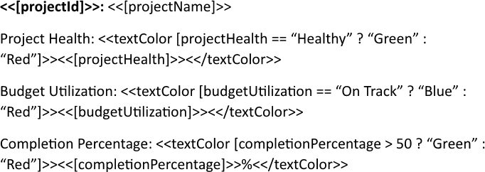
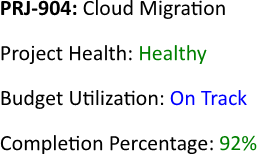

Overriding text color provides precise visual control, allowing important data points to stand out against the default palette.
This capability enhances readability and directs the reader’s attention to critical information without altering the underlying
data. You can override text color using LINQ Reporting Engine in C#.

## How to Override Text Color

{}

This guide provides a shortcut method for applying only text colors to output text.

{}

1. Prepare data for your report in one of [formats supported by LINQ Reporting Engine](),
for example, a JSON file as follows:




2. In Microsoft Word, bind a template document to data values that do not require text coloring by adding expression tags to
the template such as the following ones:

<<[projectId]>>


<<[projectName]>>


3. Bind the text color of a text fragment to a [color value]() by adding an opening
`textColor` tag to the beginning of the fragment like one of these:

<<textColor [projectHealth == "Healthy" ? "Green" : "Red"]>>


<<textColor [budgetUtilization == "On Track" ? "Blue" : "Red"]>>


<<textColor [completionPercentage > 50 ? "Green" : "Red"]>>


{}

A color value can be directly stored in a data source, for example, as an object property.

{}

4. Bind the text fragment to a data value by adding an expression tag to the fragment after the opening `textColor` tag, such
as:

<<[projectHealth]>>


<<[budgetUtilization]>>


<<[completionPercentage]>>


5. Add a closing `textColor` tag at the end of the text fragment this way:

<</textColor>>


{}

Such a text fragment may be multi-paragraph or even multi-section.

{}

6. Review your text color overriding template before saving, it should look like this:\
\

7. Build your report overriding a text color using LINQ Reporting Engine by running the following C# code:\


## Text Color Overriding Report Example

After taking all the steps, LINQ Reporting Engine creates a text color overriding report as follows:\
\

{}

You can download the [template
](https://github.com/aspose-words/Aspose.Words-for-.NET/raw/ivan.lyagin/UEX-331/Examples/Data/LINQ/Text%20Color%20Overriding%20Template.docx)
and [data
](https://github.com/aspose-words/Aspose.Words-for-.NET/raw/ivan.lyagin/UEX-331/Examples/Data/LINQ/Text%20Color%20Overriding%20Data.json)
from the example, and try to override text color online for free by using one of
the options:\
<a class="product-item docs-btn" href="https://products.aspose.app/words/assembly" >APP </a>
<a class="product-item docs-btn" href="https://products.aspose.com/words/net/report/" >.NET API </a>
<a class="product-item docs-btn" href="https://products.aspose.com/words/python-net/report/" >
PYTHON via <em class="docs-vianet">net</em> API</a>
 
 

{}

{}

## See Also

- [Formatting Text]()
- [LINQ Reporting Engine]()
- [ReportingEngine Class](https://reference.aspose.com/words/net/aspose.words.reporting/reportingengine/)

{}