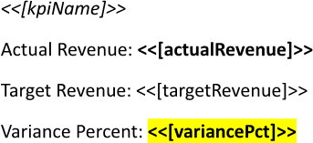
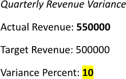
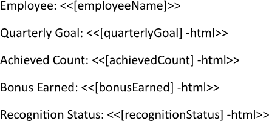
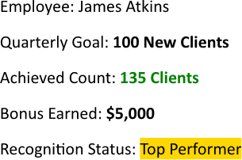

Overriding text format enables custom styling of any textual element, allowing the report to use specific fonts, sizes, colors,
or alignments that reflect the desired visual identity. This targeted formatting highlights key information and supports
conditional presentation based on data values. You can override text format using LINQ Reporting Engine in C#.

## How to Format Output Text

1. Prepare data for your report in one of [formats supported by LINQ Reporting Engine](),
for example, a JSON file as follows:




2. In Microsoft Word, bind a template document to data values by adding expression tags to the template such as the following
ones:

<<[kpiName]>>


<<[actualRevenue]>>


<<[targetRevenue]>>


<<[variancePct]>>


3. Select text of an added expession tag and [apply text formatting to
it](https://support.microsoft.com/en-us/word/training/add-and-edit-text) depending on your requirements. The expression result
will derive this formatting in an output report.

4. Review your output text formatting template before saving, it should look like this:\
\

5. Build your report formatting output text using LINQ Reporting Engine by running the following C# code:\


## Output Text Formatting Report Example

After taking all the steps, LINQ Reporting Engine creates an output text formatting report as follows:\
\

{}

You can download the [template
](https://github.com/aspose-words/Aspose.Words-for-.NET/raw/ivan.lyagin/UEX-331/Examples/Data/LINQ/Output%20Text%20Formatting%20Template.docx)
and [data
](https://github.com/aspose-words/Aspose.Words-for-.NET/raw/ivan.lyagin/UEX-331/Examples/Data/LINQ/Output%20Text%20Formatting%20Data.json)
from the example, and try to format output text online for free by using one of
the options:\
<a class="product-item docs-btn" href="https://products.aspose.app/words/assembly" >APP </a>
<a class="product-item docs-btn" href="https://products.aspose.com/words/net/report/" >.NET API </a>
<a class="product-item docs-btn" href="https://products.aspose.com/words/python-net/report/" >
PYTHON via <em class="docs-vianet">net</em> API</a>
 
 

{}

## How to Override Text Format

{}

This guide walks through overriding text format dynamically by basic usage of HTML. LINQ Reporting Engine also provides
[advanced options for HTML insertion]().

{}

1. Prepare data for your report in one of [formats supported by LINQ Reporting Engine](),
for example, a JSON file as follows:




2. In Microsoft Word, bind a template document to data values that do not require dynamic text format overriding by adding
expression tags to the template like this one:

<<[employeeName]>>


3. Bind the template document to HTML-string values to override text format dynamically by adding expression tags with `html`
switches such as the following ones:

<<[quarterlyGoal] -html>>


<<[achievedCount] -html>>


<<[bonusEarned] -html>>


<<[recognitionStatus] -html>>


{}

* For this example, data values are preformatted with HTML tags. However, you can inject HTML tags directly into string
expressions instead, for instance, like so: `<<["<b>" + employeeName + "</b>"] -html>>`.

* An expression tag with an `html` switch cannot be used within charts.

{}

4. Review your text format overriding template before saving, it should look like this:\
\

5. Build your report overriding a text format using LINQ Reporting Engine by running the following C# code:\


## Text Format Overriding Report Example

After taking all the steps, LINQ Reporting Engine creates a text format overriding report as follows:\
\

{}

You can download the [template
](https://github.com/aspose-words/Aspose.Words-for-.NET/raw/ivan.lyagin/UEX-331/Examples/Data/LINQ/Text%20Format%20Overriding%20Template.docx)
and [data
](https://github.com/aspose-words/Aspose.Words-for-.NET/raw/ivan.lyagin/UEX-331/Examples/Data/LINQ/Text%20Format%20Overriding%20Data.json)
from the example, and try to override text format online for free by using one of
the options:\
<a class="product-item docs-btn" href="https://products.aspose.app/words/assembly" >APP </a>
<a class="product-item docs-btn" href="https://products.aspose.com/words/net/report/" >.NET API </a>
<a class="product-item docs-btn" href="https://products.aspose.com/words/python-net/report/" >
PYTHON via <em class="docs-vianet">net</em> API</a>
 
 

{}

## See Also

- [Formatting Text]()
- [LINQ Reporting Engine]()
- [ReportingEngine Class](https://reference.aspose.com/words/net/aspose.words.reporting/reportingengine/)

{}