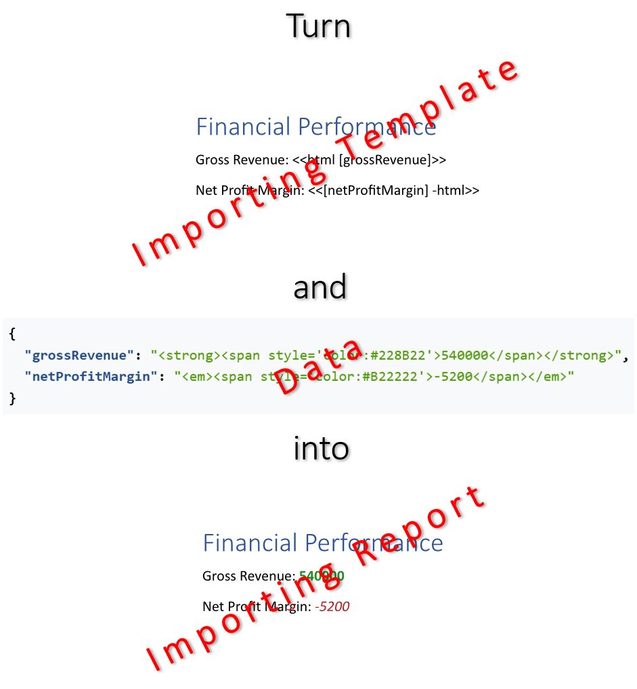

Importing [content](https://en.wikipedia.org/wiki/Digital_content) from diverse sources like documents and HTML into reports
facilitates the seamless integration of pre-existing information, transforming fragmented assets into a unified view for better
decision-making. This process also allows for the efficient reuse of repetitive blocks - such as standardized legal text,
headers, and footers - reducing manual data entry while ensuring consistency and quality across all generated documents.
You can import content by filling a template document with data using LINQ Reporting Engine in C#.\
\

The process of importing content incorporates the following steps:

1. Preparing data in one of [supported formats]() to define the source of content to be imported

2. Creating an importing template in Microsoft Word

3. Running C# code invoking [LINQ Reporting Engine
APIs](https://reference.aspose.com/words/net/aspose.words.reporting/reportingengine/)

{}

A typical importing template represents a regular Microsoft Word document with special tags added to the document's text:
`doc` or `html` tags binding the source of a document or HTML to be imported with data respectively.

{}

To learn more on how to insert a document or HTML with LINQ Reporting Engine in C# and use advanced features of content
importing, please refer to the following sections:



{}