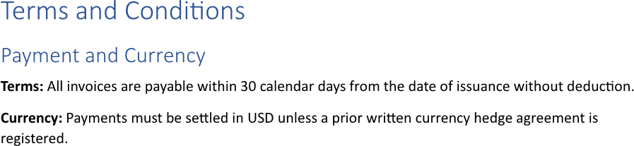
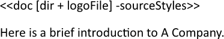
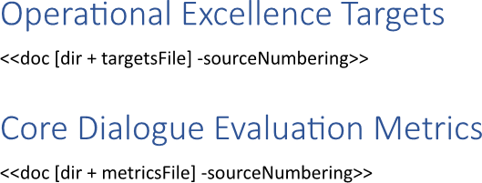
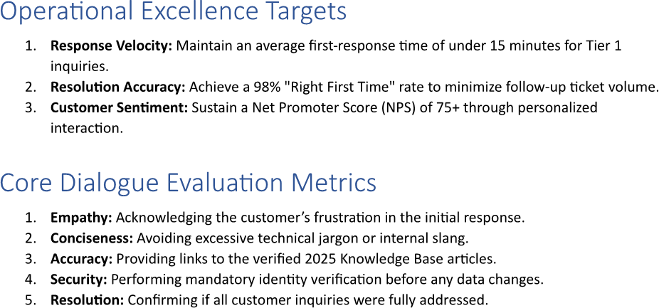
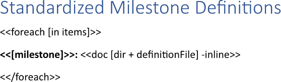

Inserting a [document](https://en.wikipedia.org/wiki/Document) ensures consistent messaging across various sections of a report
or multiple reports while significantly reducing the time spent on manual recreation. This modular approach establishes a single
source of truth, allowing updates made in one document to automatically propagate everywhere it is inserted to maintain accuracy
and compliance. You can insert a document using LINQ Reporting Engine in C#.

## How to Insert a Document

1. Prepare data for your document in one of [formats supported by LINQ Reporting Engine](),
for example, a JSON file as follows:




{}

In this example, the additional data source `dir` - the path to a directory of a document to be inserted - is used.

{}

2. In Microsoft Word, create a template document and bind the source of a document to be inserted to a [value providing
the document's data]() by adding a `doc` tag at a position within
the template's text where to insert the document, for instance, like so:

<<doc [dir + fileName]>>


{}

A `doc` tag cannot be used within textboxes and charts.

{}

3. Review your importing template before saving, it should look like this:\
\

4. Build your document using LINQ Reporting Engine by running the following C# code:\


## Document Inserting Report Example

After taking all the steps, LINQ Reporting Engine creates an importing report as follows:\
\

{}

You can download the [template
](https://github.com/aspose-words/Aspose.Words-for-.NET/raw/ivan.lyagin/UEX-331/Examples/Data/LINQ/Document%20Inserting%20Template.docx)
and [data
](https://github.com/aspose-words/Aspose.Words-for-.NET/raw/ivan.lyagin/UEX-331/Examples/Data/LINQ/Document%20Inserting%20Data.json)
from the example, and try to insert a document online for free by using one of the options:\
<a class="product-item docs-btn" href="https://products.aspose.app/words/assembly" >APP </a>
<a class="product-item docs-btn" href="https://products.aspose.com/words/net/report/" >.NET API </a>
<a class="product-item docs-btn" href="https://products.aspose.com/words/python-net/report/" >
PYTHON via <em class="docs-vianet">net</em> API</a>
 
 

{}

## How to Insert a Document Keeping Source Styles

{}

By default, content of a document being inserted inherits styles of a template document to make report content more consistent.
This guide shows how to preserve styles of a document being inserted when it is necessary.

{}

1. Prepare data for your document in one of [formats supported by LINQ Reporting Engine](),
for example, a JSON file as follows:




{}

In this example, the additional data source `dir` - the path to a directory of a document to be inserted - is used.

{}

2. In Microsoft Word, create a template document and bind the source of a document to be inserted to a [value providing
the document's data]() by adding a `doc` tag with a `sourceStyles`
switch at a position within the template's text where to insert the document, for instance, like so:

<<doc [dir + logoFile] -sourceStyles>>


{}

A `doc` tag cannot be used within textboxes and charts.

{}

3. Review your importing template before saving, it should look like this:\
\

4. Build your document using LINQ Reporting Engine by running the following C# code:\


## Document Inserting with Source Styles Keeping Report Example

After taking all the steps, LINQ Reporting Engine creates an importing report as follows:\
\

{}

You can download the [template
](https://github.com/aspose-words/Aspose.Words-for-.NET/raw/ivan.lyagin/UEX-331/Examples/Data/LINQ/Document%20Inserting%20with%20Source%20Styles%20Keeping%20Template.docx)
and [data
](https://github.com/aspose-words/Aspose.Words-for-.NET/raw/ivan.lyagin/UEX-331/Examples/Data/LINQ/Document%20Inserting%20with%20Source%20Styles%20Keeping%20Data.json)
from the example, and try to insert a document keeping source styles online for free by using one of the options:\
<a class="product-item docs-btn" href="https://products.aspose.app/words/assembly" >APP </a>
<a class="product-item docs-btn" href="https://products.aspose.com/words/net/report/" >.NET API </a>
<a class="product-item docs-btn" href="https://products.aspose.com/words/python-net/report/" >
PYTHON via <em class="docs-vianet">net</em> API</a>
 
 

{}

## How to Insert a Document Keeping Source Numbering

{}

By default, when inserting a document, numbered lists with matching identifiers are continued in a report. This guide explains
how to keep numbering for content being inserted as is when needed.

{}

1. Prepare data for your document in one of [formats supported by LINQ Reporting Engine](),
for example, a JSON file as follows:




{}

In this example, the additional data source `dir` - the path to a directory of a document to be inserted - is used.

{}

2. In Microsoft Word, create a template document and bind the source of every document to be inserted to a [value providing
the document's data]() by adding a `doc` tag with a `sourceNumbering`
switch at a position within the template's text where to insert the document, for instance, like so:

<<doc [dir + targetsFile] -sourceNumbering>>


<<doc [dir + metricsFile] -sourceNumbering>>


{}

A `doc` tag cannot be used within textboxes and charts.

{}

3. Review your importing template before saving, it should look like this:\
\

4. Build your document using LINQ Reporting Engine by running the following C# code:\


## Document Inserting with Source Numbering Keeping Report Example

After taking all the steps, LINQ Reporting Engine creates an importing report as follows:\
\

{}

You can download the [template
](https://github.com/aspose-words/Aspose.Words-for-.NET/raw/ivan.lyagin/UEX-331/Examples/Data/LINQ/Document%20Inserting%20with%20Source%20Numbering%20Keeping%20Template.docx)
and [data
](https://github.com/aspose-words/Aspose.Words-for-.NET/raw/ivan.lyagin/UEX-331/Examples/Data/LINQ/Document%20Inserting%20with%20Source%20Numbering%20Keeping%20Data.json)
from the example, and try to insert a document keeping source numbering online for free by using one of the options:\
<a class="product-item docs-btn" href="https://products.aspose.app/words/assembly" >APP </a>
<a class="product-item docs-btn" href="https://products.aspose.com/words/net/report/" >.NET API </a>
<a class="product-item docs-btn" href="https://products.aspose.com/words/python-net/report/" >
PYTHON via <em class="docs-vianet">net</em> API</a>
 
 

{}

## How to Insert a Document Inlining Content

{}

This guide walks through trimming of the last paragraph break from a document being inserted, which is most useful when
the document is single-paragraph and it is required to put the document's content within a paragraph having special formatting
such as list numbering applied. Although the guide focuses on usage of `doc` tags with `inline` switches nested to `foreach`
tags, a similar technique can be used with no `foreach` tags involved.

{}

1. Prepare data for your document in one of [formats supported by LINQ Reporting Engine](),
for example, a JSON file as follows:




{}

In this example, the additional data source `dir` - the path to a directory of a document to be inserted - is used.

{}

2. In Microsoft Word, create a template document and bind a fragment of its text to a data collection to repeat the fragment
for every item of the collection by adding an opening `foreach` tag to the beginning of the fragment, for instance, like so:

<<foreach [in items]>>


3. Bind the fragment to values calculated upon an item of the data collection by adding expression tags after the opening
`foreach` tag such as the following one:

<<[milestone]>>


4. Bind the source of a document to be inserted to a [value providing the document's
data]() calculated upon an item of the data collection by adding
a `doc` tag with an `inline` switch at a position within the fragment after the opening `foreach` tag where to insert
the document as per the example:

<<doc [dir + definitionFile] -inline>>


{}

A `doc` tag cannot be used within textboxes and charts.

{}

5. Add a closing `foreach` tag at the end of the fragment this way:

<</foreach>>


6. Review your importing template before saving, it should look like this:\
\

7. Build your document using LINQ Reporting Engine by running the following C# code:\


## Document Inserting with Content Inlining Report Example

After taking all the steps, LINQ Reporting Engine creates an importing report as follows:\
\

{}

You can download the [template
](https://github.com/aspose-words/Aspose.Words-for-.NET/raw/ivan.lyagin/UEX-331/Examples/Data/LINQ/Document%20Inserting%20with%20Content%20Inlining%20Template.docx)
and [data
](https://github.com/aspose-words/Aspose.Words-for-.NET/raw/ivan.lyagin/UEX-331/Examples/Data/LINQ/Document%20Inserting%20with%20Content%20Inlining%20Data.json)
from the example, and try to insert a document inlining content online for free by using one of the options:\
<a class="product-item docs-btn" href="https://products.aspose.app/words/assembly" >APP </a>
<a class="product-item docs-btn" href="https://products.aspose.com/words/net/report/" >.NET API </a>
<a class="product-item docs-btn" href="https://products.aspose.com/words/python-net/report/" >
PYTHON via <em class="docs-vianet">net</em> API</a>
 
 

{}

{}

## See Also

- [Importing Content]()
- [Binding Collections]()
- [LINQ Reporting Engine]()
- [ReportingEngine Class](https://reference.aspose.com/words/net/aspose.words.reporting/reportingengine/)

{}