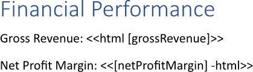
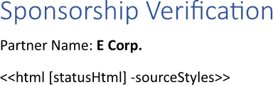
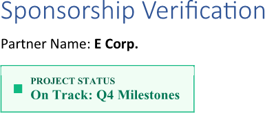

Inserting [HTML](https://en.wikipedia.org/wiki/HTML) empowers dynamic formatting by using tags to apply conditional styles -
such as highlighting specific data points or creating complex layouts - that transform static text into a visually engaging
and responsive experience. Also, this capability becomes a necessity when your source data already contains HTML strings.
You can insert HTML using LINQ Reporting Engine in C#.

## How to Insert HTML

1. Prepare data for your document in one of [formats supported by LINQ Reporting Engine](),
for example, a JSON file as follows:




2. In Microsoft Word, create a template document and bind the source of HTML to be inserted to an html-string value by adding
an `html` tag or an expression tag with an `html` switch at a position within the template's text where to insert HTML, for
instance, like so:

<<html [grossRevenue]>>


<<[netProfitMargin] -html>>


{}

* An expression tag with an `html` switch and an `html` tag with no switches applied can be used interchangeably.

* An `html` tag or an expression tag with an `html` switch cannot be used within charts.

{}

3. Review your importing template before saving, it should look like this:\
\

4. Build your HTML using LINQ Reporting Engine by running the following C# code:\


## HTML Inserting Report Example

After taking all the steps, LINQ Reporting Engine creates an importing report as follows:\
\

{}

You can download the [template
](https://github.com/aspose-words/Aspose.Words-for-.NET/raw/ivan.lyagin/UEX-331/Examples/Data/LINQ/HTML%20Inserting%20Template.docx)
and [data
](https://github.com/aspose-words/Aspose.Words-for-.NET/raw/ivan.lyagin/UEX-331/Examples/Data/LINQ/HTML%20Inserting%20Data.json)
from the example, and try to insert HTML online for free by using one of the options:\
<a class="product-item docs-btn" href="https://products.aspose.app/words/assembly" >APP </a>
<a class="product-item docs-btn" href="https://products.aspose.com/words/net/report/" >.NET API </a>
<a class="product-item docs-btn" href="https://products.aspose.com/words/python-net/report/" >
PYTHON via <em class="docs-vianet">net</em> API</a>
 
 

{}

## How to Insert HTML Keeping Source Styles

{}

By default, content of HTML being inserted inherits styles of a template document to make report content more consistent.
This guide shows how to preserve styles of HTML being inserted - to make it look like in a browser - when it is necessary.

{}

1. Prepare data for your document in one of [formats supported by LINQ Reporting Engine](),
for example, a JSON file as follows:




2. In Microsoft Word, create a template document and bind the source of HTML to be inserted to an html-string value by adding
an `html` tag with a `sourceStyles` switch at a position within the template's text where to insert HTML, for instance, like so:

<<html [statusHtml] -sourceStyles>>


{}

An `html` tag cannot be used within charts.

{}

3. Review your importing template before saving, it should look like this:\
\

4. Build your HTML using LINQ Reporting Engine by running the following C# code:\


## HTML Inserting with Source Styles Keeping Report Example

After taking all the steps, LINQ Reporting Engine creates an importing report as follows:\
\

{}

You can download the [template
](https://github.com/aspose-words/Aspose.Words-for-.NET/raw/ivan.lyagin/UEX-331/Examples/Data/LINQ/HTML%20Inserting%20with%20Source%20Styles%20Keeping%20Template.docx)
and [data
](https://github.com/aspose-words/Aspose.Words-for-.NET/raw/ivan.lyagin/UEX-331/Examples/Data/LINQ/HTML%20Inserting%20with%20Source%20Styles%20Keeping%20Data.json)
from the example, and try to insert HTML keeping source styles online for free by using one of the options:\
<a class="product-item docs-btn" href="https://products.aspose.app/words/assembly" >APP </a>
<a class="product-item docs-btn" href="https://products.aspose.com/words/net/report/" >.NET API </a>
<a class="product-item docs-btn" href="https://products.aspose.com/words/python-net/report/" >
PYTHON via <em class="docs-vianet">net</em> API</a>
 
 

{}

## See Also

- [Importing Content]()
- [LINQ Reporting Engine]()
- [ReportingEngine Class](https://reference.aspose.com/words/net/aspose.words.reporting/reportingengine/)

{}