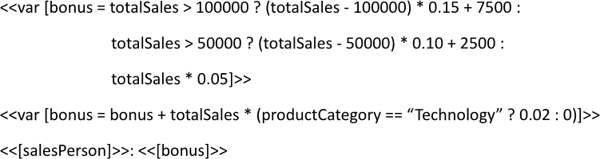
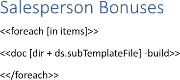
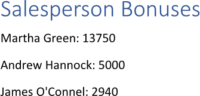

Inserting [sub-templates](https://en.wiktionary.org/wiki/subtemplate) allows users to reuse standardized blocks and layouts,
such as consistent headers, footers, or complex calculations, across multiple reports without manual recreation. This modular
approach ensures report-wide consistency and enables global updates by modifying a single source file rather than editing every
individual layout. You can insert a sub-template using LINQ Reporting Engine in C#.

## How to Insert a Sub-template

{}

* Inserting a sub-template is a special case of [inserting a document](), so all the options
available for document insertion can be applied to sub-template insertion as well.

* Although the guide focuses on usage of `doc` tags with `build` switches nested to `foreach` tags, a similar approach can be
used with no `foreach` tags involved.

{}

1. Prepare data for your template and sub-template in one of [formats supported by LINQ Reporting
Engine](), for example, a JSON file as follows:




{}

In this example, the additional data source `dir` - the path to a directory of a sub-template to be inserted - is used.

{}

2. In Microsoft Word, create a template document and bind a fragment of its text to a data collection to repeat the fragment
for every item of the collection by adding an opening `foreach` tag to the beginning of the fragment, for instance, like so:

<<foreach [in items]>>


3. In Microsoft Word, create one more standalone document to use it as a sub-template accessing an item of the data collection
by taking the following steps:

    * Define necessary calculations upon an item of the collection using [variables
]() for intermediate results by adding `var` tags to the sub-template
similar to these:

<<var [bonus = totalSales > 100000 ? (totalSales - 100000) * 0.15 + 7500 :
               totalSales > 50000 ? (totalSales - 50000) * 0.10 + 2500 :
               totalSales * 0.05]>>


<<var [bonus = bonus + totalSales * (productCategory == "Technology" ? 0.02 : 0)]>>


    * Bind the sub-template to values calculated upon an item of the collection and the variables by adding expression tags
after the `var` tags such as the following ones:

<<[salesPerson]>>


<<[bonus]>>


    * Review your sub-template before saving, it should look like that:\
\

{}

A sub-template can access the following data available at a position within a template where the sub-template is inserted:
* Data sources
* [Variables]()
* [A contextual object]()
* [Known external types]()

{}

4. Getting back to editing the template, bind the source of a sub-template to be inserted to a [value providing the document's
data]() by adding a `doc` tag with a `build` switch at a position
within the template's fragment after the opening `foreach` tag where to insert the sub-template as per the example:

<<doc [dir + ds.subTemplateFile] -build>>


{}

* Since between opening and closing `foreach` tags, expressions are evaluated upon an item of a corresponding data collection,
it is required to explicitly specify the name of a data source - such as `ds` - here, in order to reference the same
sub-template for all items of the collection.

* A `doc` tag cannot be used within textboxes and charts.

{}

5. Add a closing `foreach` tag at the end of the fragment this way:

<</foreach>>


6. Review your importing template before saving, it should look like this:\
\

7. Build your document using LINQ Reporting Engine by running the following C# code:\


## Sub-template Inserting Report Example

After taking all the steps, LINQ Reporting Engine creates an importing report as follows:\
\

{}

You can download the [template
](https://github.com/aspose-words/Aspose.Words-for-.NET/raw/ivan.lyagin/UEX-331/Examples/Data/LINQ/Sub-template%20Inserting%20Template.docx)
and [data
](https://github.com/aspose-words/Aspose.Words-for-.NET/raw/ivan.lyagin/UEX-331/Examples/Data/LINQ/Sub-template%20Inserting%20Data.json)
from the example, and try to insert a sub-template online for free by using one of the options:\
<a class="product-item docs-btn" href="https://products.aspose.app/words/assembly" >APP </a>
<a class="product-item docs-btn" href="https://products.aspose.com/words/net/report/" >.NET API </a>
<a class="product-item docs-btn" href="https://products.aspose.com/words/python-net/report/" >
PYTHON via <em class="docs-vianet">net</em> API</a>
 
 

{}

{}

## See Also

- [Importing Content]()
- [Binding Collections]()
- [LINQ Reporting Engine]()
- [ReportingEngine Class](https://reference.aspose.com/words/net/aspose.words.reporting/reportingengine/)

{}