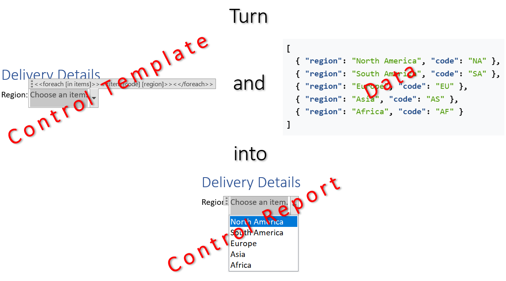

[Controls](https://en.wikipedia.org/wiki/Graphical_widget) serve as static visual indicators that communicate a state or
selected option at a glance as well as functional tools for guided data entry. They ensure data integrity by restricting
inputs to valid options and enable a report to actively capture information. You can build a control by filling a template
document with data using LINQ Reporting Engine in C#.\
\

The process of building a control incorporates the following steps:

1. Preparing data for the control in one of [supported formats]()

2. Creating a control template in Microsoft Word

3. Running C# code invoking [LINQ Reporting Engine
APIs](https://reference.aspose.com/words/net/aspose.words.reporting/reportingengine/)

{}

A typical control template represents a regular Microsoft Word control with special tags added to the control's title depending
on the control's type.

{}

To learn more on how to build a control of a particular type with LINQ Reporting Engine in C# and use advanced features of
control building, please refer to the following sections:



{}