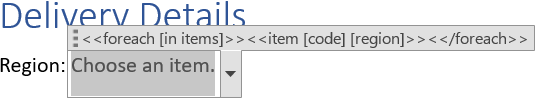
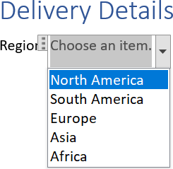

Filling a [dropdown list](https://en.wikipedia.org/wiki/Drop-down_list) or [combobox](https://en.wikipedia.org/wiki/Combo_box)
is essential for data integrity and user efficiency. It restricts user input to pre-approved choices, which enforces data
standardization by ensuring users select only from a validated set of options, thereby preventing errors in input. You can fill
a dropdown list using LINQ Reporting Engine in C#.

## How to Fill a Dropdown List

{}

This guide highlights usage of `item` tags nested to `foreach` tags to fill a dropdown list upon a data collection. However,
a similar approach without `foreach` tags can be used for filling a dropdown list with a fixed number of items just by adding
as many `item` tags as needed.

{}

1. Prepare data for your dropdown list in one of [formats supported by LINQ Reporting Engine](),
for example, a JSON file as follows:




2. In Microsoft Word, [create a dropdown list or combobox content
control](https://support.microsoft.com/en-us/office/create-a-form-in-word-that-users-can-complete-or-print-040c5cc1-e309-445b-94ac-542f732c8c8b)
and [set its
properties](https://support.microsoft.com/en-us/office/create-a-form-in-word-that-users-can-complete-or-print-040c5cc1-e309-445b-94ac-542f732c8c8b#__set_properties)
to use it as a template.

3. By editing the properties, remove the default dropdown list item, if not needed.

{}

You can modify the item instead or add more items to be present regardless of data used for filling the dropdown list.

{}

4. Bind the dropdown list to a data collection by adding an opening `foreach` tag to the title of the dropdown list upon [editing
content control properties](https://support.microsoft.com/en-us/office/create-a-form-in-word-that-users-can-complete-or-print-040c5cc1-e309-445b-94ac-542f732c8c8b#__set_properties)
as per the example:

<<foreach [in items]>>


5. Bind every dropdown list item to be added to an item of the data collection by adding an `item` tag after the opening
`foreach` tag and declaring values calculated upon the collection's item to define the value and display name of the dropdown
list item respectively, for instance, like so:

<<item [code] [region]>>


{}

The value defining the display name can be omitted, then the dropdown list item's value is used as its display name as well.

{}

6. Add a closing `foreach` tag after the `item` tag this way:

<</foreach>>


7. Review your dropdown list template before saving, it should look like this:\
\

7. Build your dropdown list using LINQ Reporting Engine by running the following C# code:\


## Dropdown List Filling Report Example

After taking all the steps, LINQ Reporting Engine creates a dropdown list report as follows:\
\

{}

You can download the [template
](https://github.com/aspose-words/Aspose.Words-for-.NET/raw/ivan.lyagin/UEX-331/Examples/Data/LINQ/Dropdown%20List%20Filling%20Template.docx)
and [data
](https://github.com/aspose-words/Aspose.Words-for-.NET/raw/ivan.lyagin/UEX-331/Examples/Data/LINQ/Dropdown%20List%20Filling%20Data.json)
from the example, and try to fill a dropdown list online for free by using one of the options:\
<a class="product-item docs-btn" href="https://products.aspose.app/words/assembly" >APP </a>
<a class="product-item docs-btn" href="https://products.aspose.com/words/net/report/" >.NET API </a>
<a class="product-item docs-btn" href="https://products.aspose.com/words/python-net/report/" >
PYTHON via <em class="docs-vianet">net</em> API</a>
 
 

{}

## See Also

- [Working with Controls]()
- [Binding Collections]()
- [LINQ Reporting Engine]()
- [ReportingEngine Class](https://reference.aspose.com/words/net/aspose.words.reporting/reportingengine/)

{}