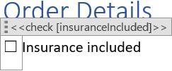
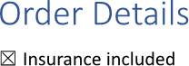

Setting a [checkbox](https://en.wikipedia.org/wiki/Checkbox) state provides an immediate visual representation of binary data
(like 'Completed' or 'Paid' status), allowing users to quickly scan and understand information. It also enables interactivity,
allowing users to select multiple items simultaneously based on the checked or unchecked status. You can set a checkbox state
using LINQ Reporting Engine in C#.

## How to Set a Checkbox State

1. Prepare data for your checkbox in one of [formats supported by LINQ Reporting Engine](),
for example, a JSON file as follows:




2. In Microsoft Word, [create a checkbox content
control](https://support.microsoft.com/en-us/office/create-a-form-in-word-that-users-can-complete-or-print-040c5cc1-e309-445b-94ac-542f732c8c8b)
and [set its
properties](https://support.microsoft.com/en-us/office/create-a-form-in-word-that-users-can-complete-or-print-040c5cc1-e309-445b-94ac-542f732c8c8b#__set_properties)
to use it as a template.

3. Bind the state of the checkbox to a Boolean value by adding a `check` tag to the title of the checkbox upon [editing
content control properties](https://support.microsoft.com/en-us/office/create-a-form-in-word-that-users-can-complete-or-print-040c5cc1-e309-445b-94ac-542f732c8c8b#__set_properties)
as per the example:

<<check [insuranceIncluded]>>


4. Review your checkbox template before saving, it should look like this:\
\

5. Build your checkbox using LINQ Reporting Engine by running the following C# code:\


## Checkbox State Setting Report Example

After taking all the steps, LINQ Reporting Engine creates a checkbox report as follows:\
\

{}

You can download the [template
](https://github.com/aspose-words/Aspose.Words-for-.NET/raw/ivan.lyagin/UEX-331/Examples/Data/LINQ/Checkbox%20State%20Setting%20Template.docx)
and [data
](https://github.com/aspose-words/Aspose.Words-for-.NET/raw/ivan.lyagin/UEX-331/Examples/Data/LINQ/Checkbox%20State%20Setting%20Data.json)
from the example, and try to set a checkbox state online for free by using one of the options:\
<a class="product-item docs-btn" href="https://products.aspose.app/words/assembly" >APP </a>
<a class="product-item docs-btn" href="https://products.aspose.com/words/net/report/" >.NET API </a>
<a class="product-item docs-btn" href="https://products.aspose.com/words/python-net/report/" >
PYTHON via <em class="docs-vianet">net</em> API</a>
 
 

{}

## See Also

- [Working with Controls]()
- [LINQ Reporting Engine]()
- [ReportingEngine Class](https://reference.aspose.com/words/net/aspose.words.reporting/reportingengine/)

{}