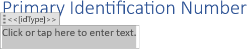
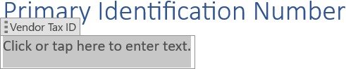

Setting a [content control](https://support.microsoft.com/en-us/office/about-content-controls-283b1e29-0b77-4781-b236-2d02c1cce1c2)
title is crucial for usability, clarity, and accessibility. The title acts as a clear caption or description, ensuring users
instantly understand the control's purpose and the data it represents or expects. You can set a content control title using
LINQ Reporting Engine in C#.

## How to Set a Content Control Title

1. Prepare data for your content control in one of [formats supported by LINQ Reporting Engine](),
for example, a JSON file as follows:




2. In Microsoft Word, [create a content
control](https://support.microsoft.com/en-us/office/create-a-form-in-word-that-users-can-complete-or-print-040c5cc1-e309-445b-94ac-542f732c8c8b)
and [set its
properties](https://support.microsoft.com/en-us/office/create-a-form-in-word-that-users-can-complete-or-print-040c5cc1-e309-445b-94ac-542f732c8c8b#__set_properties)
to use it as a template.

3. Bind the title of the content control to a value by adding an expression tag to the title upon [editing
content control properties](https://support.microsoft.com/en-us/office/create-a-form-in-word-that-users-can-complete-or-print-040c5cc1-e309-445b-94ac-542f732c8c8b#__set_properties)
as per the example:

<<[idType]>>


4. Review your content control template before saving, it should look like this:\
\

5. Build your content control using LINQ Reporting Engine by running the following C# code:\


## Content Control Title Setting Report Example

After taking all the steps, LINQ Reporting Engine creates a content control report as follows:\
\

{}

You can download the [template
](https://github.com/aspose-words/Aspose.Words-for-.NET/raw/ivan.lyagin/UEX-331/Examples/Data/LINQ/Content%20Control%20Title%20Setting%20Template.docx)
and [data
](https://github.com/aspose-words/Aspose.Words-for-.NET/raw/ivan.lyagin/UEX-331/Examples/Data/LINQ/Content%20Control%20Title%20Setting%20Data.json)
from the example, and try to set a content control title online for free by using one of the options:\
<a class="product-item docs-btn" href="https://products.aspose.app/words/assembly" >APP </a>
<a class="product-item docs-btn" href="https://products.aspose.com/words/net/report/" >.NET API </a>
<a class="product-item docs-btn" href="https://products.aspose.com/words/python-net/report/" >
PYTHON via <em class="docs-vianet">net</em> API</a>
 
 

{}

## See Also

- [Working with Controls]()
- [LINQ Reporting Engine]()
- [ReportingEngine Class](https://reference.aspose.com/words/net/aspose.words.reporting/reportingengine/)

{}