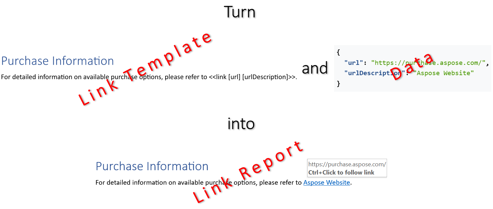

Using links makes a report significantly more user-friendly by creating an interactive and navigable structure. Bookmarks
establish internal jump points for quick navigation within the document, while hyperlinks provide instant access to external
sources and related documents, collectively enhancing efficiency, transparency, and credibility. You can build bookmarks and
links by filling a template document with data using LINQ Reporting Engine in C#.\
\

The process of building a bookmark or link incorporates the following steps:

1. Preparing data for the bookmark or link in one of [supported formats]()

2. Creating a bookmark or link template in Microsoft Word

3. Running C# code invoking [LINQ Reporting Engine
APIs](https://reference.aspose.com/words/net/aspose.words.reporting/reportingengine/)

{}

A typical bookmark or link template represents a regular Microsoft Word document with special tags added to the document's text:
Opening and closing `bookmark` tags or `link` tags binding a bookmark or link with data respectively.

{}

To learn more on how to build a bookmark or link with LINQ Reporting Engine in C#, please refer to the following sections:



{}